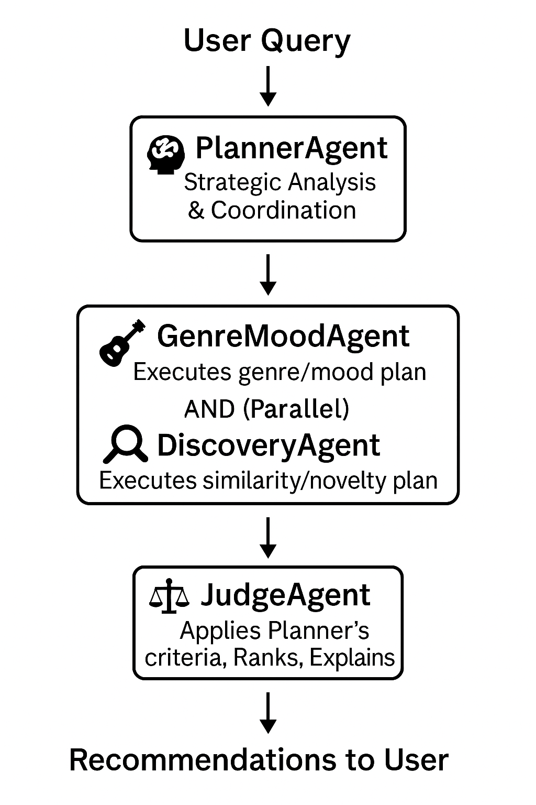

# BeatDebate — Technical Deep Dive  
*A planning-centric, multi-agent approach to explainable music recommendation*

## Introduction

!!! abstract "Purpose"
    BeatDebate is a proof-of-concept web app that shows how a **large-language-model (LLM) planner** can orchestrate specialised agents to deliver transparent, long-tail music recommendations in under seven seconds.  

    Check out the [project GitHub repository](https://github.com/SulmanK/BeatDebate) for the full code and detailed documentation. Here is the [web application](#). Check out the AgentX [course](https://llmagents-learning.org/sp25)

!!! info "Problem Statement"
    Standard collaborative-filtering pipelines optimise clicks but amplify popularity bias and tell listeners nothing about *why* a song appears. BeatDebate flips the workflow: first an LLM writes an explicit machine-readable plan, then lightweight agents execute it, and finally a Judge agent converts plan weights into human-readable explanations.

### **What you’ll learn**

* **Designing an LLM-planned recommender** — externalising reasoning as JSON so downstream agents become cheap and debuggable.  
* **Using LangGraph for agent orchestration** — a typed DAG with retries, time-outs, and state-passing.  
* **Balancing novelty and relevance** with dual advocate agents (Genre-Mood vs. Discovery).  
* **Generating explanations by design** rather than post-hoc.  
* **Running at interactive speed** on commodity hardware for <$0.04 per query.

<!-- more -->

## System Architecture



1. **User query** enters via a Gradio chat front-end.  
2. **PlannerAgent** (Gemini-2.5 Flash) classifies intent, sets novelty/similarity weights, and emits a `planning_strategy` JSON.  
3. **Genre-MoodAgent** fetches stylistically coherent tracks; **DiscoveryAgent** hunts low-playcount gems.  
4. **JudgeAgent** ranks and explains using the Planner’s evaluation rubric.  
5. Results stream back with Spotify previews.

LangGraph moves a single `MusicRecommenderState` object through the graph, enforcing type safety and providing span-level tracing.

## Getting Started

```bash
git clone https://github.com/your-org/beatdebate
cd beatdebate
uv run python -m src.main
# Point browser to http://localhost:7860
```
Set these environment variables:
```bash
LASTFM_API_KEY=your_lastfm_api_key_here
LASTFM_SHARED_SECRET=your_lastfm_shared_secret_here
SPOTIFY_CLIENT_ID=your_spotify_client_id_here
SPOTIFY_CLIENT_SECRET=your_spotify_client_secret_here
```

## 1. The Backend: FastAPI, LangGraph, and an LLM Planner  
The BeatDebate backend turns a chat prompt into a ranked, explained playlist in one HTTP call.  
Everything is Python 3.11; **FastAPI** exposes the `/recommend` endpoint, **LangGraph** orchestrates four agents, and **Pydantic** types the shared state.

### Key Components & Technologies

#### FastAPI
Chosen for its async-first design (perfect for I/O-bound API calls to Last.fm, Spotify and Gemini) and native Pydantic validation.

```python
# src/api/backend.py (illustrative snippet)
from fastapi import APIRouter, HTTPException # Corrected: FastAPI uses HTTPException
from src.models.agent_models import MusicRecommenderState # Assuming this path
from src.services.enhanced_recommendation_service import get_recommendation_service, RecommendationRequest # Using enhanced service

router = APIRouter()
recommendation_service = get_recommendation_service() # Assuming service is initialized elsewhere

@router.post("/recommendations", response_model=list[str]) # Updated endpoint
async def recommend_tracks(request: RecommendationRequest): # Updated request model
    if not recommendation_service:
        raise HTTPException(status_code=503, detail="Recommendation service not available")
    
    result = await recommendation_service.get_recommendations(request)
    return [track.name for track in result.recommendations] # Simplified for example
```

#### LangGraph
A tiny DAG with four nodes; advocates run in parallel.

```python
# src/services/recommendation_engine.py (excerpt based on your LangGraph design)
from langgraph.graph import StateGraph, END
from src.models.agent_models import MusicRecommenderState
# ... import agent classes ...

class RecommendationEngine:
    # ...
    def _build_workflow_graph(self) -> StateGraph: # Corrected method name
        workflow = StateGraph(MusicRecommenderState)
        workflow.add_node("planner", self._planner_node)
        workflow.add_node("genre_mood_advocate", self._genre_mood_node)
        workflow.add_node("discovery_advocate", self._discovery_node)
        workflow.add_node("judge", self._judge_node)

        workflow.set_entry_point("planner")
        # ... connect nodes ...
        # For example:
        workflow.add_conditional_edges(
            "planner",
            self._route_agents, # Example router
            {
                "discovery_only": "discovery_advocate",
                "genre_mood_only": "genre_mood_advocate",
                "both_agents": "discovery_advocate", # Start of parallel execution
                "judge_only": "judge"
            }
        )
        # ... other edges for parallel flow and to judge ...
        workflow.add_edge("judge", END)
        return workflow.compile()
    # ...
```

#### Pydantic
Pydantic is the backbone for data validation and settings management throughout BeatDebate. Its primary role in the backend is defining the `MusicRecommenderState` model (`src/models/agent_models.py`).
```python
# src/models/agent_models.py (abridged - MusicRecommenderState)
from typing import Dict, List, Any, Optional, Annotated
from pydantic import BaseModel, Field

# Reducer examples (from your agent_models.py)
def keep_first(x: Any, y: Any) -> Any:
    if x is None or (isinstance(x, (list, dict, str)) and len(x) == 0): return y
    return x

def list_append_reducer(x: List, y: List) -> List:
    if x is None: x = []
    if y is None: y = []
    return x + y

class MusicRecommenderState(BaseModel):
    user_query: Annotated[str, keep_first] = Field(...)
    # ... many other fields like planning_strategy, entities, etc. ...
    genre_mood_recommendations: Annotated[List[Dict], list_append_reducer] = Field(default_factory=list)
    discovery_recommendations: Annotated[List[Dict], list_append_reducer] = Field(default_factory=list)
    final_recommendations: Annotated[List[Dict], list_append_reducer] = Field(default_factory=list) # Corrected reducer based on typical usage
    reasoning_log: Annotated[List[str], list_append_reducer] = Field(default_factory=list)
    # ...
```


#### Layered Architecture

##### API Layer 
*   **(`src/api/`):**
    * This layer serves as the unified gateway for all external service interactions, ensuring consistency, robustness, and maintainability. It's not just about exposing endpoints with FastAPI but also about how the application consumes external music data APIs.
        * **(`src/api/backend.py`):**
            * Exposes the primary HTTP endpoints (like `/recommendations`, `/planning`) for the Gradio frontend and potentially other clients.

            * Handles request validation using Pydantic models defined in src/models/.

            * Orchestrates calls to the EnhancedRecommendationService to initiate the agent workflow.

            * Manages application lifecycle events (startup/shutdown) for initializing and closing resources like the recommendation service and API clients (as seen in lifespan manager in `src/api/backend.py`).

            ```python

            # src/api/backend.py (Illustrative Snippet)
            from fastapi import FastAPI, HTTPException, Depends # Ensure Depends is imported
            from pydantic import BaseModel, Field
            from typing import List, Optional, Dict, Any # Ensure necessary typing imports

            # Assuming these are correctly pathed in your project
            from src.services.enhanced_recommendation_service import (
                EnhancedRecommendationService,
                RecommendationRequest as ServiceRequest, # Renaming to avoid Pydantic model conflict
                RecommendationResponse as ServiceResponse,
                get_recommendation_service
            )
            from src.models.metadata_models import UnifiedTrackMetadata # For response model

            # Placeholder for lifespan manager and other initializations
            # async def lifespan(app: FastAPI): ...
            # app = FastAPI(lifespan=lifespan)
            app = FastAPI() # Simplified for snippet

            # --- Pydantic Model for API Request ---
            class APIRecommendationRequest(BaseModel):
                query: str = Field(..., min_length=3, max_length=500, description="User's music preference query")
                session_id: Optional[str] = Field(None, description="Session ID for conversation context")
                max_recommendations: int = Field(10, ge=1, le=20, description="Number of recommendations")
                # Add other relevant fields from your actual RecommendationRequest

            # --- Pydantic Model for API Response Track ---
            class APITrackResponse(BaseModel):
                title: str
                artist: str
                album: Optional[str] = None
                preview_url: Optional[str] = None
                explanation: Optional[str] = None
                # Add other relevant fields from your UnifiedTrackMetadata or TrackRecommendation

            # --- Pydantic Model for API Response ---
            class APIRecommendationResponse(BaseModel):
                recommendations: List[APITrackResponse]
                reasoning_log: List[str]
                session_id: str
                # Add other relevant fields like strategy_used, processing_time etc.

            @app.post("/recommendations", response_model=APIRecommendationResponse)
            async def get_recommendations(
                request: APIRecommendationRequest,
                # Using a dependency function to get the service instance
                # This assumes get_recommendation_service is properly set up to provide an initialized service
                recommendation_service: EnhancedRecommendationService = Depends(get_recommendation_service)
            ):
                if not recommendation_service:
                    raise HTTPException(status_code=503, detail="Recommendation service not available")

                try:
                    # Map API request model to service request model
                    service_request_data = ServiceRequest(
                        query=request.query,
                        session_id=request.session_id,
                        max_recommendations=request.max_recommendations
                        # Map other fields as necessary, e.g., chat_context
                    )

                    # Call the enhanced recommendation service
                    service_response: ServiceResponse = await recommendation_service.get_recommendations(service_request_data)

                    # Transform service response (List[UnifiedTrackMetadata]) to API response (List[APITrackResponse])
                    api_tracks = []
                    for track_meta in service_response.recommendations:
                        api_tracks.append(APITrackResponse(
                            title=track_meta.name,
                            artist=track_meta.artist,
                            album=track_meta.album,
                            preview_url=track_meta.preview_url,
                            explanation=track_meta.recommendation_reason
                            # Map other fields
                        ))
                    
                    return APIRecommendationResponse(
                        recommendations=api_tracks,
                        reasoning_log=service_response.reasoning,
                        session_id=service_response.session_id
                        # Map other fields
                    )
                except Exception as e:
                    # Log the error using your structured logger
                    # logger.error("Recommendation processing error", exc_info=True)
                    raise HTTPException(status_code=500, detail=f"An unexpected error occurred: {str(e)}")
            ```

        * **Client Abstraction & Standardization:**
            * `base_client.py` (`BaseAPIClient`): This is a crucial piece for code reuse. It provides a foundational class for all external API clients (Last.fm, Spotify). Key responsibilities include:

            * Unified HTTP request handling using `aiohttp.ClientSession` for asynchronous operations.

            * Standardized error handling and retry mechanisms (e.g., exponential backoff).

            * Integration with the UnifiedRateLimiter to ensure all API calls respect external service rate limits.

            * Abstracting common logic like parsing JSON responses and handling API-specific error formats (subclasses implement `_extract_api_error`).

            * `lastfm_client.py` (`LastFmClient`) and `spotify_client.py` (`SpotifyClient`): These are concrete implementations inheriting from `BaseAPIClient`.

                * They encapsulate all logic specific to interacting with the Last.fm and Spotify Web APIs, respectively. This includes endpoint definitions, parameter formatting, and parsing service-specific response structures into standardized Pydantic models (like `TrackMetadata` from `src/api/lastfm_client.py` or `SpotifyTrack` from `src/api/spotify_client.py`).

                * For example, `LastFmClient` handles searching tracks, getting track info, similar tracks, and artist info, while `SpotifyClient` manages authentication (OAuth Client Credentials flow) and fetching track details or audio features.

                ```python
                # src/api/lastfm_client.py (Illustrative snippet of _make_lastfm_request)
                class LastFmClient(BaseAPIClient):
                    # ...
                    async def _make_lastfm_request(
                        self, 
                        method: str, 
                        params: Optional[Dict[str, Any]] = None,
                        # ...
                    ) -> Dict[str, Any]:
                        request_params = {
                            "method": method,
                            "api_key": self.api_key,
                            "format": "json",
                            **(params or {})
                        }
                        return await self._make_request( # Calls BaseAPIClient's method
                            endpoint="", # Last.fm uses query params on base URL
                            params=request_params,
                            # ...
                        )
                ```
          
##### Agent Layer
*   **(`src/agent/`):**
    * This layer is where the core intelligence for music discovery, analysis, and decision-making resides. Instead of a monolithic AI, BeatDebate employs a team of specialized agents, each with a distinct role, working in concert to fulfill the user's request. This design promotes modularity, specialization, and transparent reasoning.

      *   **`base_agent.py` (`BaseAgent`):**
          *   This abstract base class provides common scaffolding for all agents.
          *   It includes shared functionalities like integration with the LLM client (Gemini), standardized logging via `structlog`, performance monitoring hooks (tracking processing times, success/error counts), and basic error handling.
          *   A key feature is the management of a `_reasoning_steps` list, allowing each agent to document its decision-making process, contributing to the overall explainability of the system.
          ```python
          # src/agents/base_agent.py (Illustrative Snippet)
          class BaseAgent(ABC):
              def __init__(self, config: AgentConfig, llm_client, api_service, metadata_service, rate_limiter):
                  self.config = config
                  self.agent_name = config.agent_name
                  # ... other initializations for llm_utils, logger, etc. ...
                  self._reasoning_steps: List[str] = [] # Initialize here

              @abstractmethod
              async def process(self, state: MusicRecommenderState) -> MusicRecommenderState:
                  pass

              def add_reasoning_step(self, step: str, confidence: float = 0.8):
                  self._reasoning_steps.append(step)
                  self.logger.debug("Reasoning step added", step=step, confidence=confidence)
          ```

      *   **Shared Agent Components (`src/agents/components/`):**
          *   To avoid code duplication and promote reusability *within* the agent layer, common utilities used by multiple agents are centralized here. This is a key design choice for maintainability.
          *   **`llm_utils.py` (`LLMUtils`):** Standardizes calls to the Gemini LLM, including prompt construction, JSON response parsing, error handling, and rate limiting integration. All agents use this for their LLM interactions.
          *   **`entity_extraction_utils.py` (`EntityExtractionUtils`):** Provides pattern-based methods for extracting entities like artists and genres. This serves as a fallback or supplement to LLM-based extraction.
          *   **`query_analysis_utils.py` (`QueryAnalysisUtils`):** Contains helpers for analyzing query characteristics (intent, complexity, mood indicators) using pattern matching.
          *   **`unified_candidate_generator.py` (`UnifiedCandidateGenerator`):** A crucial component that consolidates track candidate generation logic. Both `GenreMoodAgent` and `DiscoveryAgent` use this to fetch an initial pool of potential tracks based on different strategies (e.g., genre-focused, discovery-focused), ensuring consistent data fetching.
          *   **`quality_scorer.py` (`ComprehensiveQualityScorer`):** Implements a multi-dimensional system for scoring track quality, considering audio features (placeholder for now), popularity balance, user engagement signals (placeholder), and genre/mood fit. Used by advocate agents and the judge.

      *   **Specialized Agents (each in its own subdirectory like `src/agents/planner/`):**
          *   **`PlannerAgent` (`src/agents/planner/agent.py`):**
              *   The strategic coordinator. It's the first agent to process the user query.
              *   Utilizes the `QueryUnderstandingEngine` (from `src/agents/planner/query_understanding_engine.py`) which leverages `LLMUtils` for deep query analysis.
              *   Its primary output is the `planning_strategy` which includes `task_analysis`, `coordination_strategy` for advocate agents, and an `evaluation_framework` for the `JudgeAgent`. This structured plan is the core of BeatDebate's explainable AI approach.
              *   The enhanced version also incorporates `EntityRecognizer` (which might use `EntityExtractionUtils` and `LLMUtils`) and `ConversationContextManager` for richer, context-aware planning.
              ```python
              # src/agents/planner/agent.py (Illustrative Snippet)
              class PlannerAgent(BaseAgent):
                  async def process(self, state: MusicRecommenderState) -> MusicRecommenderState:
                      # Phase 1: Query Understanding (uses QueryUnderstandingEngine)
                      query_understanding = await self._understand_user_query(state.user_query)
                      state.query_understanding = query_understanding
                      state.entities = self._convert_understanding_to_entities(query_understanding)
                      
                      # Phase 2: Task Analysis (uses LLMUtils or fallbacks)
                      task_analysis = await self._analyze_task_complexity(state.user_query, query_understanding)
                      state.intent_analysis = task_analysis # Critical for other agents
                      
                      # Phase 3: Planning Strategy Creation (internal logic)
                      planning_strategy = await self._create_planning_strategy(query_understanding, task_analysis)
                      state.planning_strategy = planning_strategy
                      # ...
                      return state
              ```

        *   **`GenreMoodAgent` (`src/agents/genre_mood/agent.py`):**
            *   Focuses on finding tracks that match the user's specified or inferred genre and mood preferences.
            *   Takes its part of the `coordination_strategy` from the `PlannerAgent`.
            *   Uses the `UnifiedCandidateGenerator` with a "genre_mood" strategy and `QualityScorer`.
            *   May employ helper modules like `MoodLogic` and `TagGenerator` for specialized processing.
            ```python
            # src/agents/genre_mood/agent.py (Illustrative Snippet - Process Overview)
            class GenreMoodAgent(BaseAgent):
                async def process(self, state: MusicRecommenderState) -> MusicRecommenderState:
                    self.logger.info("Starting genre/mood agent processing")
                    entities = state.entities or {}
                    intent_analysis = state.intent_analysis or {}
                    
                    # Adapt parameters based on detected intent (e.g., 'genre_mood', 'contextual')
                    self._adapt_to_intent(intent_analysis.get('intent', 'genre_mood'))

                    # Generate candidates using shared generator
                    candidates = await self.candidate_generator.generate_candidate_pool(
                        entities=entities,
                        intent_analysis=intent_analysis,
                        agent_type="genre_mood",
                        target_candidates=self.target_candidates,
                        detected_intent=intent_analysis.get('intent', 'genre_mood')
                    )
                    self.logger.debug(f"Generated {len(candidates)} candidates")

                    # Score candidates for genre/mood fit and quality
                    scored_candidates = await self._score_candidates(candidates, entities, intent_analysis)
                    
                    # Filter and rank based on requirements
                    filtered_candidates = await self._filter_by_genre_requirements(scored_candidates, entities, self.llm_client)
                    
                    # Apply diversity based on context (handles by_artist, followup etc.)
                    context_override_data = getattr(state, 'context_override', None)
                    filtered_candidates = self._ensure_diversity(
                        filtered_candidates, entities, intent_analysis, context_override_data
                    )

                    recommendations = await self._create_recommendations(
                        filtered_candidates[:self.final_recommendations], entities, intent_analysis
                    )
                    state.genre_mood_recommendations = [rec.model_dump() for rec in recommendations]
                    self.logger.info(f"Genre/mood agent completed, {len(recommendations)} recommendations.")
                    return state

                async def _calculate_genre_mood_score(self, candidate, entities, intent_analysis) -> float:
                    # Uses self.api_service to check genre match via track/artist tags
                    # Considers mood_mappings, energy_mappings from MoodLogic
                    # ... detailed scoring logic ...
                    score = 0.0
                    target_genres = self._extract_target_genres(entities)
                    for genre in target_genres:
                        match_result = await self._check_genre_match(candidate, genre)
                        if match_result.get('matches'):
                            score += 0.6 * match_result.get('confidence', 0.5) # Boost by confidence
                    # ... add mood and energy scoring ...
                    return min(score, 1.0)

            ```

        *   **`DiscoveryAgent` (`src/agents/discovery/agent.py`):**
            *   Specializes in finding novel, under-the-radar, or serendipitous tracks.
            *   Also guided by the `PlannerAgent`'s `coordination_strategy`.
            *   Leverages `UnifiedCandidateGenerator` with a "discovery" strategy and `QualityScorer`.
            *   Its internal logic might involve components like `SimilarityExplorer` and `UndergroundDetector` for multi-hop similarity and identifying obscure artists.
            ```python
            # src/agents/discovery/agent.py (Illustrative Snippet - Process Overview)
            class DiscoveryAgent(BaseAgent):
                async def process(self, state: MusicRecommenderState) -> MusicRecommenderState:
                    entities = state.entities or {}
                    intent_analysis = state.intent_analysis or {}
                    self._adapt_to_intent(intent_analysis.get('intent', 'discovery'))

                    # Generate candidates using discovery-focused strategy
                    candidates = await self.candidate_generator.generate_candidate_pool(
                        entities=entities,
                        intent_analysis=intent_analysis,
                        agent_type="discovery",
                        # ...
                    )
                    # Score, filter, and create recommendations
                    # ...
                    state.discovery_recommendations = [rec.model_dump() for rec in recommendations]
                    return state
            ```

        *   **`JudgeAgent` (`src/agents/judge/agent.py`):**
            *   The final arbiter. It evaluates candidates from both advocate agents.
            *   Uses the `evaluation_framework` (weights, diversity targets) from the `PlannerAgent`'s strategy.
            *   Employs `RankingLogic` for scoring and selection, and `ConversationalExplainer` (which uses `LLMUtils`) to generate human-readable explanations for each chosen track.
            *   The "Enhanced JudgeAgent" (as per design docs) incorporates more sophisticated prompt-driven ranking, contextual relevance, and discovery appropriateness scoring.
            ```python
            # src/agents/judge/agent.py (Illustrative Snippet - Process Overview)
            class JudgeAgent(BaseAgent):
                async def process(self, state: MusicRecommenderState) -> MusicRecommenderState:
                    self.logger.info("Starting judge agent processing")
                    all_candidates = self._collect_all_candidates(state) # From GenreMood & Discovery

                    if not all_candidates:
                        state.final_recommendations = []
                        return state

                    # Score all candidates (quality, relevance, intent alignment, etc.)
                    # This step internally uses QualityScorer and context/intent specific logic
                    scored_candidates_with_details = await self._score_all_candidates(all_candidates, state)

                    # Rank candidates using intent-aware RankingLogic
                    # The intent is pulled from state.query_understanding.intent
                    ranked_candidates = await self._rank_candidates(scored_candidates_with_details, state)
                    
                    # Select final recommendations with diversity
                    # The diversity logic also considers the intent (e.g., allowing more from one artist if 'by_artist')
                    final_selections = self._select_with_diversity(ranked_candidates, state)
                    
                    final_recommendations_with_explanations = await self._generate_explanations(final_selections, state)
                    
                    # Convert to dict for state (as per MusicRecommenderState annotation)
                    state.final_recommendations = [rec.model_dump() for rec in final_recommendations_with_explanations]
                    self.logger.info(f"Judge agent completed, {len(state.final_recommendations)} final recommendations.")
                    return state
                    
                async def _rank_candidates(self, scored_candidates_with_details, state):
                    # Determine intent (e.g., 'artist_similarity', 'hybrid_discovery_primary')
                    intent = state.query_understanding.intent.value if state.query_understanding else 'balanced'
                    if intent == 'hybrid': # Refine to sub-type if hybrid
                        intent = self._detect_hybrid_subtype(state)

                    # Get weights and novelty threshold based on this refined intent
                    scoring_weights = self.ranking_logic.get_intent_weights(intent, state.entities, state.intent_analysis)
                    novelty_threshold = self.ranking_logic.get_novelty_threshold(intent)

                    # Rank using these intent-specific parameters
                    return self.ranking_logic.rank_recommendations(
                        candidates=scored_candidates_with_details,
                        intent=intent,
                        entities=state.entities,
                        intent_analysis=state.intent_analysis,
                        novelty_threshold=novelty_threshold,
                        scoring_weights=scoring_weights
                    )
            ```


##### Services
*   **(`src/services/`):**
    * This layer acts as an intermediary between the API/UI and the agent system, managing workflows and shared resources.
        *   **`enhanced_recommendation_service.py` (`EnhancedRecommendationService`):**
            *   This is the primary service responsible for handling a user's recommendation request from end-to-end.
            *   **Agent Initialization:** It instantiates all agents (`PlannerAgent`, `GenreMoodAgent`, `DiscoveryAgent`, `JudgeAgent`), injecting necessary dependencies like the `APIService`, `MetadataService`, LLM client, and rate limiters. This dependency injection pattern is crucial for creating testable and configurable agents.
            *   **LangGraph Workflow Orchestration:** It defines and compiles the LangGraph state graph. This graph dictates the flow of execution:
                1.  `PlannerAgent` runs first.
                2.  Based on the planner's output (specifically `agent_sequence` in the `planning_strategy`), it conditionally routes to either `DiscoveryAgent` only, `GenreMoodAgent` only, or both in parallel.
                3.  Outputs from advocate agents are collected in the `MusicRecommenderState`.
                4.  `JudgeAgent` runs last to produce the final recommendations.
            *   **State Management:** It initiates the `MusicRecommenderState` and manages its passage through the LangGraph workflow.
            *   **Response Formatting:** It converts the final agent outputs into a user-friendly `RecommendationResponse`, often involving calls to `APIService` to enrich track data (e.g., adding Spotify preview URLs).
            ```python
            # src/services/enhanced_recommendation_service.py (Illustrative Snippet - Graph Building)
            class EnhancedRecommendationService:
                def _build_workflow_graph(self) -> StateGraph:
                    workflow = StateGraph(MusicRecommenderState)
                    workflow.add_node("planner", self._planner_node)
                    # ... add advocate and judge nodes ...
                    workflow.set_entry_point("planner")
                    workflow.add_conditional_edges("planner", self._route_agents, ...)
                    # ... define other edges for the workflow ...
                    workflow.add_edge("judge", END)
                    return workflow.compile()

                async def get_recommendations(self, request: ServiceRequest) -> ServiceResponse:
                    await self.initialize_agents() # Ensure agents are ready
                    # ... create initial MusicRecommenderState ...
                    # ... (NEW) Analyze context using self.context_analyzer ...
                    workflow_state = MusicRecommenderState(user_query=request.query, ..., context_override=context_override_data)
                    final_state = await self.graph.ainvoke(workflow_state)
                    # ... process final_state and convert to ServiceResponse ...
                    return ServiceResponse(...)
            ```

        *   **`api_service.py` (`APIService`):** *(Described in the API Layer, but used extensively by services)*
            *   Provides a centralized and abstracted way for all services (and subsequently agents, via dependency injection) to interact with external music APIs like Last.fm and Spotify.
            *   It uses the `APIClientFactory` to get configured `LastFmClient` and `SpotifyClient` instances, ensuring shared rate limiters and session management.

        *   **`metadata_service.py` (`MetadataService`):**
            *   Offers unified functions for fetching and processing track and artist metadata.
            *   It can combine information from multiple sources (e.g., Last.fm and Spotify) into a `UnifiedTrackMetadata` or `UnifiedArtistMetadata` object, providing a consistent data view to the rest of the application.

        *   **`conversation_context_service.py` (`ConversationContextManager`):**
            *   Manages the history of interactions within a user session.
            *   Tracks queries, extracted entities from those queries, recommendations provided, and any user feedback.
            *   This service is crucial for enabling multi-turn conversations and allowing the system to understand evolving user preferences.

        *   **`smart_context_manager.py` (`SmartContextManager`):**
            *   Works in tandem with the `ConversationContextManager`.
            *   Its key responsibility is to *intelligently decide* whether to maintain the current conversation context, modify it, or reset it entirely based on the user's new query.
            *   It analyzes the new query for intent changes (e.g., switching from "music like Artist A" to "music like Artist B", or from "workout music" to "study music") and explicit reset triggers (e.g., "never mind").
            *   The `EnhancedRecommendationService` uses this manager (via its `ContextAwareIntentAnalyzer` which uses LLM capabilities) *before* invoking the agent workflow to determine the appropriate context to pass to the `PlannerAgent`.
            ```python
            # src/services/enhanced_recommendation_service.py (Illustrative usage of context_analyzer)
            # (Inside get_recommendations method)
            # ...
            context_override = await self.context_analyzer.analyze_context(
                request.query, conversation_history # conversation_history fetched via self.context_manager
            )
            # ...
            workflow_state = MusicRecommenderState(..., context_override=context_override)
            # ...
            ```

        *   **`cache_manager.py` (`CacheManager`):**
            *   Provides a file-based caching layer (using `diskcache`) for API responses, track metadata, and potentially agent strategies.
            *   It helps reduce redundant API calls, improve performance, and stay within API rate limits. Different cache types (e.g., "lastfm", "spotify", "tracks") with configurable TTLs are managed.

Okay, here's the "Frontend" section for your blog post, drawing from your UI components (`src/ui/`) and the overall system design.

---

## 2. The Frontend: Gradio for Interactive Music Discovery

The user interface for BeatDebate is built using **Gradio**, enabling a rapid, interactive, and chat-first experience. Gradio was chosen for its simplicity in creating web UIs for machine learning models and agent-based systems, and its seamless integration with Python backends. The frontend is designed to be intuitive, providing not just recommendations but also insights into the AI's decision-making process.

### Key UI Components & Features


*   **(`src/ui/`)**:
    * This is where the user interface components of the web application are located.
        *   **`chat_interface.py` (`BeatDebateChatInterface`):**
            *   This is the central component, creating the primary chat window where users interact with BeatDebate.
            *   **Chat Input & Display:** Provides a familiar textbox for users to type their music queries and a chat area to display the conversation history (user prompts and agent responses).
            *   **Example Prompts:** To help users get started, the interface (as seen in `create_interface`) presents clickable example queries categorized by intent (Artist Similarity, Discovery, Genre/Mood, Contextual, Hybrid). This showcases the system's versatility.
                ```python
                # src/ui/chat_interface.py (Illustrative - Example Button Setup)
                # (Inside create_interface method)
                # ...
                with gr.Row():
                    with gr.Column(scale=1):
                        gr.Markdown("**🎯 Artist Similarity**")
                        for example in QUERY_EXAMPLES["Artist Similarity"]:
                            btn = gr.Button(example, elem_classes=["example-chip"], ...)
                            example_buttons.append((btn, example))
                # ...
                # Example button handlers
                for btn, example_text in example_buttons:
                    btn.click(fn=lambda x=example_text: x, inputs=[], outputs=[msg_input])
                ```
            *   **Asynchronous Processing:** The `process_message` method handles user input by making an asynchronous HTTP POST request to the FastAPI backend's `/recommendations` endpoint. This ensures the UI remains responsive while the backend agents work.
                ```python
                # src/ui/chat_interface.py (Illustrative - process_message)
                class BeatDebateChatInterface:
                    async def process_message(self, message: str, history: List[Tuple[str, str]]):
                        # ...
                        recommendations_response = await self._get_recommendations(message)
                        if recommendations_response:
                            formatted_response = self.response_formatter.format_recommendations(recommendations_response)
                            history.append((message, formatted_response))
                            # ... update internal conversation_history for context ...
                            lastfm_player_html = self._create_lastfm_player_html(...)
                            return "", history, lastfm_player_html # Clears input, updates chat, updates player
                        # ... error handling ...
                ```
            *   **Contextual History:** The `BeatDebateChatInterface` maintains `self.conversation_history`. This history (recent queries and first track of recommendations) is passed back to the backend with each new request, enabling the `SmartContextManager` and `ContextAwareIntentAnalyzer` to understand multi-turn conversations and provide contextually relevant responses.

        *   **`response_formatter.py` (`ResponseFormatter`):**
            *   This class is responsible for taking the JSON response from the backend (which includes the list of `UnifiedTrackMetadata` objects and reasoning logs) and transforming it into rich, human-readable Markdown suitable for display in the Gradio chat.
            *   **Track Display:** Each recommended track is formatted with its title, artist, a confidence badge (color-coded based on the recommendation score), and the source agent.
            *   **External Links:** It generates direct links for each track to Last.fm, Spotify (search), and YouTube (search), making it easy for users to listen.
            *   **Reasoning Visibility:** It includes an expandable "View Detailed Agent Reasoning" section, displaying the `reasoning_log` from the backend. This directly addresses the goal of explainable AI.
                ```python
                # src/ui/response_formatter.py (Illustrative - Single Recommendation Formatting)
                class ResponseFormatter:
                    def _format_single_recommendation(self, rec: Dict[str, Any], rank: int) -> str:
                        title = rec.get("title", "Unknown Title")
                        artist = rec.get("artist", "Unknown Artist")
                        confidence = rec.get("confidence", 0.0) * 100
                        # ... logic for confidence badge color ...
                        
                        # Generates links using f-strings to Last.fm, Spotify, YouTube
                        lastfm_url = f"https://www.last.fm/search?q={artist}+{title}".replace(" ", "+")
                        # ...
                        
                        markdown = [
                            f"## {rank}. \"{title}\" by {artist}",
                            f"{confidence_badge_html} • *via {rec.get('source', 'unknown')}*",
                            f"🎧 **[Listen on Last.fm]({lastfm_url})** ..."
                        ]
                        # ... add reasoning, genres, moods ...
                        return "\\n".join(markdown)
                ```

          *   **Interactive Track Information Panel:**
              *   A dedicated section of the UI (managed by `_create_lastfm_player_html` in `chat_interface.py`) dynamically updates to show details of the *latest* set of recommendations.
              *   Instead of an embedded player (which can be complex with API limitations), it provides styled cards for each track from the most recent response. Each card includes:
                  *   Artist and Title.
                  *   A "Confidence" badge indicating the system's score for that track.
                  *   Direct links to search for the track on Last.fm, Spotify, and YouTube.
              *   This panel uses HTML directly rendered by a `gr.HTML` component and is updated after each successful recommendation. The styling is dark-mode compatible and uses visual cues (like border colors) to reflect recommendation confidence.

          *   **Styling and Layout:**
              *   The interface uses `gr.Blocks` for a custom layout, allowing for a main chat area alongside the track information panel and example prompts.
              *   Custom CSS is applied via the `css` parameter in `gr.Blocks` to achieve the "BeatDebate" theme (dark mode, violet/blue accents, modern feel). This includes styling for chat bubbles, input areas, buttons, and the track info panel for a polished look.

          *   **`planning_display.py` (`PlanningDisplay`):** (Though not directly shown as a separate Gradio component in `chat_interface.py`, its formatting logic would be invoked if the backend `/planning` endpoint's output were to be displayed).
              *   This component is designed to take the detailed `planning_strategy` JSON from the `PlannerAgent` (via the backend) and format it into a structured, readable HTML representation.
              *   It would break down the strategy into sections: Task Analysis (primary goal, complexity), Agent Coordination (specific instructions for `GenreMoodAgent` and `DiscoveryAgent`), Evaluation Criteria (weights, diversity targets), and Execution Monitoring.
              *   This visualization is key for the AgentX competition to showcase the "planning-centric" nature of BeatDebate. The `ResponseFormatter` could potentially integrate this to display parts of the planning strategy alongside recommendations if desired.


## Conclusion
BeatDebate set out to explore a novel approach to music recommendation: one where explicit, LLM-driven planning and transparent agentic workflows take center stage. By decoupling query understanding and strategic planning (PlannerAgent) from specialized execution (Advocate Agents) and reasoned evaluation (JudgeAgent), the system achieves a new level of explainability and control. While currently a proof-of-concept, the architectural patterns explored in BeatDebate—planning-centric design, specialized agent collaboration, and explainable outputs—offer a promising direction for the next generation of intelligent recommender systems and beyond.


