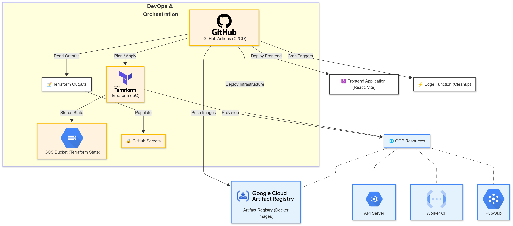
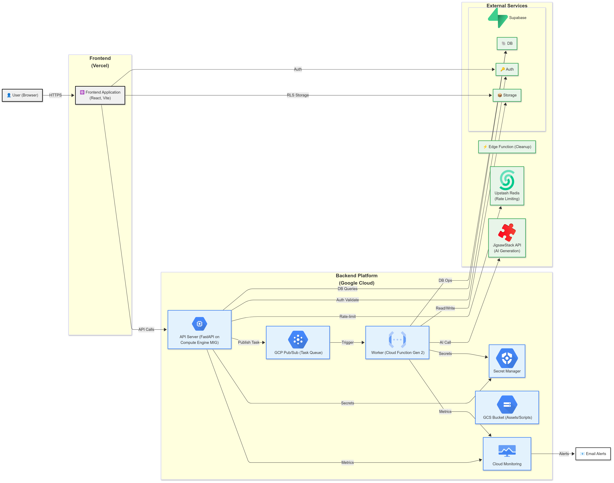
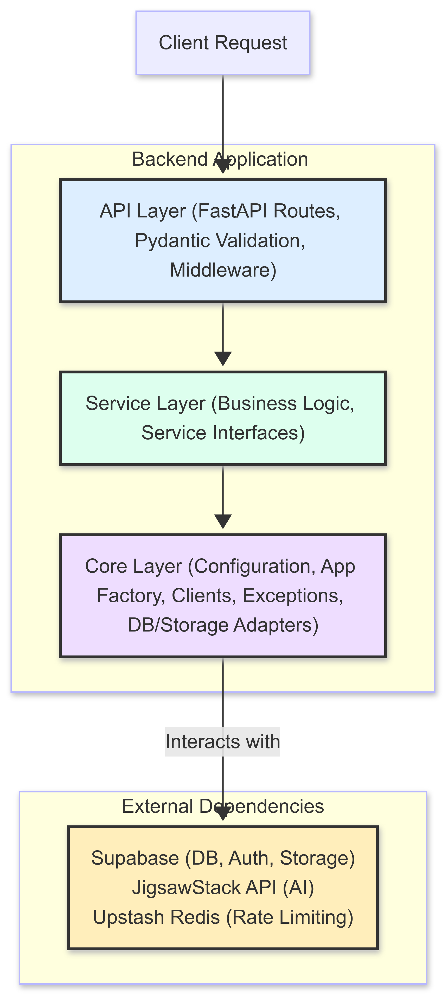
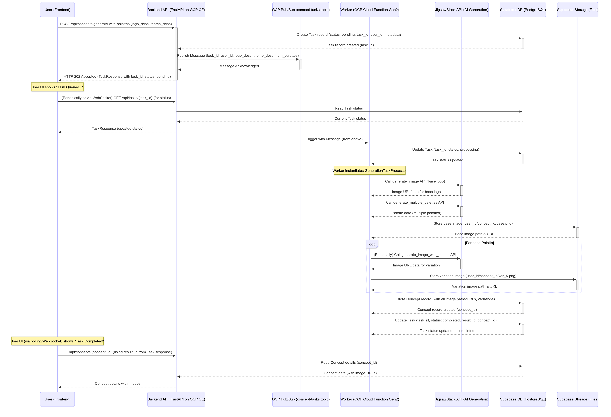
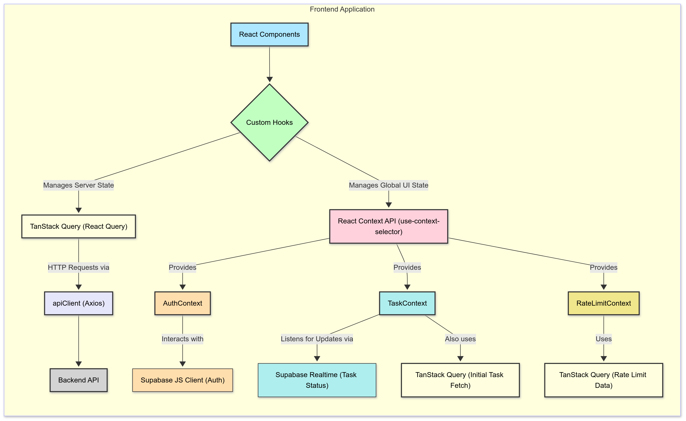

# Concept Visualizer: An AI-Powered Design Tool - Technical Deep Dive

## Introduction

!!! abstract "Purpose"
    This blog post documents the technical architecture and implementation of the **Concept Visualizer**, a web application designed to help users generate and refine visual concepts like logos and color palettes using AI. We'll explore the journey from an idea described in text to a set of visual assets, powered by a modern cloud-native stack.

    Check out the [project GitHub repository](https://github.com/SulmanK/concept_visualizer) for the full code and detailed documentation. Here is the [web application](https://concept-visualizer-blush.vercel.app/). 

    <!-- more -->

!!! info "Problem Statement"
    In the fast-paced world of branding and design, quickly translating abstract ideas into concrete visual representations is a significant challenge. Traditional design processes can be time-consuming and resource-intensive. The Concept Visualizer aims to streamline this by leveraging AI to generate initial designs and facilitate iterative refinement, making visual concept creation more accessible and efficient.

### **What You’ll Learn**

*   **Architecting Decoupled Full-Stack Applications**: Insights into structuring applications with a **FastAPI** backend and a **React** frontend for maintainability and scalability.
*   **Integrating AI for Creative Generation**: How the **JigsawStack API** is leveraged for AI-driven logo and color palette creation, including prompt engineering considerations.
*   **Implementing Asynchronous Task Processing**: Utilizing **GCP Cloud Functions (Gen 2)** and **Pub/Sub** to handle long-running AI tasks, ensuring a non-blocking user experience.
*   **Mastering Infrastructure as Code (IaC)**: Managing a complex, reproducible cloud infrastructure on **Google Cloud Platform** using **Terraform**.
*   **Automating CI/CD Pipelines**: Employing **GitHub Actions** for robust testing, Docker image building, and automated deployments to GCP and Vercel.
*   **Securing Cloud Resources**: Best practices for credential management with **GCP Secret Manager**, IAM, and **Workload Identity Federation**.
*   **Designing Robust APIs**: Implementing effective authentication, rate limiting (with **Upstash Redis**), and standardized error handling in FastAPI.
*   **Developing Modern Frontends**: Using **TanStack Query** for server state, React Context API (with `use-context-selector`) for global UI state, and **Tailwind CSS** for styling.

## System Architecture: A Modular and Scalable Design

The Concept Visualizer is built upon a modular architecture, ensuring scalability, maintainability, and clear separation of concerns. The system primarily consists of a user-facing frontend, a backend API to handle business logic and AI integration, cloud infrastructure to host these components, and automated workflows for CI/CD.

### Build Path Diagram
 <!-- Make sure this path is correct -->

### Runtime Path Diagram
 <!-- Make sure this path is correct -->

The diagrams illustrates the flow:

1.  **User Interaction**: Users engage with the **React Frontend Application**, built with Vite and TypeScript, and hosted on **Vercel**. Vercel was chosen for its excellent developer experience, global CDN, and seamless Git integration for frontend deployments.
2.  **API Communication**: The frontend makes API calls, proxied by Vercel for `/api/*` paths, via HTTPS to the **Backend API Server**.
3.  **Backend Processing**:
    *   The API Server, a **FastAPI application running on a GCP Compute Engine Managed Instance Group (MIG)**, processes requests. FastAPI was selected for its high performance, asynchronous capabilities, and Pydantic-driven data validation.
    *   **Supabase** handles authentication (Supabase Auth) and data persistence (PostgreSQL DB). It was chosen for its integrated BaaS features, simplifying user management and database setup with Row Level Security (RLS).
    *   **Upstash Redis** serves as a high-performance cache for API rate limiting.
    *   The external **JigsawStack API** is the core AI engine for generating images and color palettes.
    *   Computationally intensive or long-running AI tasks are offloaded to a **GCP Cloud Function (Gen 2) Worker** via **GCP Pub/Sub** to ensure the API remains responsive.
4.  **Asynchronous Tasks**:
    *   The Worker, triggered by Pub/Sub messages, performs AI calls to JigsawStack, processes images, and stores results (images and palettes) in **Supabase Storage**.
    *   Task status is tracked and updated in the Supabase database.
5.  **Infrastructure & DevOps**:
    *   The entire **GCP Infrastructure** is defined using **Terraform**, enabling version-controlled, reproducible environments.
    *   **GitHub Actions** automate the CI/CD pipeline: building Docker images (stored in **GCP Artifact Registry**), deploying infrastructure changes via Terraform, deploying the frontend to Vercel, and executing security and maintenance workflows.
    *   **GCP Secret Manager** securely stores all sensitive credentials.
    *   **GCP Cloud Monitoring** provides observability with logs, metrics, and alert policies.
    *   A **GCS Bucket** is dedicated to storing Terraform state (ensuring collaborative and safe IaC practices) and static assets like VM startup scripts.


## Getting Started & Local Development

For those interested in running the Concept Visualizer locally or contributing to its development, here's a streamlined guide to get you up and running. For a more exhaustive setup guide, please refer to the [Setup Documentation on GitHub](https://github.com/SulmanK/concept-visualizer/blob/main/Design/Setup.md).

---

## 1. The Backend: Python, FastAPI, and Asynchronous Power

The backend is the application's core, handling business logic, AI integration, and data persistence. Built with Python 3.11 and FastAPI, it’s designed for performance and scalability.

### Key Components & Technologies:

#### FastAPI
* Chosen for its asynchronous nature (critical for I/O-bound operations like external API calls), high performance, and built-in data validation via Pydantic.

    ```python
    # backend/app/api/routes/concept/generation.py (Illustrative Snippet)
    from fastapi import APIRouter, Depends
    from app.models.concept.request import PromptRequest
    from app.models.task.response import TaskResponse
    from app.api.dependencies import CommonDependencies

    router = APIRouter()

    @router.post("/generate-with-palettes", response_model=TaskResponse)
    async def generate_concept_with_palettes(
        request: PromptRequest,
        commons: CommonDependencies = Depends(),
        # ... other params
    ) -> TaskResponse:
        # ... logic to create and queue a task ...
        user_id = commons.user_id
        # ...
        task = await commons.task_service.create_task(
            user_id=user_id,
            task_type="concept_generation",
            metadata=task_metadata
        )
        # ... publish to Pub/Sub ...
        return TaskResponse(**task) # Simplified
    ```

#### Pydantic
* Used for defining request/response models and settings, providing robust data validation and serialization, reducing runtime errors, and improving code clarity.
    ```python
    # backend/app/models/concept/request.py (Illustrative Snippet)
    from pydantic import BaseModel, Field

    class PromptRequest(BaseModel):
        logo_description: str = Field(
            ...,
            min_length=5,
            max_length=500,
            description="Description of the logo to generate",
        )
        theme_description: str = Field(
            ...,
            min_length=5,
            max_length=500,
            description="Description of the theme/color scheme to generate",
        )
    ```

#### Layered Architecture

##### Diagram
 

##### API Layer
*   **(`backend/app/api/`):**
    *   Handles HTTP requests, validates inputs with Pydantic models, and formats responses.
    *   Routes are logically grouped by domain (e.g., `auth`, `concepts`, `tasks`). A central router in `backend/app/api/router.py` combines these.
    *   Middleware is crucial:
        *   `AuthMiddleware` (`backend/app/api/middleware/auth_middleware.py`): Integrates with Supabase Auth for JWT-based authentication.
            ```python
            # backend/app/api/middleware/auth_middleware.py (Illustrative Snippet)
            class AuthMiddleware(BaseHTTPMiddleware):
                async def dispatch(self, request: Request, call_next: RequestResponseEndpoint) -> Response:
                    if self._is_public_path(request.url.path):
                        return await call_next(request)
                    try:
                        user = self.supabase_auth.get_user_from_request(request)
                        request.state.user = user
                    except AuthenticationError as e:
                        return JSONResponse(status_code=401, content={"detail": e.message})
                    return await call_next(request)
            ```
        *   `RateLimitApplyMiddleware` & `RateLimitHeadersMiddleware` (`backend/app/api/middleware/`): Manage API usage quotas using SlowAPI with an Upstash Redis backend. The middleware order (Auth -> Rate Limiting) is vital so that authenticated users can be identified for personalized limits.
            ```python
            # backend/app/api/middleware/rate_limit_apply.py (Illustrative Snippet)
            # RATE_LIMIT_RULES = { "/concepts/generate": "10/month", ... }
            class RateLimitApplyMiddleware(BaseHTTPMiddleware):
                async def dispatch(self, request: Request, call_next: Callable) -> Response:
                    # ... skip if public or disabled ...
                    user_id = get_user_id(request)
                    limit_info = check_rate_limit(user_id, endpoint, rule)
                    if limit_info.get("exceeded", False):
                        raise HTTPException(status_code=429, ...)
                    request.state.limiter_info = limit_info
                    return await call_next(request)
            ```
        
##### Service Layer
*   **(`backend/app/services/`):**
    *   Encapsulates core business logic.
    *   `ConceptService` (`backend/app/services/concept/service.py`): Orchestrates generation (calling `JigsawStackClient`), interacts with `ImageService`, and uses `PersistenceService`s.
        ```python
        # backend/app/services/concept/service.py (Illustrative Snippet)
        class ConceptService(ConceptServiceInterface):
            async def generate_concept(self, logo_description: str, theme_description: str, ...) -> Dict[str, Any]:
                image_response = await self.client.generate_image(prompt=logo_description, ...)
                image_url = image_response.get("url")
                # ... download, process, persist if user_id and not skip_persistence ...
                return {"image_url": final_image_url, ...}
        ```
    *   `TaskService` (`backend/app/services/task/service.py`): Manages background task lifecycles.
        ```python
        # backend/app/services/task/service.py (Illustrative Snippet)
        class TaskService(TaskServiceInterface):
            async def create_task(self, user_id: str, task_type: str, ...) -> Dict[str, Any]:
                task_data = {"id": str(uuid.uuid4()), "user_id": user_id, ...}
                result = self.client.client.table(self.tasks_table).insert(task_data).execute()
                # ... error handling ...
                return result.data[0]
        ```
    *   Services often implement interfaces (e.g., `ConceptServiceInterface`) for loose coupling and testability.

##### Core Layer
*   **(`backend/app/core/`):**
    *   `config.py`: Defines application settings using Pydantic's `BaseSettings`.
        ```python
        # backend/app/core/config.py (Illustrative Snippet)
        class Settings(BaseSettings):
            JIGSAWSTACK_API_KEY: str = "dummy_key"
            SUPABASE_URL: str = "https://your-project-id.supabase.co"
            # ... other settings ...
            model_config = SettingsConfigDict(env_prefix="CONCEPT_")
        settings = Settings()
        ```
    *   `factory.py`: Contains `create_app` to initialize the FastAPI app.
        ```python
        # backend/app/core/factory.py (Illustrative Snippet)
        def create_app() -> FastAPI:
            app = FastAPI(...)
            # ... configure CORS, middleware, routes, rate limiter ...
            app.add_middleware(AuthMiddleware, ...)
            configure_api_routes(app)
            setup_limiter_for_app(app)
            return app
        ```
    *   Custom exceptions (`exceptions.py`) provide domain-specific error handling.

#### Asynchronous Task Processing

##### Diagram


*   **(`backend/cloud_run/worker/`):**
    *   **Rationale**: AI image generation can be time-consuming. Offloading these tasks to an asynchronous worker prevents API timeouts and provides a better user experience.

##### GCP Cloud Function (Gen 2)
*   Chosen for its container support, longer execution timeout, and seamless Pub/Sub integration.
    *   The worker entry point is `handle_pubsub` in `main.py`, triggered by Pub/Sub messages.
        ```python
        # backend/cloud_run/worker/main.py (Illustrative Snippet)
        @functions_framework.cloud_event
        def handle_pubsub(cloud_event: CloudEvent) -> None:
            async def _async_handle_pubsub() -> None:
                # ... decode message_payload from cloud_event ...
                await process_pubsub_message(message_payload, SERVICES_GLOBAL)
            asyncio.run(_async_handle_pubsub())
        ```
    *   `process_pubsub_message` instantiates task-specific processors (`GenerationTaskProcessor`, `RefinementTaskProcessor`).
        ```python
        # backend/cloud_run/worker/main.py (Illustrative Snippet)
        async def process_pubsub_message(message: Dict[str, Any], services: ServicesDict) -> None:
            task_type = message.get("task_type")
            if task_type == TASK_TYPE_GENERATION:
                processor = GenerationTaskProcessor(...)
            # ...
            if processor:
                await processor.process()
        ```
    *   Processors like `GenerationTaskProcessor` (`backend/cloud_run/worker/processors/generation_processor.py`) manage the task lifecycle.
        ```python
        # backend/cloud_run/worker/processors/generation_processor.py (Illustrative Snippet)
        class GenerationTaskProcessor(BaseTaskProcessor):
            async def process(self) -> None:
                if not await self._claim_task(): return
                try:
                    concept_response = await self._generate_base_image()
                    image_data = await prepare_image_data_from_response(...)
                    # ... store image, generate palettes, create variations, store concept ...
                    await self._update_task_completed(concept_id)
                except Exception as e:
                    await self._update_task_failed(str(e))
        ```

##### Pub/Sub Message Structure (Example)
*   ```json
    {
        "task_id": "unique-task-uuid",
        "user_id": "user-uuid",
        "task_type": "concept_generation",
        "logo_description": "A futuristic cat logo",
        "theme_description": "Neon and dark mode",
        "num_palettes": 5
    }
    ```

#### Database & Storage Integration
*   **(`backend/app/core/supabase/`):**
    *   **Supabase:** Selected as a BaaS for its integrated PostgreSQL, Auth, Storage, and Realtime features.
    *   `SupabaseClient` and `SupabaseAuthClient` (`client.py`) provide typed interfaces.
        ```python
        # backend/app/core/supabase/client.py (Illustrative Snippet)
        class SupabaseClient:
            def __init__(self, url: Optional[str] = None, key: Optional[str] = None, ...):
                self.client = create_client(self.url, self.key)

            def get_service_role_client(self) -> Any: # Returns a new client instance
                return create_client(self.url, settings.SUPABASE_SERVICE_ROLE)
        ```
    *   `ConceptStorage` and `ImageStorage` (`concept_storage.py`, `image_storage.py`) encapsulate data and file operations.
        ```python
        # backend/app/core/supabase/concept_storage.py (Illustrative Snippet)
        class ConceptStorage:
            def store_concept(self, concept_data: Dict[str, Any]) -> Optional[Dict[str, Any]]:
                response = self.client.client.table(self.concepts_table).insert(insert_data).execute()
                # ...
                return response.data[0] if response.data else None
        ```
    *   **Security:** RLS policies in Supabase (defined in `.sql` files in `backend/scripts/`) protect user data. The Cloud Function worker uses the `SERVICE_ROLE_KEY` to bypass RLS for system operations.

#### Docker
*   **(`backend/Dockerfile`, `backend/Dockerfile.worker`):**
    *   The API server uses a multi-stage Dockerfile for optimized builds.
        ```dockerfile
        # backend/Dockerfile (Illustrative Snippet)
        FROM python:3.11-slim AS base
        # ... install OS deps ...
        FROM base AS builder
        WORKDIR /app
        RUN pip install uv
        COPY pyproject.toml README.md ./
        COPY app /app/app
        RUN uv pip install --system --no-cache -e .[dev]
        FROM base
        WORKDIR /app
        COPY --from=builder /usr/local /usr/local
        # ... copy source, CMD ...
        ```
    *   `Dockerfile.worker` includes specific dependencies like OpenCV native libraries for the Cloud Function.

---

## 2. The Frontend: React, Vite, and a Modern UI

The frontend is a single-page application (SPA) built with React 19, Vite, and TypeScript, focused on delivering a responsive and interactive user experience.

### Key Components & Technologies:

#### React 19 & Vite
* Vite provides an extremely fast development server with Hot Module Replacement (HMR) and optimized production builds. React 19 (or latest stable at time of project) brings features for enhanced performance and developer experience.

#### Typescript
* Ensures type safety across the codebase, reducing runtime errors and improving code maintainability.

#### Styling

##### Tailwind CSS
* Leveraged for its utility-first approach, enabling rapid and consistent UI development.
    ```css
    /* frontend/my-app/tailwind.config.js (Illustrative Snippet) */
    module.exports = {
        content: ["./src/**/*.{js,ts,jsx,tsx}"],
        theme: {
        extend: {
            colors: {
            primary: "#4F46E5", // Defined from variables.css
            "primary-dark": "#4338CA",
            // ... other custom colors
            },
            boxShadow: {
            modern: "0 10px 30px -5px rgba(79, 70, 229, 0.2)",
            },
        },
        },
        plugins: [require("@tailwindcss/forms")],
    };
    ```
    
##### Material-UI
* Utilized for some pre-built, accessible UI components (e.g., Modals, Buttons), customized via a central theme in `theme.tsx`.
    ```tsx
    // frontend/my-app/src/theme.tsx (Illustrative Snippet)
    import { createTheme } from "@mui/material/styles";

    export const theme = createTheme({
        palette: {
        primary: { main: "#4F46E5" },
        // ... other palette settings
        },
        typography: { fontFamily: '"Montserrat", sans-serif' },
        components: {
        MuiButton: { styleOverrides: { root: { textTransform: "none" } } },
        },
    });
    ```

##### CSS Modules
* Applied for component-scoped styling where necessary (e.g., `frontend/my-app/src/components/concept/ConceptResult.module.css`).
* Custom animations are defined in `frontend/my-app/src/styles/animations.css`, respecting `prefers-reduced-motion`.

#### State Management
* The frontend employs a combination of TanStack Query for server state and React Context API (optimized with `use-context-selector`) for global UI state. This provides a robust and performant approach to managing application data.

##### Diagram


##### TanStack Query (React Query)
* The primary tool for managing server state. It handles data fetching, caching, background updates, and mutations for concepts, tasks, and API rate limits. Centralized query keys in `frontend/my-app/src/config/queryKeys.ts` ensure consistent cache management and invalidation.
    ```typescript
    // frontend/my-app/src/hooks/useConceptQueries.ts (Illustrative Snippet)
    import { useQuery } from "@tanstack/react-query";
    import { queryKeys } from "../config/queryKeys";
    import { fetchRecentConceptsFromApi } from "../services/conceptService"; // Assumes this function exists

    export function useRecentConcepts(userId?: string, limit: number = 10) {
        return useQuery({
        queryKey: queryKeys.concepts.recent(userId, limit),
        queryFn: () => {
            if (!userId) return Promise.resolve([]); // Or handle as needed
            return fetchRecentConceptsFromApi(userId, limit);
        },
        enabled: !!userId, // Only fetch if userId is available
        staleTime: 60 * 1000, // 1 minute
        });
    }
    ```

##### React Context API
* Manages global UI-related state such as authentication (`AuthContext`), active background task tracking (`TaskContext`), and API rate limit display (`RateLimitContext`). `use-context-selector` optimizes performance by allowing components to subscribe to only specific parts of a context, preventing unnecessary re-renders.
    ```tsx
    // frontend/my-app/src/contexts/AuthContext.tsx (Illustrative Snippet)
    import { createContext } from "use-context-selector";
    // ... other imports and AuthContextType definition ...

    export const AuthContext = createContext<AuthContextType | undefined>(undefined);

    export const AuthProvider: React.FC<{ children: React.ReactNode }> = ({ children }) => {
        // ... state and logic for session, user, isLoading, error ...
        // ... signOut, linkEmail functions ...
        const value = useMemo(() => ({ session, user, ... }), [session, user, ...]);
        return <AuthContext.Provider value={value}>{children}</AuthContext.Provider>;
    };

    // frontend/my-app/src/hooks/useAuth.ts (Illustrative Snippet for selector hook)
    import { useContextSelector } from "use-context-selector";
    import { AuthContext } from "../contexts/AuthContext";

    export const useUserId = () => {
        return useContextSelector(AuthContext, (state) => state?.user?.id);
    };
    ```

#### Routing
*   **React Router**: Manages client-side navigation. Routes are defined in `App.tsx`.
*   **Framer Motion**: Used for smooth page transitions and component animations, enhancing the user experience.

#### API Client
*   **(`frontend/my-app/src/services/apiClient.ts`):**
    *   A centralized Axios instance handles all HTTP communication with the backend.
    *   **Interceptors** are key:
        *   A request interceptor automatically fetches the current Supabase session and attaches the JWT `access_token` to the `Authorization` header.
            ```typescript
            // frontend/my-app/src/services/apiClient.ts (Request Interceptor Snippet)
            axiosInstance.interceptors.request.use(
              async (config) => {
                const { data: { session } } = await supabase.auth.getSession();
                if (session?.access_token) {
                  config.headers = config.headers || {};
                  config.headers.Authorization = `Bearer ${session.access_token}`;
                }
                return config;
              }, /* ... error handling ... */
            );
            ```
        *   A response interceptor handles API errors, parses rate limit headers (updating `RateLimitContext`), and implements a token refresh mechanism for 401 Unauthorized errors. If token refresh fails, it dispatches a global event (`auth-error-needs-logout`) handled by `AuthContext`.
            ```typescript
            // frontend/my-app/src/services/apiClient.ts (Response Error Interceptor Snippet - Simplified)
            axiosInstance.interceptors.response.use(
              (response) => { /* ... handle rate limits ... */ return response; },
              async (error) => {
                const originalRequest = error.config;
                if (error.response?.status === 401 && !originalRequest._retry) {
                  originalRequest._retry = true;
                  // ... attempt supabase.auth.refreshSession() ...
                  // if successful, retry originalRequest with new token
                  // if failed, dispatch 'auth-error-needs-logout'
                }
                // ... parse other errors into custom error classes ...
                return Promise.reject(parsedError);
              }
            );
            ```
    *   Custom error classes (`RateLimitError`, `AuthError`, `ValidationError`, etc.) are thrown by the client, providing structured error information.

#### Component Architecture 
*   Organized into `ui/` (primitive reusable components like `Button`, `Card`), `layout/` (Header, Footer, `MainLayout`), and `features/` (domain-specific components like `ConceptForm`, `ConceptDetailPage`).
*   `OptimizedImage` (`frontend/my-app/src/components/ui/OptimizedImage.tsx`) component handles lazy loading and placeholders for better perceived performance.
*   `ErrorBoundary` components (`frontend/my-app/src/components/ui/ErrorBoundary.tsx`) catch rendering errors.

#### Real-time Task Updates
*   **(`frontend/my-app/src/hooks/useTaskSubscription.ts`):**
    *   Leverages Supabase Realtime capabilities to subscribe to PostgreSQL changes on the `tasks` table.
        ```typescript
        // frontend/my-app/src/hooks/useTaskSubscription.ts (Illustrative Snippet)
        export function useTaskSubscription(taskId: string | null) {
            // ... state for taskData, error, status ...
            useEffect(() => {
                if (!taskId) return;
                const channel = supabase
                    .channel(`task-updates-${taskId}`)
                    .on("postgres_changes", { event: "UPDATE", schema: "public", table: tasksTable, filter: `id=eq.${taskId}` },
                        (payload) => {
                            // Update local state and React Query cache with payload.new
                        }
                    )
                    .subscribe();
                // ... handle subscription status, cleanup ...
                return () => { supabase.removeChannel(channel); };
            }, [taskId, tasksTable]);
            // ... return { taskData, error, status } ...
        }
        ```
    *   When a task's status is updated in the backend, the frontend receives a real-time notification, allowing for immediate UI updates in components like the `TaskStatusBar`.

#### Testing
*   Unit/Integration tests with **Vitest** and **React Testing Library**.
*   E2E, visual regression, and accessibility tests with **Playwright**.

#### Example: Asynchronous Concept Generation UI Flow

1.  User fills the `ConceptForm` (in `ConceptFormSection` on `LandingPage`).
    ```tsx
    // frontend/my-app/src/features/landing/components/ConceptFormSection.tsx (Illustrative Snippet)
    // Uses ConceptForm component
    <ConceptForm
        onSubmit={handleGenerateConcept} // handleGenerateConcept calls the mutation
        status={formStatus}
        // ...
    />
    ```
2.  On submit, `useGenerateConceptMutation` (a React Query hook from `hooks/useConceptMutations.ts`) is invoked.
    ```typescript
    // frontend/my-app/src/hooks/useConceptMutations.ts (Illustrative Snippet)
    export function useGenerateConceptMutation() {
      const { setActiveTask, setIsTaskInitiating } = useTaskContext(); // Assuming TaskContext hook
      const decrementLimit = useRateLimitsDecrement(); // Assuming RateLimit hook

      return useMutation<TaskResponse, Error, PromptRequest>({
        mutationFn: async (data) => {
          setIsTaskInitiating(true);
          decrementLimit("generate_concept");
          const response = await apiClient.post<TaskResponse>(API_ENDPOINTS.GENERATE_CONCEPT, data);
          setActiveTask(response.data.task_id || response.data.id);
          return response.data;
        },
        // ... onError, onSuccess, onSettled ...
      });
    }
    ```
3.  The hook:
    *   Calls `apiClient.post` to the `/api/concepts/generate-with-palettes` endpoint.
    *   Optimistically decrements the `generate_concept` rate limit via `useRateLimitsDecrement`.
    *   Sets the `TaskContext` state to `isTaskInitiating: true`.
4.  The backend API returns a `TaskResponse` with a `task_id` and `status: "pending"`.
5.  The `onSuccess` callback of the mutation sets this `task_id` as the `activeTaskId` in `TaskContext`. `isTaskInitiating` becomes `false`.
6.  The `TaskStatusBar` (subscribed to `TaskContext`) displays "Request queued...".
    ```tsx
    // frontend/my-app/src/components/TaskStatusBar.tsx (Illustrative Snippet)
    const TaskStatusBar: React.FC = () => {
      const { activeTaskData, isTaskInitiating, isTaskPending, isTaskProcessing } = useTaskContext();
      // ... logic to determine message and style based on task state ...
      if (isTaskInitiating) return <div>Preparing...</div>;
      if (isTaskPending) return <div>Queued...</div>;
      // ...
    };
    ```
7.  `useTaskSubscription` (used by `TaskContext` or directly) establishes a Supabase Realtime channel for this `task_id`.
8.  When the backend worker updates the task status (e.g., to "processing", then "completed"), the Realtime event triggers an update in `TaskContext`.
9.  The UI (e.g., `TaskStatusBar`, `ResultsSection`) re-renders to reflect the new status.
10. If completed, `latestResultId` in `TaskContext` is updated. The `ResultsSection` (or `ConceptDetailPage`) uses `useConceptDetail` with this ID to fetch and display the final generated concept.

---
## 3. Terraform: Infrastructure as Code for GCP

All Google Cloud Platform (GCP) infrastructure for the Concept Visualizer is provisioned and managed using Terraform. This Infrastructure as Code (IaC) approach guarantees reproducible, version-controlled, and easily adaptable environments. We selected Terraform for its declarative syntax, comprehensive GCP provider, and robust dependency management, crucial for orchestrating our multi-component cloud architecture.

### Key Infrastructure Resources & Design Decisions:

#### Networking
*   **(`terraform/network.tf`):**
    *   Utilizes GCP's default VPC network for simplicity in this project. For larger-scale production deployments, a custom VPC would offer more granular control.
    *   **Firewall Rules:** Implements a least-privilege approach.
        ```hcl
        # terraform/network.tf (Illustrative Snippet for API Ingress)
        resource "google_compute_firewall" "allow_api_ingress" {
          name    = "${var.naming_prefix}-allow-api-ingress"
          network = data.google_compute_network.default_network.id # Using default network
          allow {
            protocol = "tcp"
            ports    = ["80", "443"] # For HTTP/HTTPS
          }
          source_ranges = ["0.0.0.0/0"] # Open to the internet; consider restricting or using a Load Balancer
          target_tags   = ["${var.naming_prefix}-api-vm-${var.environment}"]
        }

        # Snippet for GCP Health Checks
        data "google_netblock_ip_ranges" "health_checkers" {
          range_type = "health-checkers"
        }
        resource "google_compute_firewall" "allow_gcp_health_checks_to_api" {
          # ...
          source_ranges = data.google_netblock_ip_ranges.health_checkers.cidr_blocks_ipv4
          target_tags   = ["${var.naming_prefix}-api-vm-${var.environment}"]
        }
        ```
        `allow_api_ingress` opens HTTP/HTTPS ports for the API VMs. `allow_ssh_ingress` (not shown for brevity) is restricted to `var.allow_ssh_ips`. Crucially, `allow_gcp_health_checks_to_api` permits Google's health checkers to reach API VMs, essential for MIG health and uptime monitoring.

#### IAM & Service Accounts
*   **(`terraform/iam.tf`):**
    *   **Dedicated Service Accounts:** `api_service_account`, `worker_service_account`, and `cicd_service_account` are created with specific, minimal roles.
        ```hcl
        # terraform/iam.tf (Illustrative Snippet for API Service Account)
        resource "google_service_account" "api_service_account" {
          project      = var.project_id
          account_id   = "${var.naming_prefix}-api-${var.environment}"
          display_name = "SA for Concept Viz API (${var.environment})"
        }

        resource "google_project_iam_member" "api_sa_secret_accessor" {
          project = var.project_id
          role    = "roles/secretmanager.secretAccessor"
          member  = "serviceAccount:${google_service_account.api_service_account.email}"
        }
        ```
    *   **Workload Identity Federation:** This is a key security feature. `google_iam_workload_identity_pool` and `google_iam_workload_identity_pool_provider` allow GitHub Actions workflows to impersonate the `cicd_service_account` using short-lived OIDC tokens from GitHub, eliminating the need to store long-lived GCP service account keys as GitHub secrets.
        ```hcl
        # terraform/iam.tf (Illustrative Snippet for Workload Identity)
        resource "google_iam_workload_identity_pool" "github_pool" {
          project                   = var.project_id
          workload_identity_pool_id = "gh-pool-${var.environment}-${random_string.pool_suffix.result}"
          # ...
        }

        resource "google_iam_workload_identity_pool_provider" "github_provider" {
          project                            = var.project_id
          workload_identity_pool_id          = google_iam_workload_identity_pool.github_pool.workload_identity_pool_id
          workload_identity_pool_provider_id = "gh-provider-${var.environment}"
          oidc { issuer_uri = "https://token.actions.githubusercontent.com" }
          attribute_mapping = { "google.subject" = "assertion.sub", ... }
          attribute_condition = "attribute.repository == \"${var.github_repo}\"" # Scoped to specific repo
        }
        ```

#### Compute Engine
*   **(`terraform/compute.tf`):**
    *   **API Server:** A `google_compute_instance_group_manager` (MIG) is used. Even with a `target_size = 1` (for cost-effectiveness in smaller environments), a MIG provides robust instance template management for updates and a clear path for future auto-scaling.
    *   `google_compute_address.api_static_ip`: Ensures the API has a stable public IP.
    *   `google_compute_instance_template.api_template`: Defines the VM configuration (Debian 11, machine type from `var.api_vm_machine_type`) and crucially references the startup script `terraform/scripts/startup-api.sh`. This script automates Docker installation, API image pulling from Artifact Registry, and container startup with environment variables fetched from instance metadata and GCP Secret Manager.
        ```hcl
        # terraform/compute.tf (Illustrative Snippet for Instance Template)
        resource "google_compute_instance_template" "api_template" {
          project      = var.project_id
          name_prefix  = "${var.naming_prefix}-api-tpl-${var.environment}-"
          machine_type = var.api_vm_machine_type
          disk { source_image = "debian-cloud/debian-11" }
          network_interface {
            network = data.google_compute_network.default_network.id
            access_config { nat_ip = google_compute_address.api_static_ip[0].address }
          }
          service_account {
            email  = google_service_account.api_service_account.email
            scopes = ["cloud-platform"]
          }
          metadata_startup_script = file("${path.module}/scripts/startup-api.sh")
          metadata = {
            environment   = var.environment
            naming_prefix = var.naming_prefix
            # Docker image URL is passed via metadata in deploy_backend.yml during instance recreation
          }
        }
        ```

#### Cloud Function
*   **(`terraform/cloud_function.tf`, `terraform/cloud_function_source.tf`):**
    *   **Worker Deployment:** A `google_cloudfunctions2_function` resource defines the Gen 2 Cloud Function. Gen 2 was chosen for its native container support (essential for dependencies like OpenCV), longer execution times (up to 9 minutes, suitable for AI tasks), and more flexible eventing compared to Gen 1.
    *   **Source Handling:** Terraform initially deploys the function configuration using a placeholder ZIP from `google_storage_bucket_object.placeholder_source_zip`. The actual worker's container image (built by CI/CD) is deployed by the `deploy_backend.yml` GitHub Action workflow, which directly updates the Cloud Function with the new image from Artifact Registry (`gcloud functions deploy ... --docker-image ...` or similar). Terraform primarily manages the function's immutable configuration.
        ```hcl
        # terraform/cloud_function.tf (Illustrative Snippet)
        resource "google_cloudfunctions2_function" "worker_function" {
          name        = "${var.naming_prefix}-worker-${var.environment}"
          location    = var.region
          build_config {
            runtime     = "python311" # Required even for container deployment
            entry_point = "handle_pubsub"
            source { # Placeholder for initial Terraform apply
              storage_source {
                bucket = google_storage_bucket.function_source_placeholder.name
                object = google_storage_bucket_object.placeholder_source_zip.name
              }
            }
          }
          service_config {
            max_instance_count  = var.worker_max_instances
            service_account_email = google_service_account.worker_service_account.email
            environment_variables = { GCP_PROJECT_ID = var.project_id, ... }
            secret_environment_variables { # Example for one secret
              key    = "CONCEPT_SUPABASE_URL"
              secret = google_secret_manager_secret.supabase_url.secret_id
              # ... other secrets ...
            }
          }
          event_trigger {
            trigger_region = var.region
            event_type     = "google.cloud.pubsub.topic.v1.messagePublished"
            pubsub_topic   = google_pubsub_topic.tasks_topic.id
            retry_policy   = "RETRY_POLICY_RETRY"
          }
        }
        ```
    *   **Trigger:** Configured to be triggered by messages on the `tasks_topic` Pub/Sub topic.

#### Pub/Sub
*   **(`terraform/pubsub.tf`):**
    *   `google_pubsub_topic.tasks_topic`: The central message queue for decoupling the API from the worker and enabling asynchronous task processing.
    *   `google_pubsub_subscription.worker_subscription`: Connects the worker Cloud Function to the `tasks_topic`. It's configured with `enable_exactly_once_delivery = true` for improved message processing reliability.
        ```hcl
        # terraform/pubsub.tf (Illustrative Snippet)
        resource "google_pubsub_topic" "tasks_topic" {
          name    = "${var.naming_prefix}-tasks-${var.environment}"
        }

        resource "google_pubsub_subscription" "worker_subscription" {
          name  = "${var.naming_prefix}-worker-sub-${var.environment}"
          topic = google_pubsub_topic.tasks_topic.name
          ack_deadline_seconds = 60 # Example
          retry_policy { minimum_backoff = "10s" }
          enable_exactly_once_delivery = true
        }
        ```

#### Secret Manager
*   **(`terraform/secrets.tf`):**
    *   Defines `google_secret_manager_secret` resources (as empty shells) for all sensitive credentials.
    *   `google_secret_manager_secret_iam_member` grants specific service accounts (`api_service_account`, `worker_service_account`) the `roles/secretmanager.secretAccessor` role *only* for the secrets they require.
        ```hcl
        # terraform/secrets.tf (Illustrative Snippet)
        resource "google_secret_manager_secret" "supabase_url" {
          secret_id = "${var.naming_prefix}-supabase-url-${var.environment}"
          # ... replication ...
        }

        resource "google_secret_manager_secret_iam_member" "api_sa_can_access_supabase_url" {
          secret_id = google_secret_manager_secret.supabase_url.secret_id
          role      = "roles/secretmanager.secretAccessor"
          member    = "serviceAccount:${google_service_account.api_service_account.email}"
        }
        ```

#### Artifact Registry
*   **(`terraform/artifact_registry.tf`):**
    *   `google_artifact_registry_repository.docker_repo`: A private Docker repository to securely store the API and worker container images built by CI/CD.
        ```hcl
        # terraform/artifact_registry.tf (Illustrative Snippet)
        resource "google_artifact_registry_repository" "docker_repo" {
          location      = var.region
          repository_id = "${var.naming_prefix}-docker-repo"
          format        = "DOCKER"
        }
        ```

#### Cloud Storage
*   **(`terraform/storage.tf`):**
    *   `google_storage_bucket.assets_bucket`: Used to store VM startup scripts (`terraform/scripts/startup-api.sh`) and potentially other non-sensitive static assets.
    *   **Terraform State Backend:** The `main.tf` configures a GCS backend using a *manually pre-created* bucket (`var.manual_tf_state_bucket_name`). This is crucial for team collaboration, providing a centralized, versioned, and locked state.
        ```hcl
        # terraform/main.tf (Backend Configuration Snippet)
        terraform {
          backend "gcs" {
            # Bucket name is passed via -backend-config during init
            prefix = "terraform/state" # Workspace name (dev/prod) is appended automatically
          }
        }
        ```

#### Monitoring
*   **(`terraform/monitoring.tf`):**
    *   **Log-Based Metrics:** `google_logging_metric.concept_task_failures` creates a custom metric to count specific error patterns from Cloud Function logs, enabling alerts on critical worker failures.
        ```hcl
        # terraform/monitoring.tf (Illustrative Log-Based Metric Snippet)
        resource "google_logging_metric" "concept_task_failures" {
          name   = "${var.naming_prefix}-task-fails-${var.environment}"
          filter = "resource.type=\"cloud_function\" AND resource.labels.function_name=\"${google_cloudfunctions2_function.worker_function.name}\" AND jsonPayload.severity=\"ERROR\" AND (jsonPayload.taskType=\"concept_generation\" OR jsonPayload.taskType=\"concept_refinement\")"
          metric_descriptor { metric_kind = "DELTA"; value_type  = "INT64"; }
        }
        ```
    *   **Alerting:** `google_monitoring_alert_policy` resources define alerts (e.g., for task failures, API/Frontend unavailability) and send notifications via an email channel.
    *   **Uptime Checks:** `google_monitoring_uptime_check_config` resources are set up for the API's health endpoint and the Vercel-hosted frontend URL.

### Environment Management & Deployment Scripts:

*   Terraform workspaces (`dev` and `prod`) isolate state and allow for different configurations per environment using `.tfvars` files (e.g., `environments/dev.tfvars`).
*   The `scripts/gcp_apply.sh` orchestrates a multi-step deployment:
    1.  **IAM & Secrets Shells First**: Critical for dependency management.
    2.  **Secret Population (`gcp_populate_secrets.sh`):** Reads from local `.env.{environment}` files (e.g., `backend/.env.develop`) and populates GCP Secret Manager. This keeps secrets out of Terraform state and source control.
    3.  **Full Infrastructure Apply**: Deploys remaining resources.
    4.  **Docker Build & Push**: For the API image.
    5.  **VM Update/Restart**: Ensures the API VM uses the new image.
    6.  **Startup Script Upload (`upload_startup_scripts.sh`):** Updates the VM startup script in GCS.
    7.  **GitHub Secret Population (`gh_populate_secrets.sh`):** Syncs Terraform outputs (like SA emails, Workload Identity Provider name) to GitHub Actions secrets.
    8.  **Vercel Config Update**: Modifies `frontend/my-app/vercel.json` with the API VM's new external IP and commits/pushes it, ensuring the Vercel frontend correctly proxies API requests.

---
## 4. GitHub Actions Workflows

GitHub Actions automates the Concept Visualizer's entire development lifecycle—from testing and builds to deployments and security scans. We chose GitHub Actions for its seamless repository integration, vast library of reusable actions, and its power in building sophisticated CI/CD pipelines directly within our version control, streamlining our development and release processes.

### Core CI/CD Pipeline:

#### Continuous Integration tests
*   **`ci-tests.yml` (CI):**
    *   **Triggers**: Runs on pushes and pull requests to `main` and `develop` branches, and can be manually dispatched (`workflow_dispatch`).
    *   **Responsibilities**:
        *   Performs comprehensive **backend testing** (Pytest, Flake8, Mypy).
            ```yaml
            # .github/workflows/ci-tests.yml (Backend Test Snippet)
            - name: Run Pytest
              run: uv run pytest tests/ # Assuming uv is set up
              env: # Mock environment variables for tests
                CONCEPT_SUPABASE_URL: "https://example.supabase.co"
                # ... other mock env vars ...
            ```
        *   Conducts **frontend testing** (Vitest, ESLint, TypeScript checks).
            ```yaml
            # .github/workflows/ci-tests.yml (Frontend Test Snippet)
            - name: Run NPM Tests
              working-directory: ./frontend/my-app
              run: npm test
              env:
                CI: true
                VITE_API_URL: "http://localhost:8000/api" # Mock API URL
                # ... other mock env vars ...
            ```
        *   If all tests and linters pass for pushes to `main` or `develop`, it **builds the API Docker image** and pushes it to GCP Artifact Registry. GCP authentication for this step uses Workload Identity Federation.
            ```yaml
            # .github/workflows/ci-tests.yml (Docker Build & Push Snippet)
            - name: Authenticate to Google Cloud
              uses: google-github-actions/auth@v2
              with:
                workload_identity_provider: ${{ env.WORKLOAD_IDENTITY_PROVIDER }} # From branch logic
                service_account: ${{ env.CICD_SERVICE_ACCOUNT_EMAIL }}
            - name: Build and Push API Image
              uses: docker/build-push-action@v5
              with:
                context: ./backend
                file: ./backend/Dockerfile
                push: true
                tags: |
                  ${{ secrets.GCP_REGION }}-docker.pkg.dev/${{ env.GCP_PROJECT_ID }}/${{ env.ARTIFACT_REGISTRY_REPO_NAME }}/concept-api-${{ env.ENVIRONMENT }}:${{ github.sha }}
                  ${{ secrets.GCP_REGION }}-docker.pkg.dev/${{ env.GCP_PROJECT_ID }}/${{ env.ARTIFACT_REGISTRY_REPO_NAME }}/concept-api-${{ env.ENVIRONMENT }}:latest
            ```

#### Deploy Backend
*   **`deploy_backend.yml` (CD):**
    *   **Triggers**: Runs automatically upon the successful completion of the `ci-tests.yml` workflow on the `main` or `develop` branch (`workflow_run`).
    *   **Responsibilities**:
        1.  **Environment Detection**: Determines `dev` or `prod` GCP environment based on the Git branch of the triggering workflow.
            ```yaml
            # .github/workflows/deploy_backend.yml (Environment Detection Snippet)
            - name: Set Environment Specifics
              id: set_env
              run: |
                if [[ "${{ github.event.workflow_run.head_branch || github.ref_name }}" == "develop" ]]; then
                  echo "ENVIRONMENT=dev" >> $GITHUB_ENV
                  echo "GCP_PROJECT_ID=${{ secrets.DEV_GCP_PROJECT_ID }}" >> $GITHUB_ENV
                  # ... more dev secrets ...
                elif [[ "${{ github.event.workflow_run.head_branch || github.ref_name }}" == "main" ]]; then
                  echo "ENVIRONMENT=prod" >> $GITHUB_ENV
                  echo "GCP_PROJECT_ID=${{ secrets.PROD_GCP_PROJECT_ID }}" >> $GITHUB_ENV
                  # ... more prod secrets ...
                fi
            ```
        2.  **GCP Authentication**: Securely authenticates to GCP using Workload Identity Federation.
        3.  **Cloud Function Deployment**: Deploys the worker Cloud Function (Gen 2). The `gcloud functions deploy` command is used, building from the source in `./backend` if no specific image is provided, or can be configured to use an image from Artifact Registry. This ensures the latest worker code is deployed.
            ```yaml
            # .github/workflows/deploy_backend.yml (Cloud Function Deploy Snippet)
            - name: Deploy Cloud Function Worker
              run: |
                FUNCTION_NAME="${{ env.NAMING_PREFIX }}-worker-${{ env.ENVIRONMENT }}"
                # ... set SECRETS_ARG dynamically ...
                gcloud functions deploy "$FUNCTION_NAME" \
                  --gen2 \
                  --region="${{ env.REGION }}" \
                  --runtime=python311 \
                  --entry-point=handle_pubsub \
                  --trigger-topic="$TASKS_TOPIC_NAME" \
                  --set-env-vars="..." \
                  --set-secrets="$SECRETS_ARG" \
                  --source="./backend" # Or --docker-image if pre-built
                  # ... other flags ...
            ```
        4.  **API VM Deployment/Update**:
            *   Creates a new **instance template** for the Compute Engine MIG, referencing the Docker image from Artifact Registry (pushed by `ci-tests.yml`, tagged with the commit SHA).
            *   Updates the MIG to use this new template, triggering a deployment strategy (e.g., rolling update) to deploy the new API version.
            *   Cleans up old, unused instance templates.
            ```yaml
            # .github/workflows/deploy_backend.yml (API VM Deploy Snippet - Simplified)
            - name: Deploy API to Compute Engine MIG
              run: |
                IMAGE_URL="${{ env.REGION }}-docker.pkg.dev/.../concept-api-${{ env.ENVIRONMENT }}:${{ github.sha }}"
                TEMPLATE_NAME="${{ env.NAMING_PREFIX }}-api-tpl-$(echo "${{ github.sha }}" | cut -c1-8)-$(date +%Y%m%d%H%M%S)"
                MIG_NAME="${{ env.NAMING_PREFIX }}-api-igm-${{ env.ENVIRONMENT }}"
                
                gcloud compute instance-templates create "$TEMPLATE_NAME" \
                  --image-family=debian-11 --machine-type=e2-micro \
                  --metadata=startup-script-url=gs://...,docker-image="$IMAGE_URL" \
                  # ... other template flags ...

                gcloud compute instance-groups managed set-instance-template "$MIG_NAME" \
                  --template="$TEMPLATE_NAME" --zone="${{ env.GCP_ZONE }}"
                
                # ... logic for rolling update / recreate ...
                # ... logic for cleaning up old templates ...
            ```
        5.  **Frontend Monitoring Update**:
            *   Dynamically fetches the **latest Vercel deployment URL**.
            *   Uses Terraform (selecting the `dev` or `prod` workspace) to **update GCP Monitoring resources** (`google_monitoring_uptime_check_config.frontend_availability`, `google_monitoring_alert_policy.frontend_availability_failure_alert`) to target this new URL.
            ```yaml
            # .github/workflows/deploy_backend.yml (Frontend Monitoring Update Snippet - Simplified)
            - name: Apply/Update Frontend Monitoring Resources
              env:
                VERCEL_URL: ${{ steps.get_vercel_url.outputs.url }}
                # ... other TF vars ...
              run: |
                CLEAN_VERCEL_HOST=$(echo "$VERCEL_URL" | sed -E 's~^https?://~~' | sed -E 's~/.*$~~')
                terraform -chdir=terraform init -reconfigure -backend-config="bucket=$TF_STATE_BUCKET"
                terraform -chdir=terraform workspace select "${{ env.ENVIRONMENT }}"
                cat > terraform/temp_frontend_monitoring.tfvars <<EOF
                project_id = "${{ env.GCP_PROJECT_ID }}"
                frontend_hostname = "$CLEAN_VERCEL_HOST"
                # ... other necessary vars for these specific targets ...
                EOF
                terraform -chdir=terraform apply -auto-approve \
                  -var-file="temp_frontend_monitoring.tfvars" \
                  -target=google_monitoring_uptime_check_config.frontend_availability \
                  -target=google_monitoring_alert_policy.frontend_availability_failure_alert
            ```

#### Playwright
*   **`frontend/my-app/.github/workflows/playwright.yml` (Frontend E2E):**
    *   Dedicated workflow for frontend Playwright tests.
    *   Jobs for functional E2E, **visual regression testing**, and **accessibility testing** (using `axe-core`).
        ```yaml
        # frontend/my-app/.github/workflows/playwright.yml (Visual Regression Test Snippet)
        - name: Run visual regression tests
          run: npx playwright test -c visual-regression.config.ts # Uses a specific Playwright config
        - name: Upload visual test results
          if: always()
          uses: actions/upload-artifact@v3
          with:
            name: visual-regression-report
            path: |
              test-results/visual-regression/
              tests/e2e/__snapshots__/ # Path to snapshots
        ```

### Security & Maintenance Workflows:

#### Environment Security
*   **`env_check.yml` (Environment Security):**
    *   **Secret Scanning**: Uses **GitLeaks** to scan history for committed secrets.
        ```yaml
        # .github/workflows/env_check.yml (GitLeaks Snippet)
        - name: Run GitLeaks
          run: |
            gitleaks detect --config=gitleaks.toml --report-format json --report-path gitleaks-report.json || true
        ```
    *   **Example File Validation**: Ensures `.env.example` files contain only placeholders.

#### Security Scan
*   **`security_scan.yml` (Code & Dependency Security):**
    *   **Static Analysis**: Runs **GitHub CodeQL** for Python and JavaScript/TypeScript.
        ```yaml
        # .github/workflows/security_scan.yml (CodeQL Snippet)
        - name: Initialize CodeQL
          uses: github/codeql-action/init@v3
          with:
            languages: ${{ matrix.language }} # Runs for 'javascript', 'python'
        - name: Perform CodeQL Analysis
          uses: github/codeql-action/analyze@v3
        ```
    *   **Dependency Scanning**: Uses `safety` for Python and `npm audit` for the frontend.

#### Schedule Cleanup
*   **`schedule-cleanup.yml` (Data Maintenance):**
    *   **Scheduled Execution**: Runs hourly via cron (`0 * * * *`).
    *   **Triggers Supabase Edge Function**: Makes an HTTP POST to the `cleanup-old-data` Supabase Edge Function URL.
        ```yaml
        # .github/workflows/schedule-cleanup.yml (Curl Snippet)
        - name: Call Cleanup Edge Function
          run: |
            curl -L -X POST '${{ env.SUPABASE_URL }}' \ # URL set based on branch
              -H 'Authorization: Bearer ${{ env.SUPABASE_KEY }}' \
              -H 'Content-Type: application/json'
        ```

### Key Workflow Features:

*   **Environment-Specific Logic**: Workflows dynamically select GCP project IDs, secrets, and configurations based on the Git branch (`develop` or `main`).
*   **Artifact Management**: Docker images (in Artifact Registry) and test reports (GitHub artifacts) are versioned and stored.
*   **Permissions**: Utilizes granular permissions for GitHub Actions tokens, especially for Workload Identity Federation with GCP.

---

## External Services Integration

The Concept Visualizer relies on several key external services, each playing a vital role:

*   **Supabase:** Chosen as an integrated Backend-as-a-Service (BaaS) to accelerate development.
    *   **PostgreSQL Database:** Stores application data like user information, concept metadata (prompts, descriptions, paths to stored images), color palette details, and background task statuses. Row Level Security (RLS) policies are defined in `pg-bucket-schema-policies.sql` scripts to ensure users can only access their own data.
    *   **Authentication:** Manages user sign-up, login, and session handling. The frontend `AuthContext` and backend `AuthMiddleware` integrate with Supabase Auth. Anonymous authentication is supported for guest users.
    *   **Storage:** Stores the actual generated image files (concepts and palette variations) in separate GCS-backed buckets (e.g., `concept-images-dev`, `palette-images-dev`). Access is controlled via RLS and signed URLs.
    *   **Edge Functions:** The `cleanup-old-data` function (TypeScript, Deno runtime) is deployed to Supabase to perform scheduled data hygiene tasks (e.g., deleting concepts older than 30 days). This is triggered by a GitHub Actions cron job.
*   **JigsawStack API:** This is the core AI engine for the application.
    *   The backend's `JigsawStackClient` interacts with this third-party API to:
        *   Generate initial logo/concept images from text prompts.
        *   Generate diverse color palettes based on theme descriptions.
        *   Refine existing images based on further user input.
    *   Prompt engineering logic within the client enhances user inputs for better AI results.
*   **Upstash Redis:** Provides a managed, serverless Redis instance.
    *   Primarily used by the backend's API rate limiting system (implemented with SlowAPI). It stores request counts for different users/IPs and endpoints, enabling efficient enforcement of usage quotas. Its serverless nature simplifies management and scaling.
*   **Vercel:** Hosts the static frontend application.
    *   Chosen for its seamless Git integration, global CDN for fast content delivery, and easy-to-configure CI/CD for the frontend.
    *   The `vercel.json` file configures **API rewrites/proxies**, directing requests from the frontend (e.g., `/api/*`) to the backend API server running on GCP. This provides a unified domain for the application and simplifies CORS configuration. The `gcp_apply.sh` script automatically updates this file with the API VM's IP address after infrastructure changes.

---

## Conclusion

The Concept Visualizer stands on three technical pillars: a modern React/Vite frontend, a high-performance FastAPI backend, and a scalable GCP infrastructure defined by Terraform. Its design prioritizes asynchronous AI processing, robust security (IAM, Secret Manager), and extensive CI/CD automation via GitHub Actions. This foundation ensures a powerful AI design tool that is both user-centric and developer-efficient, with clear avenues for growth.