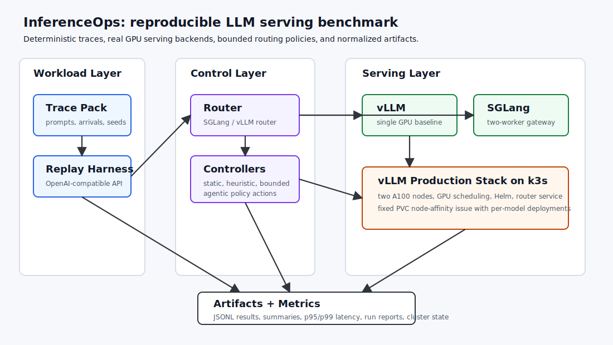

---
draft: false
date: 2026-06-08
slug: inferenceops-llm-serving-gpu-benchmark

categories:
  - AI
  - LLM
  - Benchmark
  - Evaluation
  - Cloud Architecture
  - MLOps
authors:
  - sulmank
---

# InferenceOps: Building a Reproducible LLM Serving Lab

## Introduction

!!! abstract "Purpose"
    InferenceOps is a reproducible lab for studying LLM inference systems under real serving conditions: request replay, routing, GPU workers, controller policies, and Kubernetes deployment. The goal was not just to serve a model. The goal was to build enough infrastructure to compare serving decisions with repeatable workloads, real GPU runs, and inspectable artifacts.

!!! info "Problem Statement"
    LLM serving performance depends on workload shape, prompt locality, routing policy, backend health, GPU scheduling, and deployment topology. A useful benchmark needs deterministic traces, real backend runs, raw metrics, and enough operational detail to explain why a system behaves the way it does.

### **What you'll learn**

* **How I built a serving benchmark from a single vLLM baseline to a two-node GPU cluster.**
* **Why deterministic trace replay matters for LLM inference evaluation.**
* **How SGLang Gateway and vLLM Production Stack fit into an inference operations workflow.**
* **What heuristic and agentic controllers can change, and what they cannot prove without strong baselines.**
* **What broke during real Kubernetes GPU deployment and how I fixed it.**

<!-- more -->

## Why I built this

Most LLM projects focus on model quality, prompts, retrieval, or agents. Those are important, but production LLM systems also live or die on the serving layer.

A serving system has to answer questions like:

- Can the same workload be replayed later with comparable results?
- Which routing policy handles repeated-prefix traffic better?
- What happens when one worker is slower or overloaded?
- Does adding a second GPU actually improve throughput?
- What does Kubernetes add once the model server becomes a production service?

InferenceOps was my attempt to make those questions testable in a small but realistic workspace.

## System overview



The project has five core layers:

- **Trace packs:** deterministic workload definitions with prompts, arrival times, model metadata, prefix groups, and target output lengths.
- **Replay harness:** sends OpenAI-compatible requests into serving backends and records per-request results.
- **Serving backends:** vLLM, SGLang Gateway, and vLLM Production Stack.
- **Controllers:** static policies, heuristic policies, and a bounded optional agentic controller.
- **Artifacts and metrics:** normalized JSON/CSV outputs, summaries, run reports, and milestone recaps.

The important design decision was to separate the request/data plane from the control plane. OpenAI-compatible APIs are useful for sending requests, but backend-specific adapters are still needed for policy changes, worker health, metrics, drain/resume behavior, and unsupported operations.

## Milestone roadmap

| Milestone | Focus | What it proved |
| --- | --- | --- |
| M0 | Single vLLM baseline | A real OpenAI-compatible vLLM server could be deployed and measured on a GPU VM. |
| M1 | Deterministic trace replay | Workloads could be replayed with stable prompts, timing, model metadata, and artifacts. |
| M2 | SGLang Gateway router | Multiple vLLM workers could be routed through a real serving gateway. |
| M3 | Heuristic controller policies | Static and heuristic policies could be compared across the same trace pack. |
| M4 | Bounded agentic controller | An LLM-driven controller could choose among safe, deterministic policy actions offline. |
| M5 | vLLM Production Stack on k3s | The benchmark could run against an industry-style Kubernetes serving stack. |
| M6 | Two-node GPU cluster | Two vLLM model pods could run across two A100 nodes, exposing real scaling and storage constraints. |

## Milestone 0: vLLM baseline

The first step was a single-backend vLLM deployment on a Lambda GPU VM. This gave the project a known-good serving baseline before adding routers or controllers.

| Field | Value |
| --- | --- |
| Backend | vLLM 0.21.0 |
| GPU | NVIDIA A10 |
| Model | `Qwen/Qwen2.5-1.5B-Instruct` |
| Requests | 100 |
| Request rate | 2 req/s |

| Metric | Value |
| --- | ---: |
| Successful requests | 100 |
| Failed requests | 0 |
| Request throughput | 1.956 req/s |
| Output throughput | 250.37 tok/s |
| TTFT p95 | 64.91 ms |
| TPOT p95 | 9.40 ms |
| GPU utilization avg / max | 70.88% / 100% |

This milestone was intentionally simple. Before testing routers, controllers, or Kubernetes, I wanted one real model server producing reliable artifacts.

## Milestone 1: deterministic trace replay

The next step was moving from fixed benchmark commands to deterministic trace generation and replay.

The first trace pack, `traces/pack_v1`, included three scenarios:

| Scenario | Records | Purpose |
| --- | ---: | --- |
| `shared_prefix_burst` | 48 | Repeated-prefix traffic to test cache/locality-sensitive behavior. |
| `mixed_short_long` | 48 | Mixed prompt and output sizes to expose tail latency differences. |
| `degraded_worker` | 48 | A workload shape used later for routing and worker-health experiments. |

The trace schema stores more than token counts:

- prompt text or deterministic prompt-generation metadata
- tokenizer and model revision
- seed
- prefix group
- input and output targets
- request arrival time

That matters because token lengths alone are not enough to evaluate cache locality or repeated-prefix behavior.

The full trace pack replay on vLLM completed with zero failures:

| Scenario | Requests | Failed | P50 ms | P95 ms | P99 ms |
| --- | ---: | ---: | ---: | ---: | ---: |
| `shared_prefix_burst` | 48 | 0 | 298.18 | 302.41 | 634.58 |
| `mixed_short_long` | 48 | 0 | 226.64 | 445.44 | 446.80 |
| `degraded_worker` | 48 | 0 | 298.90 | 301.65 | 302.27 |

## Milestone 2: SGLang Gateway router

Milestone 2 added a real router layer using SGLang Gateway in front of two workers.

```text
replay_trace_pack.py -> SGLang Gateway :30000
                         -> SGLang worker 1 :31001
                         -> SGLang worker 2 :31002
```

The benchmark compared three routing policies across the three trace scenarios:

- `round_robin`
- `cache_aware`
- `power_of_two`

All policy/scenario runs completed successfully: `432` total requests, `0` failures.

| Policy | Scenario | Requests | Failed | P95 ms | Duration s |
| --- | --- | ---: | ---: | ---: | ---: |
| `cache_aware` | `degraded_worker` | 48 | 0 | 195.37 | 28.87 |
| `cache_aware` | `mixed_short_long` | 48 | 0 | 288.97 | 31.38 |
| `cache_aware` | `shared_prefix_burst` | 48 | 0 | 193.33 | 13.16 |
| `power_of_two` | `degraded_worker` | 48 | 0 | 195.58 | 28.82 |
| `power_of_two` | `mixed_short_long` | 48 | 0 | 287.92 | 31.22 |
| `power_of_two` | `shared_prefix_burst` | 48 | 0 | 193.49 | 13.13 |
| `round_robin` | `degraded_worker` | 48 | 0 | 196.72 | 29.01 |
| `round_robin` | `mixed_short_long` | 48 | 0 | 289.63 | 31.47 |
| `round_robin` | `shared_prefix_burst` | 48 | 0 | 196.92 | 13.29 |

This was the first point where the project became more than a load generator. It could compare routing behavior under repeatable workloads.

## Milestone 3: heuristic controller policies

Milestone 3 added controller logic on top of the routing benchmark. The controller action space was bounded:

```text
set_policy in {round_robin, cache_aware, power_of_two}
```

Implemented controllers included:

- `static_round_robin`
- `static_cache_aware`
- `static_power_of_two`
- `scenario_heuristic`
- `tail_guard`

The first heuristic controller selected policies by scenario:

| Scenario | Selected Policy | Reason |
| --- | --- | --- |
| `shared_prefix_burst` | `cache_aware` | Prefer cache locality for repeated-prefix traffic. |
| `mixed_short_long` | `power_of_two` | Protect short requests from long-prefill imbalance. |
| `degraded_worker` | `power_of_two` | Prefer load-sensitive routing when a worker looks degraded. |

The live controller run completed `144` requests with `0` failures.

| Scenario | Requests | Failed | P50 ms | P95 ms | P99 ms |
| --- | ---: | ---: | ---: | ---: | ---: |
| `shared_prefix_burst` | 48 | 0 | 168.21 | 197.93 | 200.60 |
| `mixed_short_long` | 48 | 0 | 149.29 | 293.51 | 298.59 |
| `degraded_worker` | 48 | 0 | 183.45 | 196.58 | 196.88 |

The key outcome was not that one heuristic is universally best. The important part was building a repeatable controller evaluation path with finite, auditable actions.

## Milestone 4: bounded agentic controller

The agentic controller was intentionally introduced after heuristic baselines. It was not allowed to invent arbitrary infrastructure operations. It could only choose from the same bounded policy actions.

That framing matters. An agentic controller is interesting, but it should not be the first benchmark result. In this project, it was treated as an optional research layer after reproducible traces, real routers, and heuristic baselines were already working.

The useful lesson was architectural: agentic control needs a narrow action space, deterministic evaluation, and strong baselines. Without those, it is hard to tell whether the agent is improving the system or just adding complexity.

## Milestone 5: vLLM Production Stack on k3s

Milestone 5 moved the benchmark onto vLLM Production Stack using k3s on a single GPU VM.

Deployment path:

```text
Lambda GPU VM
  -> k3s
  -> NVIDIA container runtime
  -> NVIDIA Kubernetes device plugin
  -> vLLM Production Stack Helm chart
  -> vLLM router Kubernetes Service
  -> replay_trace_pack.py
```

This milestone added Kubernetes deployment, Helm configuration, GPU device plugin setup, router service access, and cluster-state collection.

| Scenario | Requests | Failed | P50 ms | P95 ms | P99 ms | Duration s |
| --- | ---: | ---: | ---: | ---: | ---: | ---: |
| `shared_prefix_burst` | 48 | 0 | 279.04 | 280.90 | 748.65 | 19.49 |
| `mixed_short_long` | 48 | 0 | 213.68 | 415.19 | 415.91 | 35.75 |
| `degraded_worker` | 48 | 0 | 279.71 | 280.89 | 281.74 | 34.51 |

This was valuable because it moved the project into an industry-style serving stack without immediately taking on the complexity of a full managed Kubernetes cluster.

## Milestone 6: two-node GPU cluster

The final experiment used two Lambda GPU VMs as a k3s cluster:

- server/control-plane node: A100 40GB
- worker node: A100 40GB
- one vLLM model pod per GPU node
- vLLM router service in front of both model pods

The first attempt exposed a real Kubernetes storage issue. The vLLM Production Stack chart created one local PVC for the model deployment. With two replicas, the first pod bound the PVC to one node, and the second pod could not schedule on the other GPU node.

The fix was to define two one-replica model deployments, each with its own PVC. That allowed Kubernetes to place one vLLM model pod on each GPU node.

| Case | Requests | Failed | Approx req/s | Notes |
| --- | ---: | ---: | ---: | --- |
| Single-replica pressure | 144 | 0 | 7.71 | Baseline pressure run completed cleanly. |
| Two-replica pressure | 144 | 0 | 7.67 | Two model pods ran successfully across two A100 nodes. |

The two-GPU deployment worked, but this trace pack did not saturate the system enough to demonstrate throughput scaling. That is a useful benchmark finding: scaling experiments need workloads designed to create real pressure, not just successful replay.

## Results snapshot

| Milestone | Run | Success | Main result |
| --- | --- | ---: | --- |
| M0 | vLLM baseline | 100/100 | Single GPU serving baseline established. |
| M1 | Trace replay | 144/144 | Deterministic trace pack replay worked against vLLM. |
| M2 | SGLang Gateway | 432/432 | Multi-worker routing policy matrix completed. |
| M3 | Live controller | 144/144 | Heuristic policy loop controlled real SGLang Gateway runs. |
| M5 | vLLM Production Stack | 144/144 | k3s + vLLM stack served the trace pack. |
| M6 | Two-node pressure | 144/144 | Two vLLM pods ran across two A100 nodes. |

## What broke and what I learned

### Kubernetes API endpoint routing

The first two-node k3s install advertised the public IP as the API endpoint. That made internal cluster services unreliable. CoreDNS and metrics-server had trouble reaching the Kubernetes service endpoint.

The fix was to rebuild the cluster using Lambda private IPs for internal node and API routing, while keeping the public IP only for SSH/admin access.

### Local PVC scheduling

The second issue was Kubernetes storage affinity. A local PVC is bound to the node where it is provisioned. One shared PVC across two GPU replicas meant the second replica could not schedule on the other node.

The fix was to avoid one shared local PVC for a multi-node deployment. In this experiment, two one-replica model specs gave each pod its own PVC and allowed one pod per GPU node.

### Scaling requires saturation

The two-replica system worked, but the workload was not heavy enough to show throughput improvement. That is not a failed experiment. It is a benchmark-design result.

A stronger scaling test should include:

- higher concurrent arrivals
- longer output targets
- longer run duration
- GPU utilization sampling during replay
- router-level request distribution metrics

## What I would build next

- Add a saturation trace pack with higher concurrency and longer output targets.
- Collect timestamped GPU utilization during replay.
- Compare router behavior under actual saturation, not just normal replay.
- Add a compact dashboard for run comparison.
- Test managed Kubernetes only if the goal shifts toward deeper platform/MLOps work.

## Links

- Project repo: [github.com/SulmanK/InferenceOps](https://github.com/SulmanK/InferenceOps)
- Design docs: [InferenceOps design folder](https://github.com/SulmanK/InferenceOps/tree/main/design)
- Trace pack: [traces/pack_v1](https://github.com/SulmanK/InferenceOps/tree/main/traces/pack_v1)
- Deployment scripts: [deploy](https://github.com/SulmanK/InferenceOps/tree/main/deploy)


