# RecSys Challenge 2024: Exploratory Data Analysis
## Introduction
!!! abstract "Purpose"
    This article will cover the exploratory data analysis of the RecSys 2024 Challenge dataset. The content will be structured into the following sections:

    - Data Preprocessing
    - Functions
        * Plot Functions
        * Feature Functions
    - Feature Analysis
        - Overall Feature Analysis
        - Article
        - User
        - Session
        - Topic
        - Devices
        - Age
    
    For more in-depth analysis, please check out the [notebook](https://github.com/SulmanK/2024-Recsys-Challenge/blob/main/notebooks/2024_Recsys_Challenge_EDA.ipynb)!

    <!-- more -->


!!! info "About"
    This year's challenge focuses on online news recommendation, addressing both the technical and normative challenges inherent in designing effective and responsible recommender systems for news publishing. The challenge will delve into the unique aspects of news recommendation, including modeling user preferences based on implicit behavior, accounting for the influence of the news agenda on user interests, and managing the rapid decay of news items. Furthermore, our challenge embraces the normative complexities, involving investigating the effects of recommender systems on the news flow and whether they resonate with editorial values. [[1]](https://recsys.eb.dk/)

!!! info "Challenge Task"
    The Ekstra Bladet RecSys Challenge aims to predict which article a user will click on from a list of articles that were seen during a specific impression. Utilizing the user's click history, session details (like time and device used), and personal metadata (including gender and age), along with a list of candidate news articles listed in an impression log, the challenge's objective is to rank the candidate articles based on the user's personal preferences. This involves developing models that encapsulate both the users and the articles through their content and the users' interests. The models are to estimate the likelihood of a user clicking on each article by evaluating the compatibility between the article's content and the user's preferences. The articles are ranked based on these likelihood scores, and the precision of these rankings is measured against the actual selections made by users. [[1]](https://recsys.eb.dk/)

!!! info note "Dataset Information"
    The Ekstra Bladet News Recommendation Dataset (EB-NeRD) was created to support advancements in news recommendation research. It was collected from user behavior logs at Ekstra Bladet. We collected behavior logs from active users during the 6 weeks from April 27 to June 8, 2023. This timeframe was selected to avoid major events, e.g., holidays or elections, that could trigger atypical behavior at Ekstra Bladet. The active users were defined as users who had at least 5 and at most 1,000 news click records in a three-week period from May 18 to June 8, 2023. To protect user privacy, every user was delinked from the production system when securely hashed into an anonymized ID using one-time salt mapping. Alongside, we provide Danish news articles published by Ekstra Bladet. Each article is enriched with textual context features such as title, abstract, body, categories, among others. Furthermore, we provide features that have been generated by proprietary models, including topics, named entity recognition (NER), and article embeddings. [[2]](https://recsys.eb.dk/dataset/)

    For more information on the [dataset](https://recsys.eb.dk/dataset/).

!!! note "Key Metrics" 
    We need to establish specific metrics and analyze how different features impact those metrics. Our platform generates revenue through both subscriptions and advertisements. User engagement is crucial because the more time users spend reading new articles, the greater our advertisement revenue. We will need this insight for our next section on model selection for a recommendation system.

## Data Preprocessing
Let's start by importing the packages required for this section.

```python
# Packages
from datetime import datetime
from plotly.subplots import make_subplots
import numpy as np
import pandas as pd
import plotly
import plotly.express as px
import plotly.graph_objects as go
```
Next, let's load in the three separate data sources of the dataset:

!!! note "Data Sources"
    [**Articles**](https://recsys.eb.dk/dataset/#articles): Detailed information of news articles

    [**Behaviors**](https://recsys.eb.dk/dataset/#behaviors): Impression Logs. 
    
    [**History**](https://recsys.eb.dk/dataset/#history): Click histories of users. 

```python
# Load in various dataframes
# Articles
df_art = pd.read_parquet("Data/Small/articles.parquet")

# Behaviors
df_bev = pd.read_parquet("Data/Small/train/behaviors.parquet")

# History
df_his = pd.read_parquet("Data/Small/train/history.parquet")
```
!!! question "How can we merge these data sources?" 

!!! info
    We've noticed that there are columns shared among each of these data sources that we can use for joining.

    * **Articles** <> Article ID <> **Behavior**
    * **History** <> User ID <> **Behavior**


Before merging them together, we'll need to adjust the `behaviors['articles_id_clicked']` feature.


```python
# Convert datatype of column first
df_bev['article_id'] = df_bev['article_id'].apply(lambda x: x if type(s) == str else x.astype(np.int32) )

# Join bevhaiors to article
df = df_bev.join(df_art.set_index("article_id"), on="article_id")

# Join bevhaiors to history
df = df.join(df_his.set_index("user_id"), on="user_id")

# Drop all other dataframes from me
df_bev = []
df_his = []
df_art = []
```
Finally, we'll preprocess additional columns by converting the `device_type` from integer to string, `gender` from float to string, `postcodes` from float to string, `article_id` from string to integer, and `age` from an integer to a string.

```python
def device_(x):
    """ 
    Changes the device input from a int to a str
    Keyword arguments:
        x -- int
    Output:
        str
    """
    if x == 1:
        return 'Desktop'
    elif x == 2:
        return 'Mobile'
    else:
        return 'Tablet'

def gender_(x):
    """ 
    Changes the gender input from a float to a str
    Keyword arguments:
        x -- float
    Output:
        str
    """
    if x == 0.0:
        return 'Male'
    elif x == 1.0:
        return 'Female'
    else:
        return None


def postcodes_(x):
    """ 
    Changes the postcodes input from a float to a str
    Keyword arguments:
        x -- float
    Output:
        str
    """
    if x == 0.0:
        return 'Metropolitan'
    elif x == 1.0:
        return 'Rural District'

    elif x == 2.0:
        return 'Municipality'

    elif x == 3.0:
        return 'Provincial'

    elif x == 4.0:
        return 'Big City'

    else:
        return None

# Preprocessing
df.dropna(subset=['article_id'], inplace=True)

# Change article IDs into int
df['article_id'] = df['article_id'].apply(lambda x: int(x))
df['article_id'] = df['article_id'].astype(np.int64)

# Change age from int to string
df['device_type'] = df['device_type'].apply(lambda x: device_(x))

# Change genders from float to string
df['gender'] = df['gender'].apply(lambda x: gender_(x))

# Change age to str it's a range
df['age'] = df['age'].astype('Int64')
df['age'] = df['age'].astype(str)
df['age'] = df['age'].apply(
    lambda x: x if x == '<NA>' else x + ' - ' + x[0] + '9')


# Change postcodes from int to str
df['postcode'] = df['postcode'].apply(lambda x: postcodes_(x))
```

## Functions
This section is divided into two types of functions used for EDA:

1. Visualization 
2. Feature preprocessing 

### Plot Functions
We'll implement functions to generate the following visualizations:

- Single and Multiple Categorical Bar Plots
- Single and Multiple Categorical Histograms, Box Plots, and Bar plots
- Scatter plots to measure activity across a time period

Below is an example of a plot function implemented. This function will generate a histogram, a box plot, and a bar plot visualization for two features: This function is useful when comparing a categorical feature (such as Age) with a numerical feature (such as Read Time).


```python
def multiple_subset_feature_visualization(
    df_,
    feature_1, feature_2,
    feature_2_title, feature_1_title,
    histogram_xaxis_title
    ) -> "Graph":
    """ 
    Displays multiple plots: Histogram, Box, and Bar plots based on multiple features given.
    Keyword arguments:
        df_ -- list
        feature_1 -- str
        feature_2 -- str
        feature_1_title -- str
        feature_2_title -- str
        histogram_xaxis_title -- str
    Output: 
        Plotly graph object!
    """

    # Make subplots object
    fig = make_subplots(
        rows=3, cols=1, subplot_titles=("<b>Histogram<b>", "<b>Box plot<b>", "<b>Average {} for {}<b>".format(feature_2_title, feature_1_title))
    )

    # Assign tmp_df based on feature
    if feature_1 == 'age':
        tmp_df = df_[df_['age'] != '<NA>']
    else:
        tmp_df = df_[~df_[feature_1].isnull()]

    # Create a category list from the feature given 
    categories = [d for d in tmp_df[feature_1].unique()]
    categories.sort()

    # Iterate through each category and produce a histogram, boxplot, and bar plots for that subset of the data
    for category_ in categories:
        subset_feature_2 = tmp_df[tmp_df[feature_1]== category_][feature_2].values
        avg = round(float(tmp_df[tmp_df[feature_1] == category_][feature_2].mean()), 3)
        # Add histogram
        fig.add_trace(
            go.Histogram(
                x=subset_feature_2,
                name=str(category_) + ' Histogram',
            ),
            row=1, col=1
        )
        # Add Boxplot
        # Need to create an array that is similar to the array used in subset_feature_2, to name the traces!
        xo = [str(category_) for x in range(0, len(subset_feature_2))]
        fig.add_trace(
            go.Box(
                y=subset_feature_2, x=xo,
                name=str(category_) + ' Box',
            ),
            row=2, col=1
        )

        # Add Bar
        fig.add_trace(
            go.Bar(
                x=[str(category_)], y=[avg],
                text='<b>{}<b>'.format(avg),
                textposition='outside',
                name=str(category_) + ' Bar',
                textfont=dict(
                    family='sans serif',
                    size=18,
                    color='#1f77b4'
                )
            ),
            row=3, col=1
        )

    # Update xaxis properties
    fig.update_xaxes(
        title_text='<b>{}<b>'.format(str(histogram_xaxis_title)), row=1, col=1
    )
    fig.update_xaxes(
        title_text='<b>{}<b>'.format(str(feature_1_title)), row=2, col=1
    )
    fig.update_xaxes(
        title_text='<b>{}<b>'.format(str(feature_1_title)), row=3, col=1
    )

    # Update yaxis properties
    fig.update_yaxes(
        title_text='<b>Count<b>', row=1, col=1, type = 'log'
    )
    fig.update_yaxes(
        title_text='<b>{}<b>'.format(str(feature_2_title)), row=2, col=1, type ='log'
    )
    fig.update_yaxes(
        title_text='<b>{}<b>'.format(str(feature_2_title)),
        range=[0, 125], row=3, col=1
    )

    # Update subplot title sizes
    fig.update_annotations(
        font_size=20,
    )

    # Update title and height
    fig.update_layout(
        title_text="<b>Distributions of {} for {}<b>".format(
            feature_2_title, feature_1_title),
        height=750, width=1000,
        font=dict(
            family="Courier New, monospace",
            size=16,
        )
    )

    return fig
```

### Feature Functions
These are helper functions designed to preprocess features, preparing them to be used in the previous visaulization functions. 

They are split into separate sections for specific features:

- Article
- User
- Topic 

The following code snippet demonstrates a function that will populate a dictionary.

```python
def populate_dict(list_, dict_):
    """ 
    Populates the dict from list indices
    Keyword arguments:
        list_--  list
        dict_ -- dict: 
    Output: 
        None
    """
    # Iterate through each list index and append the index as a key 
    for idx in list_:
        if idx not in dict_:
            dict_[idx] = 1
        else:
            dict_[idx] += 1
```

## Feature Analysis
We aim to gain insights into which features we can utilize for our recommendation system. This analysis will be brief. For more information, check out the [notebook](https://github.com/SulmanK/2024-Recsys-Challenge/blob/main/2024_Recsys_Challenge_EDA.ipynb) which contains more in-depth feature analysis.

### Main Questions:
These are questions we seek to address by the end of this analysis.

!!! question "What features provide details about an article?"
    - Topic
    - Read Time
    - Scroll Percentage

!!! question "What is the behavior of the following features?"
    - Article
    - User
    - Session
    - Devices
    - Ages
    - Postcodes


!!! question "Explain the activity of our users (activity across a time period)? Segment it based on our categorical features such as ages, devices, gender, and postcodes."

    - Daily
    - Hourly
    - Weekly
    - Day of the week

!!! question "Describe the topic distribution across our categorical features such as ages, devices, and postcodes?"

### Overall Feature Analysis

!!! question "How many impressions are there in total?"

!!! success "Solution"
    There are 70421 impressions in this data.
    ```python
    # Number of Impressions
    single_subset_bar(df_=df, feature_='impression_id',
                    xaxis_title='Number of Impressions', yrange=[0, 80000])
    ```

    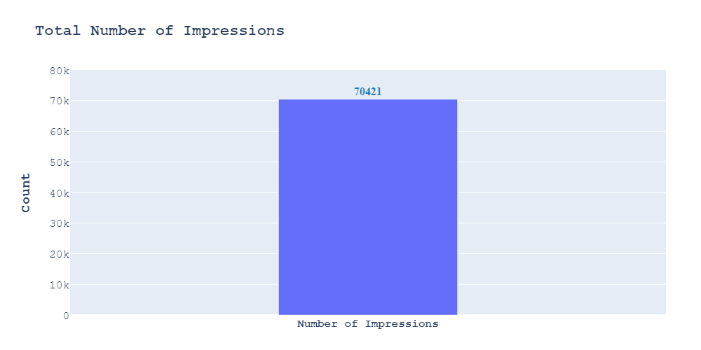

!!! question "What does the distribution of read times look like?"

!!! success "Solution"
    Long-tailed distribution. 
    ```python
    # Distribution of Read Times
    single_subset_feature_visualization(
        df_=df, feature_='read_time', data_title='All Users',
        feature_title='Read Time(s)', histogram_xaxis_title='Read Time(s)')
    ```
    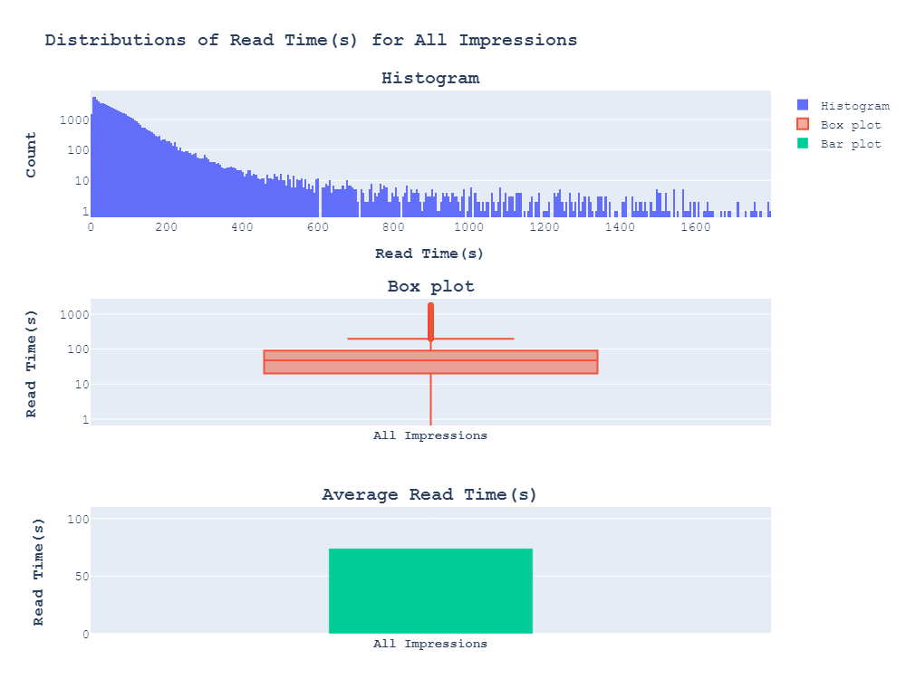


!!! question "How is the distribution of scroll percentages represented?"

!!! success "Solution"
    Long-tailed distribution.
    ```python
    # Distribution of Scroll Percentages
    single_subset_feature_visualization(
        df_=df, feature_='scroll_percentage', data_title='All Users',
        feature_title='Scroll Percentage(%)', histogram_xaxis_title='Scroll Percentage(%)')
    ```
    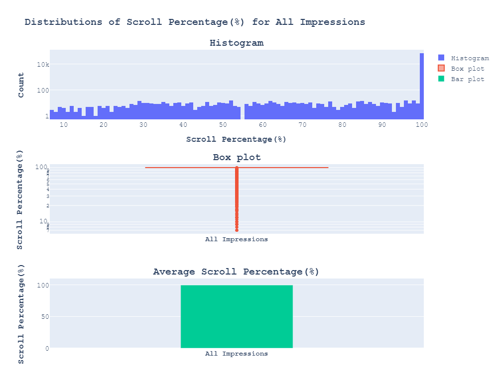

### Article

!!! question "What is the total number of articles?"

!!! success "Solution"
    There are 1723 articles.
    ```python
    # Total Number of Articles
    single_subset_bar(df_ = df, feature_ = 'article_id', xaxis_title = 'Number of Articles', yrange = [0, 2000])
    ```
    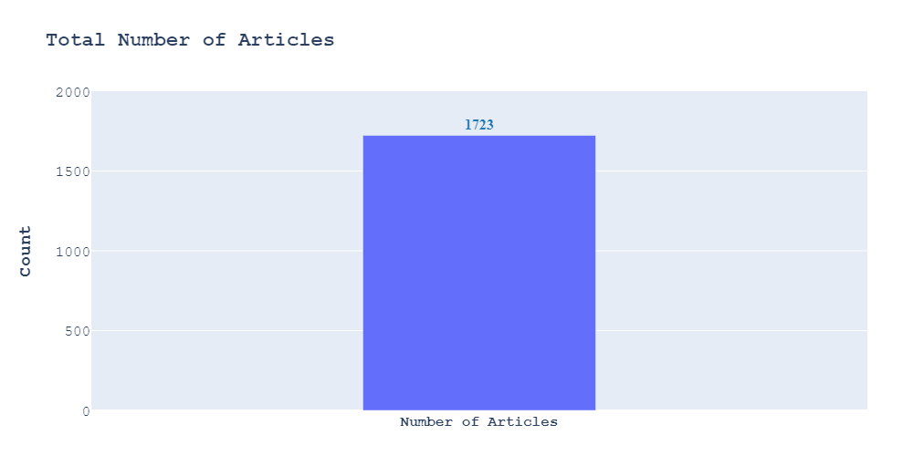


!!! question "How many unique articles are clicked in a single session?"

!!! success "Solution"
    There is a distribution starting from 1 to 19 articles clicked in a single session.

    ```python
    # How many unique articles are clicked in a session?

    # Group by sessions and get the article ids
    tmp_aps = df.groupby('session_id')['article_id'].apply(list)

    # Create a dict to store the count of articles per session
    articles_per_session = {k: 0 for k in range(1, 20)}

    # Iterate through our list previously, and record the number of articles in a session to our res dict
    for i in tmp_aps:
        num_articles = len(i)
        articles_per_session[num_articles] += 1

    # Set as our indices / values for plot
    indices = [k for k in articles_per_session.keys()]
    values = [k for k in articles_per_session.values()]

    # Plot
    plot_bar(
        indices_=indices, values_=values,
        yrange_=[0, 5], xaxis_title='Number of Articles ',
        yaxis_title='Count', title_='<b> Number of Articles clicked in a session<b>')
    ```
    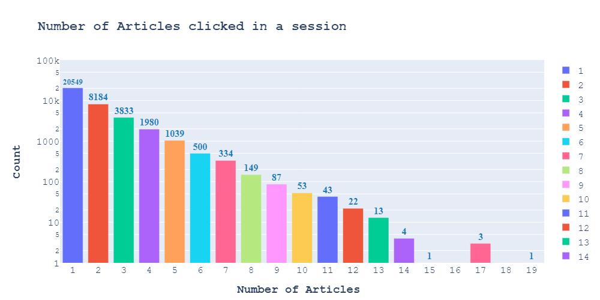

!!! question "What is the average read time and scroll percentage for each article?"

!!! success "Solution"

    ```python
    # Get the average readtime and scroll percentages for all articles!

    # Unique User Ids
    unique_user_ids = df['user_id'].values[0:1000]
    # We take the set because the scroll, article per user is joined in a list for every user id (so just take the set of it!)
    unique_user_ids = set(unique_user_ids)
    # Unique Article Ids
    unique_article_ids = df['article_id'].unique()
    unique_article_ids = unique_article_ids[~np.isnan(unique_article_ids)]
    # Create dictionaries
    unique_article_read = {k: [0] for k in unique_article_ids}
    unique_article_read_avg = {k: [0] for k in unique_article_ids}
    unique_article_scroll = {k: [0] for k in unique_article_ids}
    unique_article_scroll_avg = {k: [0] for k in unique_article_ids}

    # Iterate across each user id
    for id in unique_user_ids:
        # Get the subset of that user id
        tmp_df = df[df['user_id'] == id]
        # Now lets go through each scroll and article
        indices = np.array(tmp_df.index)
        for i in indices:
            tmp_dict = {}
            # Select the scroll / article of that indice and
            tmp_read = tmp_df['read_time_fixed'][i]
            tmp_article = tmp_df['article_id_fixed'][i]
            tmp_scroll = tmp_df['scroll_percentage_fixed'][i]
            # Create list objects for article, read, scroll
            read = [x for x in tmp_read]
            scroll = [x for x in tmp_scroll]
            articles = [np.int64(x) for x in tmp_article]
            # Populate our unique_article_read dictionary based on the results found in our previous list objects
            tmp_articles_read = {k: v for k, v in zip(articles, read)}
            article_id_read_scroll(tmp_articles_read, unique_article_read)
            # Populate our unique_article_scroll dictionary based on the results found in our previous list objects
            tmp_articles_scroll = {k: v for k, v in zip(articles, scroll)}
            article_id_read_scroll(tmp_articles_scroll, unique_article_scroll)

    # Get the average scroll percentage and read times for each article
    for k, v in zip(unique_article_read.keys(), unique_article_read.values()):
        unique_article_read_avg[k] = np.mean(v)
    for k, v in zip(unique_article_scroll.keys(), unique_article_scroll.values()):
        unique_article_scroll_avg[k] = np.mean(v)
    ```

    #### Average Read Time 

    The average reading time spans from 0 to 43.29 seconds, with outliers extending beyond this range.
    ```python
    # Distribution of Read Times for each Article
    ## Indices / Values
    indices = ['<b>All Unique Articles<b>']
    values = [x for x in unique_article_read_avg.values()]
    ## Plot
    plot_box(
        indices_=indices, values_=[values],
        yrange_=[0, 3], xaxis_title='',
        yaxis_title='Read Time(s)', title_='<b> Distributions of Read Times Across All Articles<b>')
    ```
    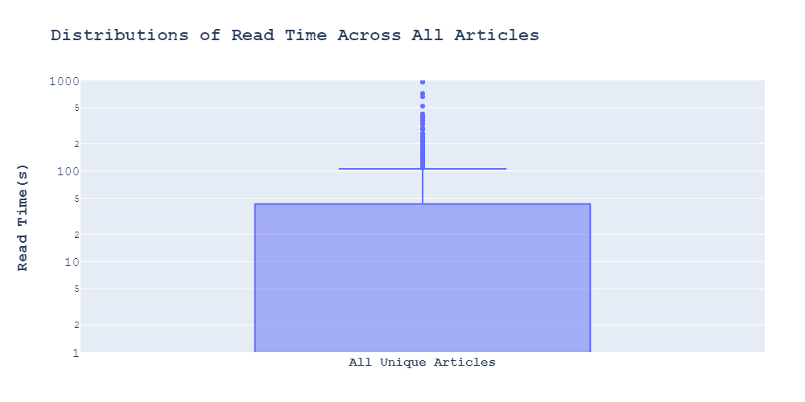

    #### Average Scroll Percentage
    The average scroll percentage ranges from 0 - 100%.
    ```python
    # Distribution of Scroll Percentages for each Article
    ## Indices / Values
    indices = ['<b>All Unique Articles<b>']
    values = [x for x in unique_article_scroll_avg.values()]
    ## Plot
    plot_box(
        indices_=indices, values_=[values],
        yrange_=[0, 2], xaxis_title='',
        yaxis_title='Scroll Percentage (%)', title_='<b> Distributions of Scroll Percentage Across All Articles<b>')
    ```
    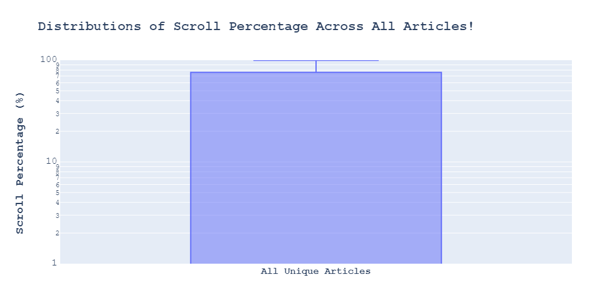

### User

!!! question "What is the total number of users?"

!!! success "Solution"
    There are 9194 users. 
    ```python
    # Total Number of Users
    single_subset_bar(df_ = df, feature_ = 'user_id', xaxis_title = 'Number of Users', yrange = [0, 11000])
    ```
    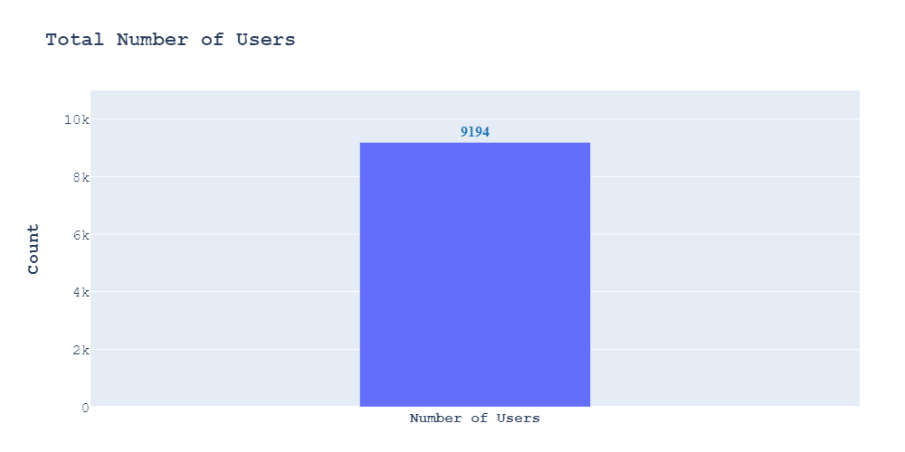

!!! question "Describe the behavior of daily user growth?"
!!! success "Solution"
    There are significant peaks observed in the first three dates, followed by a tapering off in the subsequent dates.
    ```python
    # Record the daily user growth
    unique_user_ids = df['user_id'].unique()

    # Create dictionaries
    unique_users_daily_growth_freq= {}
    unique_users_hourly_freq = {}
    unique_users_dayofweek_freq = {}
    unique_users_weekly_freq = {}

    # Iterate through each user id and record the number of unique users present!
    for id in unique_user_ids[0:1000]:
        # Get the subset of that user id
        tmp_df = df[df['user_id'] == id]
        # Get the first index of that impression time
        first_index = tmp_df['impression_time_fixed'].index[0]
        # Record that join_date 
        tmp_datetime = pd.DatetimeIndex(tmp_df['impression_time_fixed'][first_index])
        tmp_date = tmp_datetime[0].date()
        join_date = tmp_date
        # Populate our unique_user_daily_growth
        if join_date not in unique_users_daily_growth_freq:
            unique_users_daily_growth_freq[join_date] = 1
        else:
            unique_users_daily_growth_freq[join_date] +=1

    # Sort our dict
    unique_users_daily_growth_freq = dict(sorted(unique_users_daily_growth_freq.items()))


    # Indices / Values for Plot
    indices = [x for x in unique_users_daily_growth_freq.keys()]
    values = [x for x in unique_users_daily_growth_freq.values()]
    # Plot
    plot_bar(indices_=indices, values_=values, yrange_=[
            0, 3], xaxis_title='<b>Dates<b>', yaxis_title='<b>Count<b>', title_='<b>Daily User Growth<b>')
    ```

    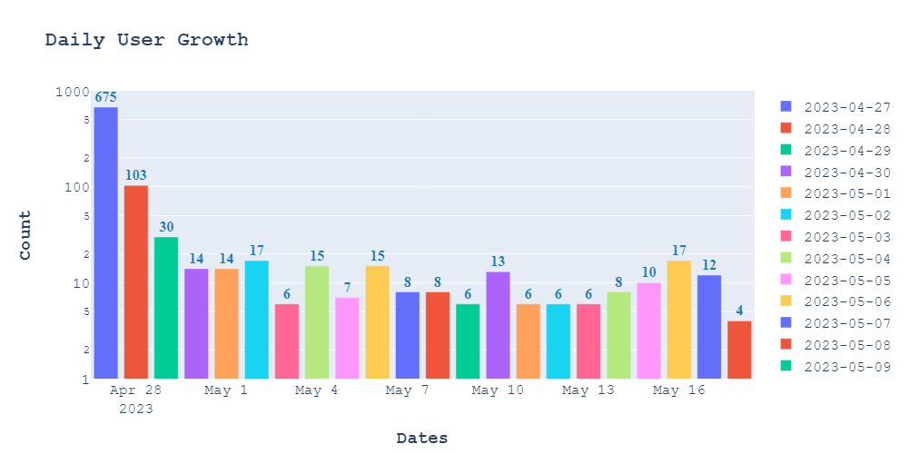

!!! question "What is the average read time and scroll percentage across each unique user?"
!!! success "Solution"
    #### Read Time

    ```python
    # Read Time per User

    # Group by User and Read Time
    tmp_user_df = pd.DataFrame(data=df.groupby(by='user_id')[
                            'read_time'].mean(), columns=['read_time'])
    # Plot
    single_subset_feature_visualization(
        df_=tmp_user_df,  feature_='read_time',
        data_title='Unique Users', feature_title ='Read Time(s)',
        histogram_xaxis_title = 'Read Time(s)')
    ```
    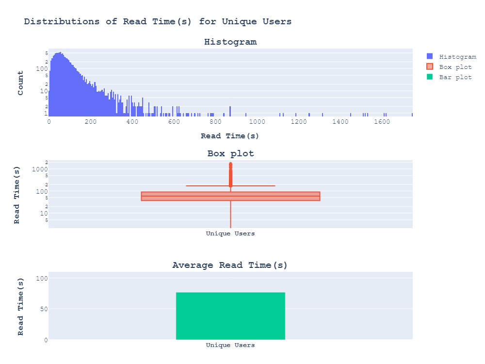

    #### Scroll Percentage

    ```python
    # Scroll Percentage per User

    # Group by User and Scroll Percentage
    tmp_user_df = pd.DataFrame(data=df.groupby(by='user_id')[
                            'scroll_percentage'].mean(), columns=['scroll_percentage'])
    # Plot
    single_subset_feature_visualization(
        df_=tmp_user_df,  feature_='scroll_percentage',
        data_title='Unique Users', feature_title ='Scroll Percentage(%)',
        histogram_xaxis_title = 'Scroll Percentage(%)')
    ```

    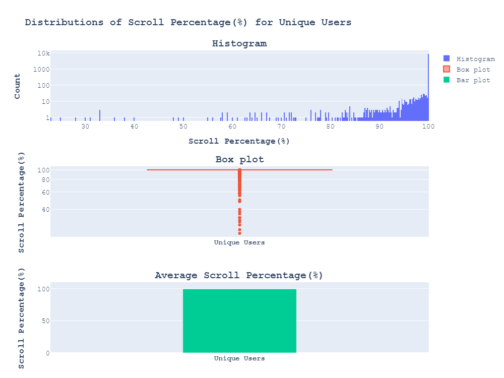

!!! question "Describe the behavior of user activity?"
!!! success "Solution"
    ```python
    # Record the daily, hourly, weekly, dayofweek activity across all users

    # Get all unique ids in a list
    unique_user_ids = df['user_id'].unique()[0:1000]

    # Create dictionaries
    unique_users_daily_freq = {}
    unique_users_hourly_freq = {}
    unique_users_dayofweek_freq = {}
    unique_users_weekly_freq = {}

    # Iterate through each user id
    for id in unique_user_ids:
        # Get the subset of that user id
        tmp_df = df[df['user_id'] == id]

        # Now lets go through each and populate the unique dates, hours and day of the week for each user
        dates = []
        hours = []
        dayofweek = []
        week = []
        indices = np.array(tmp_df.index)

        # Iterate through each index
        for i in indices:
            # Store the date, time, dayofweek, and week number
            tmp_datetime = pd.DatetimeIndex(tmp_df['impression_time_fixed'][i])
            tmp_date = tmp_datetime.date
            tmp_time = tmp_datetime.time
            tmp_dayofweek = tmp_datetime.weekday
            tmp_week = tmp_datetime.isocalendar().week
            # Append our dates, hours, dayofweek, week number
            for j, k, l, m in zip(tmp_date, tmp_time, tmp_dayofweek, tmp_week):
                dates.append(j)
                hours.append(k)
                dayofweek.append(l)
                week.append(m)

        # Get rid of duplicate values
        unique_dates = list(set(dates))
        unique_hours = list(set(hours))
        unique_dayofweek = list(set(dayofweek))
        unique_week = list(set(week))

        # Convert to string
        unique_hours = [x.hour for x in unique_hours]
        unique_hours = [str(i) + ':00' if i > 9 else str(0) +
                        str(i) + ':00' for i in unique_hours]

        # Convert the week int to mapping from 1++
        unique_week = weekly_map(unique_week)

        # Populate dicts
        populate_dict(list_=unique_dates, dict_=unique_users_daily_freq)
        populate_dict(list_=unique_hours, dict_=unique_users_hourly_freq)
        populate_dict(list_=unique_dayofweek, dict_=unique_users_dayofweek_freq)
        populate_dict(list_=unique_week, dict_=unique_users_weekly_freq)


    # Sort our dicts
    unique_users_daily_freq = dict(sorted(unique_users_daily_freq.items()))
    unique_users_hourly_freq = dict(sorted(unique_users_hourly_freq.items()))

    # Sort by integers for day of the week and then lets change the dict from int to str
    unique_users_dayofweek_freq = dict(sorted(unique_users_dayofweek_freq.items()))
    unique_users_dayofweek_freq = int_dow_dict(unique_users_dayofweek_freq)

    unique_users_weekly_freq = dict(sorted(unique_users_weekly_freq.items()))
    ```

    #### Daily User Activity
    We notice a fluctuation between 675 and 850 users, with a substantial drop-off toward the end.
    ```python
    # Daily User Activity

    ## Indices / Values for Plot
    indices = [x for x in unique_users_daily_freq.keys()]
    values = [x for x in unique_users_daily_freq.values()]

    ## Plot
    plot_scatter(
        indices_=indices, values_=values,
        yrange_=[200, 900], xaxis_title='Date',
        yaxis_title='Active Users', title_='<b>Daily Active Users<b>'
    )
    ```
    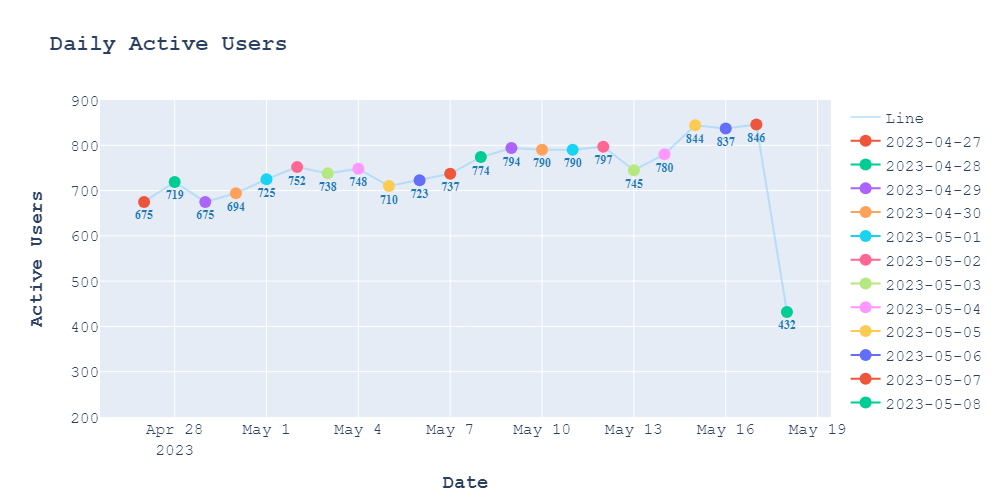

    #### Hourly User Activity
    We notice a significant surge in users at 04:00 (4am), which remains relatively consistent until 21:00 (9:00 pm). Following that, there is a notable decline until 04:00.

    ```python
    # Hourly User Activity

    ## Indices / Values for Plot
    indices = [x for x in unique_users_hourly_freq.keys()]
    values = [x for x in unique_users_hourly_freq.values()]

    ## Plot
    plot_scatter(
        indices_ = indices , values_ = values,
        yrange_ = [0, 20000], xaxis_title = 'Hour',
        yaxis_title= 'Active Users', title_ = '<b>Hourly Active Users<b>'
        )
    ```
    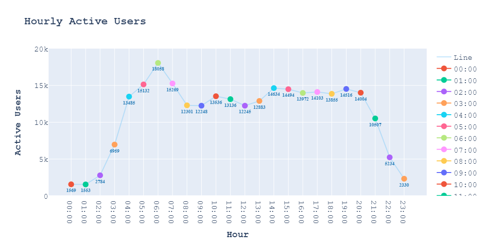

    #### Weekly User Activity
    There is a consistent upward trend in the number of users from week 1 to week 4. 

    ```python
    # Weekly User Activity

    ## Indices / Values for Plot
    indices = [x for x in unique_users_weekly_freq.keys()]
    values = [x for x in unique_users_weekly_freq.values()]

    ## Plot
    plot_bar(
        indices_ = indices, values_ = values,
        yrange_ = [0, 3.5], xaxis_title = 'Week',
        yaxis_title= 'Active Users', title_ = '<b> Weekly Active Users <b>')
    ```

    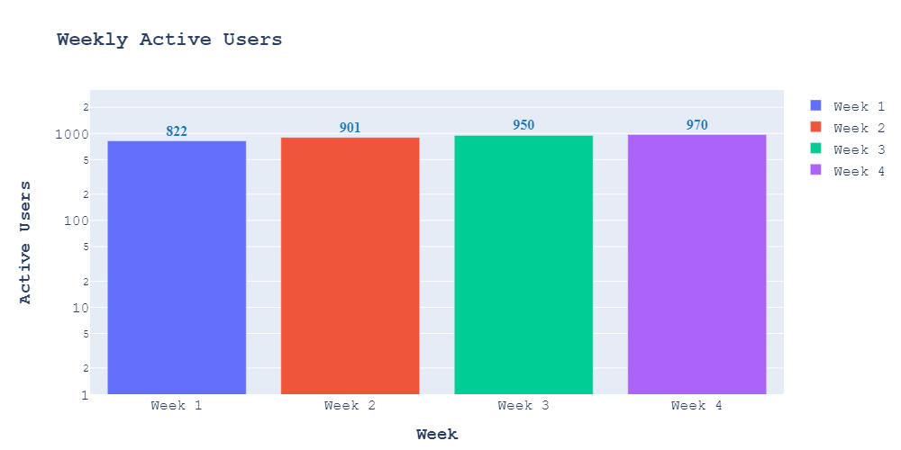

    #### Day of the Week User Activity
    User activity remains consistent throughout all days of the week.

    ```python
    # Day Of The Week Activity

    ## Indices / Values for Plot
    indices = [x for x in unique_users_dayofweek_freq.keys()]
    values = [x for x in unique_users_dayofweek_freq.values()]

    ## Plot
    plot_bar(
        indices_ = indices, values_ = values,
        yrange_ = [0, 3.5], xaxis_title = 'Day',
        yaxis_title= 'Active Users', title_ = '<b> Day of the Week Activity  <b>')
    ```

    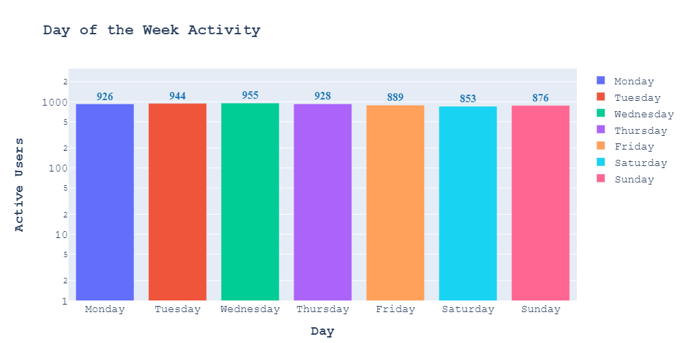

### Session

!!! question  "What are the total number of sessions?"

!!! success "Solution"
    There are 36795 unique sessions.
    ```python
    # Toal Number of Sessions
    single_subset_bar(df_=df, feature_='session_id',
                    xaxis_title='Number of Sessions', yrange=[0, 40000])
    ```
    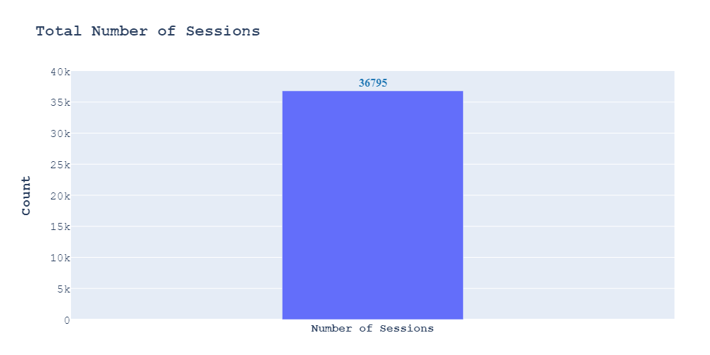

!!! question "What are the number of unique sessions per day?"

!!! success "Solution"

    The session count remains relatively stable within the range of 4000 to 6000 sessions until the final date, where a notable decline is observed.

    ```python
    # Number of unique sessions per day

    # Make a copy of the dataframe and extract the time as a str
    copy_df = df.copy()
    copy_df['impression_time'] = copy_df['impression_time'].apply(
        lambda x: x.date())

    # Group by the session ids with the impression time
    unique_sessions_per_day = copy_df.groupby(
        by='session_id')['impression_time'].min()
    tmp_dau_df = pd.DataFrame(data=unique_sessions_per_day.values,
                            index=unique_sessions_per_day.keys(), columns=['Session Dates'])

    # Plot
    multiple_subset_bar(
        df_=tmp_dau_df, feature_='Session Dates',
        yrange=[0, 4.5], xaxis_title = 'Session Dates')
    ```

    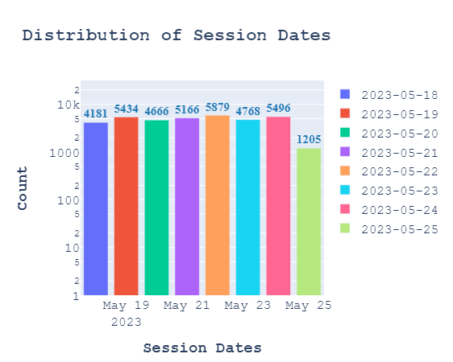

!!! question "What is average read time and scroll percentage for each unique session?"

!!! success "Solution"
    #### Read Time
    ```python
    # Read Time per Session
    ## Group by session ids and read_time 
    tmp_session_df = pd.DataFrame(data=df.groupby(by='session_id')[
                                'read_time'].mean(), columns=['read_time'])
    ## Plot
    single_subset_feature_visualization(
        df_=tmp_session_df,  feature_='read_time',
        data_title='Unique Sessions', feature_title = 'Read Time(s)',
        histogram_xaxis_title ='Read Time(s)')
    ```
    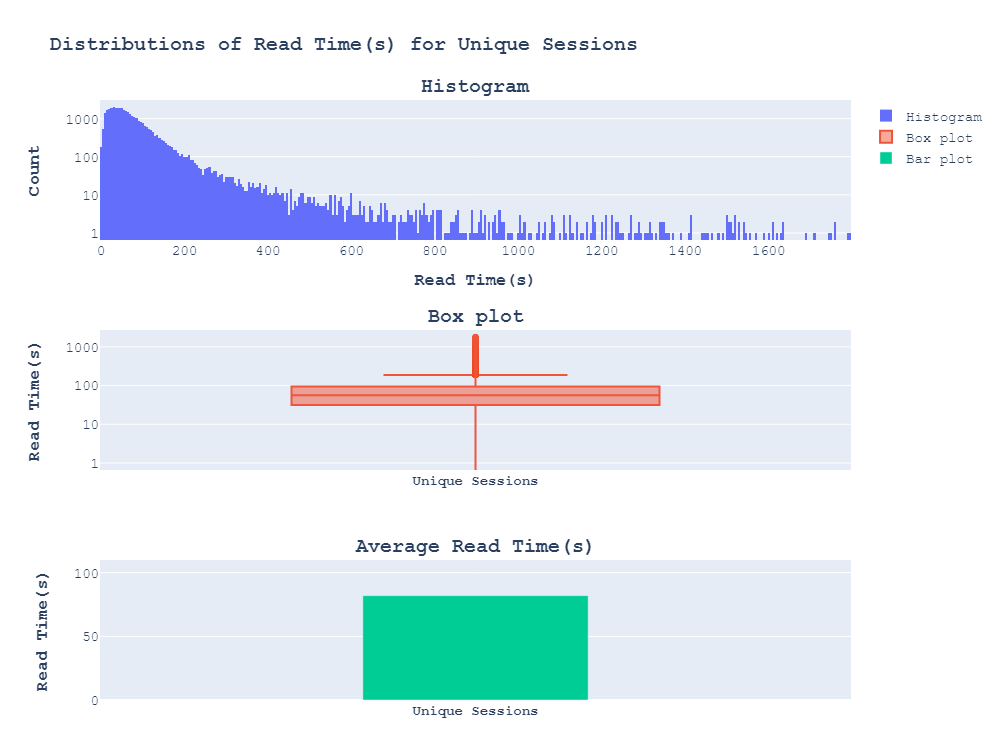

    #### Scroll Percentage
    ```python
    # Scroll Percentage per Session
    ## Group by session ids and scroll percentage
    tmp_session_df = pd.DataFrame(data=df.groupby(by='session_id')[
                                'scroll_percentage'].mean(), columns=['scroll_percentage'])
    ## Plot
    single_subset_feature_visualization(
        df_=tmp_session_df,  feature_='scroll_percentage',
        data_title='Unique Sessions', feature_title = 'Scroll Percentage(%)',
        histogram_xaxis_title ='Scroll Percentage(%)')
    ```

    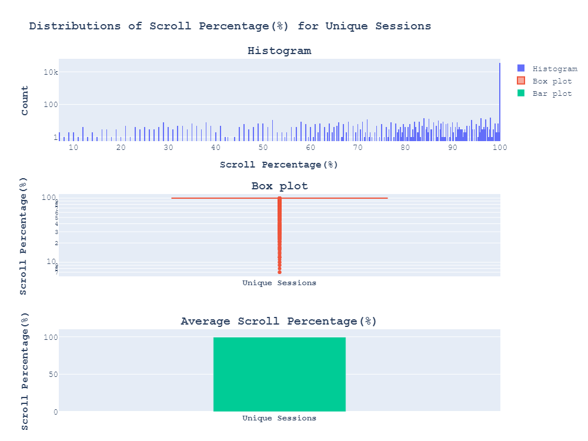

### Topic

!!! question "How many topics are there in total?"

!!! success "Solution"
    There are 78 unique topics.

    ```python
    # Number of Topics!
    # Unique Topics
    topic_list = unique_subset_topics(df)
    # Plot
    tmp_topic_df = pd.DataFrame(data=topic_list, columns=['topics'])

    single_subset_bar(df_=tmp_topic_df, feature_='topics',
                    xaxis_title='Number of Topics', yrange=[0, 100])
    ```
    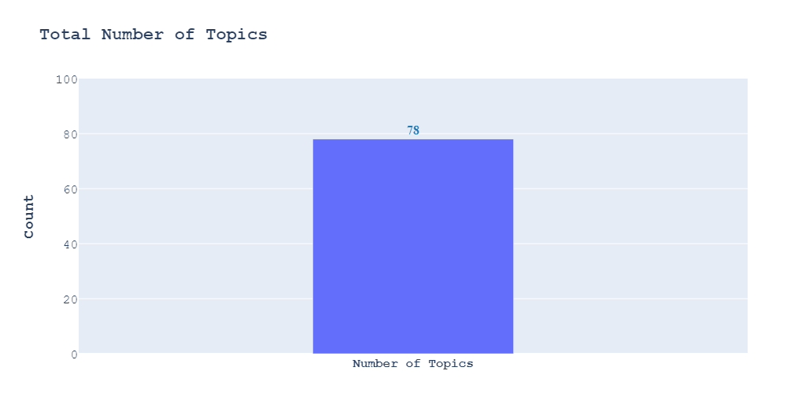

!!! question "What are the top 10 most popular topics?"

!!! success "Solution"
    Kendt > Sport > Begivenhed > Underholdning > Sportsbegivenhed > Kriminalitet > Livsstill > Politik > Fodbold > Erhverv
    ```python
    # Record the frequency of topics across unique users, readtimes across topics, and scroll percentages across those topics

    # Get all unique ids in a list
    unique_user_ids = df['user_id'].values[0:1000]

    # Create dictionaries
    unique_users_topics_freq = {}
    unique_topic_scroll_freq = {}
    unique_topic_read_freq = {}

    # Iterate through each user id and record the topics viewed!
    for id in unique_user_ids:
        # Get the subset of that user id
        tmp_df = df[df['user_id'] == id]
        # Now lets go through each topic
        indices = np.array(tmp_df.index)
        for i in indices:
            # Record the topic, scroll percentage and read_time for each index
            tmp_topics = tmp_df['topics'][i]
            tmp_scroll = tmp_df['scroll_percentage'][i]
            tmp_read = tmp_df['read_time'][i]
            topics = [x for x in tmp_topics]
            scroll = [tmp_scroll]
            read = [tmp_read]

        # Find the average scroll percentages across each topic  (Can be related to whether a topic doesnt require too much reading has visualizations)
        # Look at article_id for whichever topics the article is included in add that scroll percentage
            tmp_topic_scroll = {k: v for k, v in zip(topics, scroll)}
            unique_topic_scroll_freq = topics_article_id_scroll_read(
                tmp_topic_scroll, unique_topic_scroll_freq)

        # Find the average read time across each topic
        # Look at article_id for whichever topics the article is included in add that readtime
            tmp_topic_read = {k: v for k, v in zip(topics, read)}
            unique_topic_read_freq = topics_article_id_scroll_read(
                tmp_topic_read, unique_topic_read_freq)

        # Unique User Topics
        # Get rid of duplicate values
        unique_topics = list(set(topics))

        # Populate our dict
        populate_dict(unique_topics, unique_users_topics_freq)


    # Sort the dictionaries
    sorted_topic_freq = dict(
        sorted(unique_users_topics_freq.items(), key=lambda x: x[1], reverse=True))

    # Find the average read times across each topic
    unique_topic_read_avg_freq = {k: round(np.nanmean(v), 2) for k, v in zip(
        unique_topic_read_freq.keys(), unique_topic_read_freq.values())}
    sorted_unique_topic_read_avg_freq = dict(
        sorted(unique_topic_read_avg_freq.items(), key=lambda x: x[1], reverse=True))

    # Sort the topics for distribution
    sorted_unique_topic_read_freq = dict(sorted(unique_topic_read_freq.items()))

    # Find the average scroll percentages across each topic
    unique_topic_scroll_avg_freq = {k: round(np.nanmean(v), 2) for k, v in zip(
        unique_topic_scroll_freq.keys(), unique_topic_scroll_freq.values())}
    sorted_unique_topic_scroll_avg_freq = dict(
        sorted(unique_topic_scroll_avg_freq.items(), key=lambda x: x[1], reverse=True))

    # Sort the topics scroll pct for distribution
    sorted_unique_topic_scroll_freq = dict(
        sorted(unique_topic_scroll_freq.items()))

    # Distribution of Topics across users!
    ## Indices / Values for Plot
    indices = [x for x in sorted_topic_freq.keys()][0:10]
    values = [x for x in sorted_topic_freq.values()][0:10]

    ## Plot
    plot_bar(
        indices_=indices, values_=values,
        yrange_=[0, 3], xaxis_title='Topics',
        yaxis_title='Count', title_='<b> Top 10 Highest Topic Activity<b>')
    ```

    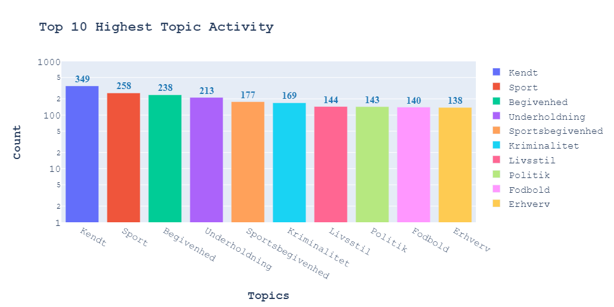

!!! question "What is the distribution of read time and scroll percentage across each topic?"

!!! success "Solution"

    #### Read Time
    ``` python
    # Box Plot of Read Time across Topics
    ## Indices / Values for Plot
    indices = [x for x in sorted_unique_topic_read_freq.keys()]
    values = [x for x in sorted_unique_topic_read_freq.values()]
    ## Plot
    plot_box(
        indices_ = indices, values_ = values,
        yrange_ = [0, 3.5], xaxis_title = 'Topics',
        yaxis_title= 'Read Time(s)', title_ = '<b> Distributions of Read Times across each Topic<b>')
    ```
    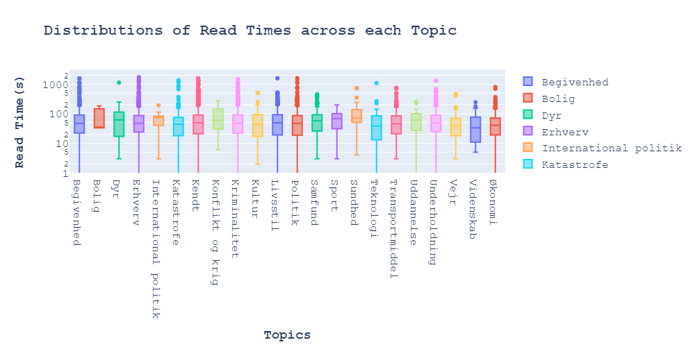

    #### Scroll Percentage
    ```python
    # Box Plot of Scroll Percentage across Topics
    ## Indices / Values for Plot
    indices = [x for x in sorted_unique_topic_scroll_freq.keys()]
    values = [x for x in sorted_unique_topic_scroll_freq.values()]
    ## Plot
    plot_box(
        indices_ = indices, values_ = values,
        yrange_ = [0, 2.1], xaxis_title = 'Topics',
        yaxis_title= 'Read Time(s)', title_ = '<b> Distributions of Read Times across each Topic<b>')
    ```
    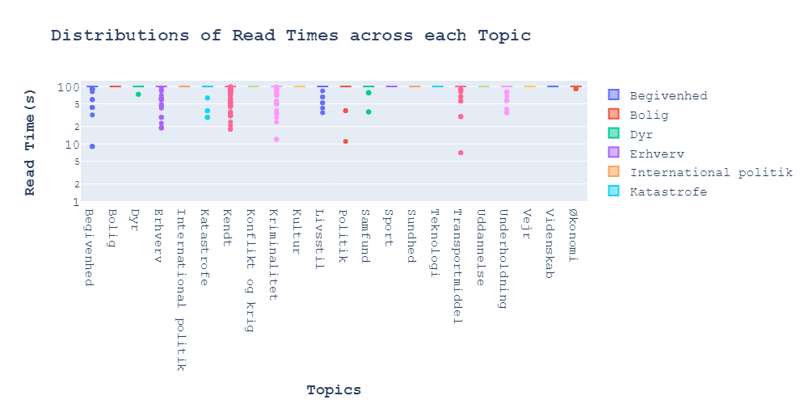

!!! question "How do daily and hourly activity patterns relate to each topic?"
!!! success "Solution"

    ```python
    # Daily and Hourly Activity across each Topic

    # Get all the unique topics
    topic_list = unique_subset_topics(df)
    unique_topics = sorted(topic_list)

    # Get the list of each unqiue topic in a specific session
    topics = df.groupby(by='session_id')['topics'].apply(list)

    # Get the list of each unique timestamp for these sessions
    timestamps = df.groupby(by='session_id')['impression_time'].apply(list)
    unique_dates = []

    # Create a list of hours in a str format
    unique_hours = [i for i in range(24)]
    unique_hours = [str(i) + ':00' if i > 9 else str(0) +
                    str(i) + ':00' for i in unique_hours]

    # Iterate through each timestamp
    for i in range(len(timestamps.values)):
        # Iterate through each idx
        for j in range(len(timestamps.values[i])):
            # Assign datetime and date objects
            tmp_datetime = timestamps.values[i][j]
            tmp_date = tmp_datetime.date()
            # if date not in unique dates, append
            if tmp_date not in unique_dates:
                unique_dates.append(tmp_date)

    # Sort dates
    unique_dates = sorted(unique_dates)

    # Instantiate dict objects with unique dates and unique key values set to 0
    unique_topic_daily_activity = {
        k: {k: 0 for k in unique_dates} for k in unique_topics}
    unique_topic_hourly_activity = {
        k: {k: 0 for k in unique_hours} for k in unique_topics}


    # Iterate through each session id
    for i in zip(range(len(topics.values))):
        # Iterate through each index of nested list
        for j, k in zip(range(0, len(topics.values[i][0])), range(0, len(i))):
            tmp = topics.values[i][0][j]
            # Assign a datetime and time object
            tmp_datetime = timestamps.values[i][k]
            tmp_date = tmp_datetime.date()
            tmp_time = tmp_datetime.time()
            tmp_hour = tmp_time.hour

            # Convert hour into a string
            if tmp_hour > 9:
                tmp_time = str(tmp_hour) + ':00'

            else:
                tmp_time = "0" + str(tmp_hour) + ':00'

            # Add to dictionary
            unique_topic_daily_activity[tmp][tmp_date] += 1
            unique_topic_hourly_activity[tmp][tmp_time] += 1
    ```

    #### Daily Activity
    Daily activity vary significantly across topics, with some topics experiencing higher levels of activity due to their popularity.
    ```python
    # Daily Activity of Topics 
    activity_scatter(
        dict_=unique_topic_daily_activity,  yrange_=[0, 2100],
        xaxis_title='Dates', yaxis_title='Active Users', title_='<b> Daily Active Users per Topic')
    ```
    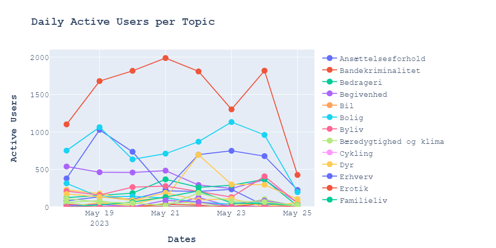

    #### Hourly Activity
    ``` python
    # Hourly Activity of Topics 
    activity_scatter(
        dict_=unique_topic_hourly_activity,  yrange_=[0, 1000],
        xaxis_title='Hourly', yaxis_title='Active Users', title_='<b> Hourly Active Users per Topic')
    ```
    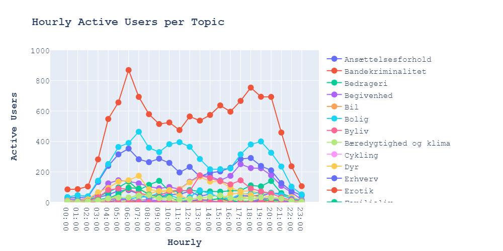


### Devices

!!! question  "What is the distribution of devices?"
!!! success "Solution"
    There are 23536 desktop users, 44472 mobile users, and 2413 tablet users. 
    ``` python
    # Distribution of Devices
    multiple_subset_bar(df_=df, feature_='device_type', yrange=[0, 5], xaxis_title = 'Devices')
    ```
    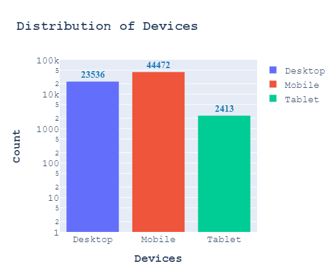

!!! question "What is the distribution of read time and scroll percentages for devices?"

!!! success "Solution"
    #### Read Time
    ``` python
    # Read Time across Devices
    multiple_subset_feature_visualization(
        df_=df,  feature_1='device_type',
        feature_2='read_time', feature_1_title='Devices',
        feature_2_title='Read Time(s)', histogram_xaxis_title='Read Time(s)'
    )
    ```

    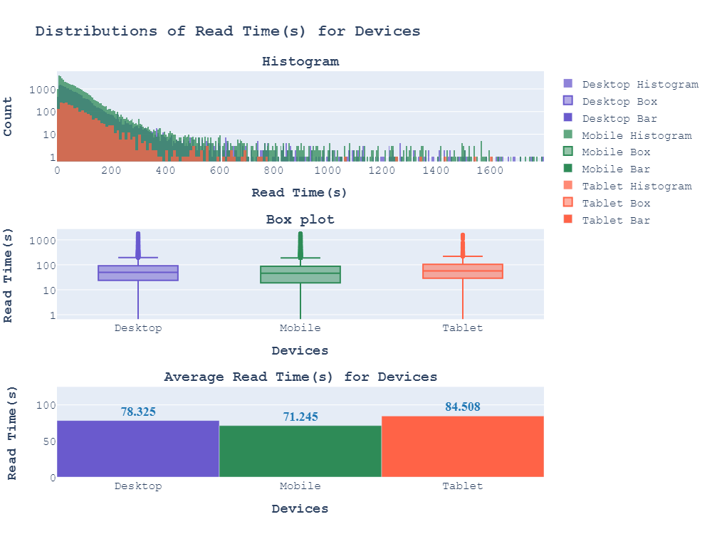

    #### Scroll Percentage
    ``` python
    # Scroll Percentage across Devices
    multiple_subset_feature_visualization(
        df_=df,  feature_1='device_type',
        feature_2='scroll_percentage', feature_1_title='Devices',
        feature_2_title='Scroll Percentages(%)', histogram_xaxis_title='Scroll Percentages(%)'
    )
    ```

    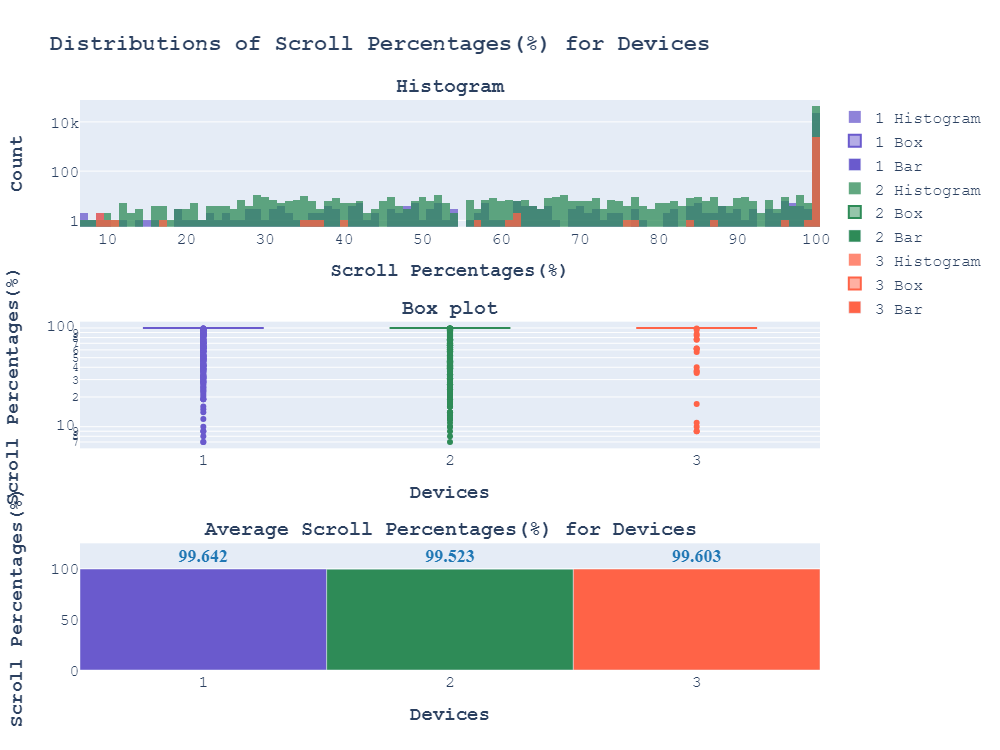

!!! question "What is the topic distribution for devices?"

!!! success "Solution"
    The topic distribution is relatively consistent across all devices: Kendt > Sport > Begivenhed, Underholdning > Kriminalitet 
    ``` python
    # Distribution of Topics Per Device
    # Unique Topics
    # Distribution of Topics Per Device
    # Unique Topics
    topic_list = unique_subset_topics(df)
    unique_topics = sorted(topic_list)
    # Plot
    topic_feature_bar_distribution(
        df_=df, feature_='device_type', yrange=[0, 4.5],
        topic_list_=unique_topics, subplot_titles_=[
            '<b>Desktop<b>', '<b>Mobile<b>', '<b>Tablet<b>'],
        xaxis_title='<b>Topics<b>', yaxis_title='<b>Count<b>',
        title_='<b>Topic Distribution Per Device<b>',
        height_=750, width_=1000
    )
    ```

    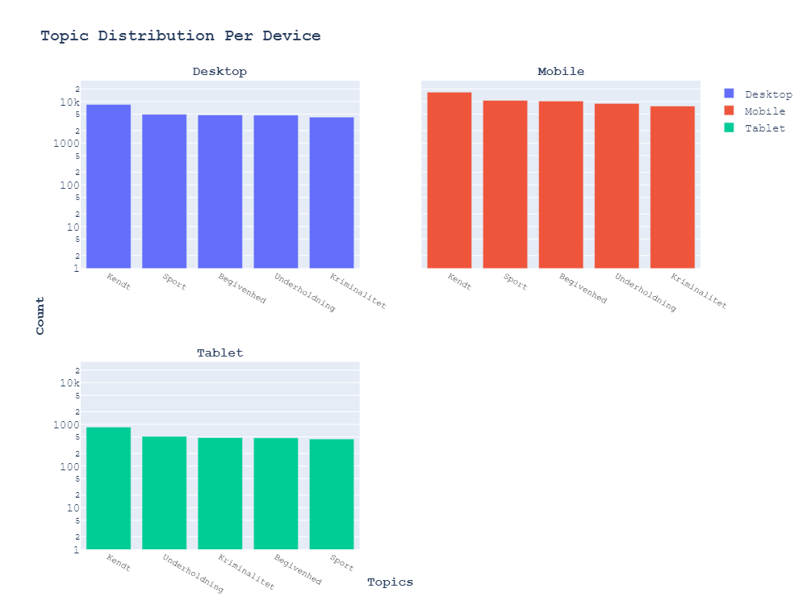

!!! question "What is the daily and hourly activity for devices?"

!!! success "Solution"
    The majority of active users are on mobile devices, outnumbering both desktop and tablet users combined. However, all activity plots exhibit similar patterns with varying magnitudes.
    ```python
    # Daily and Hourly Activity across Devices
    daily_hourly_activity_feature_bar_distribution(
        df_ = df, feature_ = 'device_type', yrange = [0, 4],
        subplot_titles_ = ['<b>Daily<b>', '<b>Monthly<b>'],
        title_ = '<b>Daily and Hourly Activity per Device<b>',
        height_ = 750, width_ = 1000
        )
    ```
    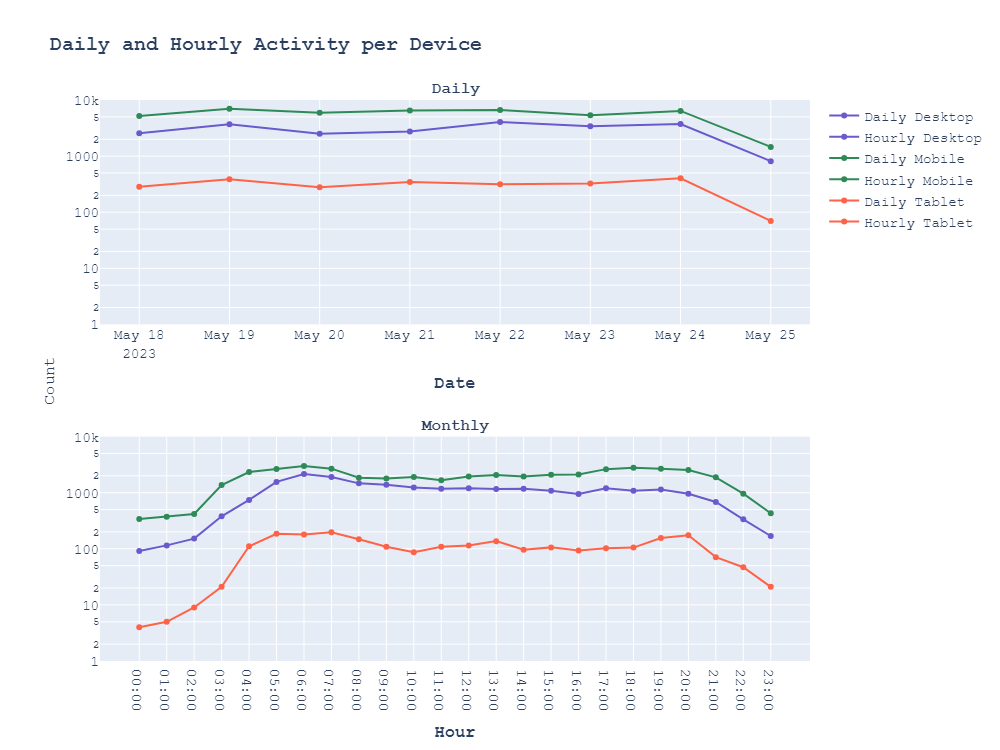


### Age

!!! question "What are the distribution of ages?"

!!! success "Solution"
    There's significant variation in the frequency of ages, with a majority of users falling within the 50-79 age range.
    ```python
    # Distribution of Ages
    multiple_subset_bar(
        df_=df, feature_='age', yrange=[0, 3.5],
        xaxis_title ='Age'
        )
    ```
    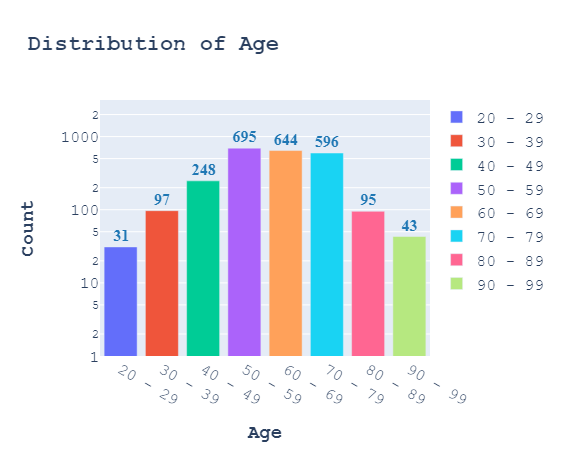


!!! question "What is the distribution of read time and scroll percentages for ages?"


!!! success "Solution"
    #### Read Time
    ```python
    # Read Time across Ages
    multiple_subset_feature_visualization(
        df_=df,  feature_1='age',
        feature_2='read_time', feature_1_title='Age',
        feature_2_title='Read Time(s)', histogram_xaxis_title='Read Time(s)'
    )

    ```
    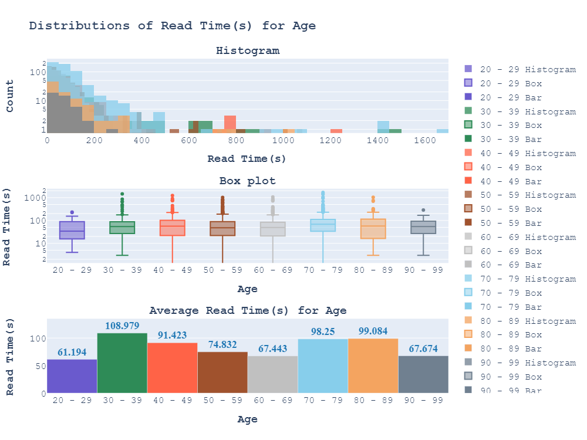

    #### Scroll Percentage
    ```python
    # Scroll Percentages across Ages
    multiple_subset_feature_visualization(
        df_=df,  feature_1='age',
        feature_2='scroll_percentage', feature_1_title='Age',
        feature_2_title='Scroll Percent(%)', histogram_xaxis_title='Scroll Percentage(%)'
    )

    ```
    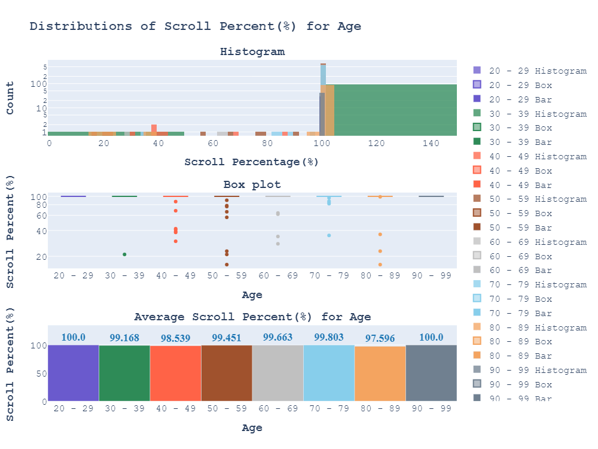

!!! question "What is the topic distribution for age?"
!!! success "Solution"
    Five topics consistently appear across all age ranges, but their frequency varies within each age group.
    ```python
    # Distribution of Topics across Ages
    ## Get all the unique topics
    topic_list = unique_subset_topics(df)
    unique_topics = sorted(topic_list)
    ## Plot
    topic_feature_bar_distribution(
        df_=df, feature_='age', yrange=[0, 2.5],
        topic_list_=unique_topics,
        subplot_titles_=[
            '<b>20-29<b>', '<b>30-39<b>', '<b>40-49<b>',
            '<b>50-59<b>', '<b>60-69<b>', '<b>70-79<b>',
            '<b>80-89<b>', '<b>90-99<b>'
        ],
        xaxis_title='<b>Topics<b>', yaxis_title='<b>Count<b>',
        title_='<b>Topic Distribution of Age Groups<b>',
        height_=1000, width_=1000
    )

    ```
    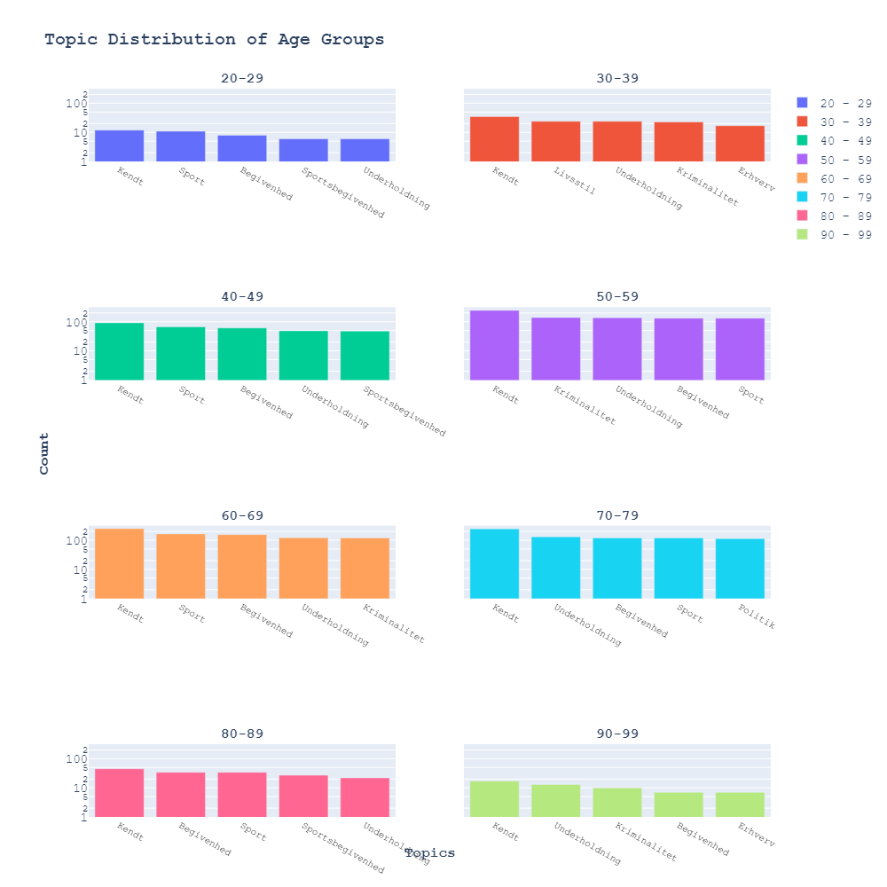


!!! question "What is the daily and hourly activity for age?"
!!! success "Solution"
    The daily and hourly activity trajectories are similar across each age group, except for the 90-99 age group, which appears scattered due to missing data on certain dates.
    ```python
    # Daily Activity Users / Hourly Activity Users across Age
    daily_hourly_activity_feature_bar_distribution(
        df_=df, feature_='age', yrange=[0, 2.5],
        subplot_titles_=['<b>Daily<b>', '<b>Monthly<b>'],
        title_='<b>Daily and Hourly Activity of Age Groups<b>',
        height_=750, width_=1000
    )

    ```
    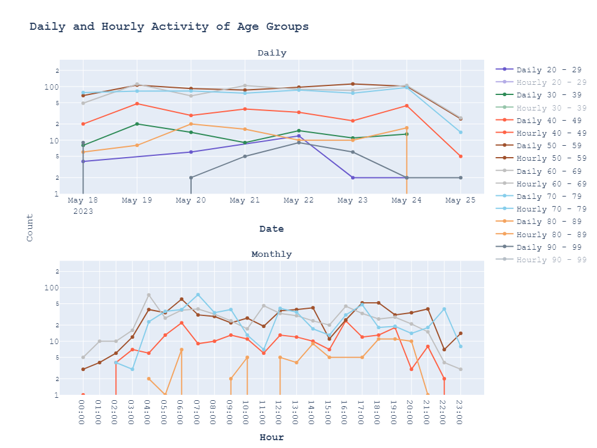

### Postcodes

!!! question "What is the distribution of postcodes?"
!!! success "Solution"
    There are 268 Big City users, 572 Metropolitan users, 190 Municipality users, 254 Provincial users, and 352 Rural District users.
    ```python
    # Distribution of Postcodes. 
    multiple_subset_bar(
        df_=df, feature_='postcode',
        yrange=[0, 3], xaxis_title ='Postcode')
    ```
    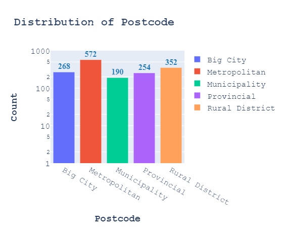


!!! question "What is the distribution read time and scroll percentage of postcodes?"

!!! success "Solution"
    #### Read Time
    ```python
    # Read Time across Postcodes
    multiple_subset_feature_visualization(
        df_=df,  feature_1='postcode',
        feature_2='read_time', feature_1_title='Postcodes',
        feature_2_title='Read Time(s)', histogram_xaxis_title='Read Time(s)'
    )
    ```
    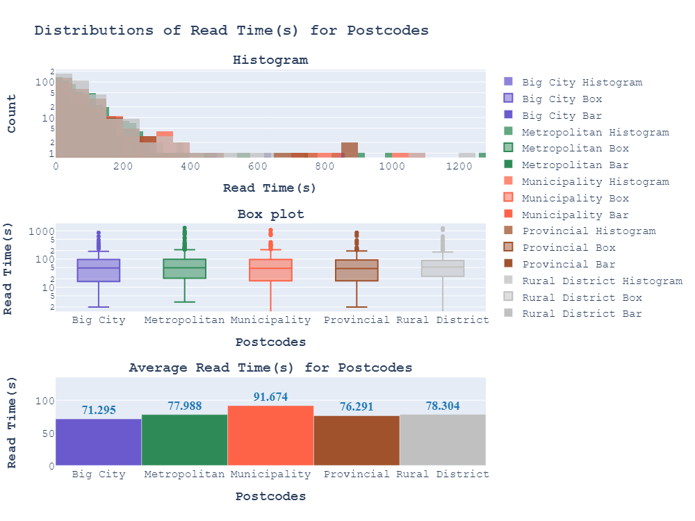

    #### Scroll percentage
    ```python
    # Scroll Percentages across Postcodes
    multiple_subset_feature_visualization(
        df_=df,  feature_1='postcode',
        feature_2='scroll_percentage', feature_1_title='Postcode',
        feature_2_title='Scroll Percent(%)', histogram_xaxis_title='Scroll Percentage(%)'
    )
    ```
    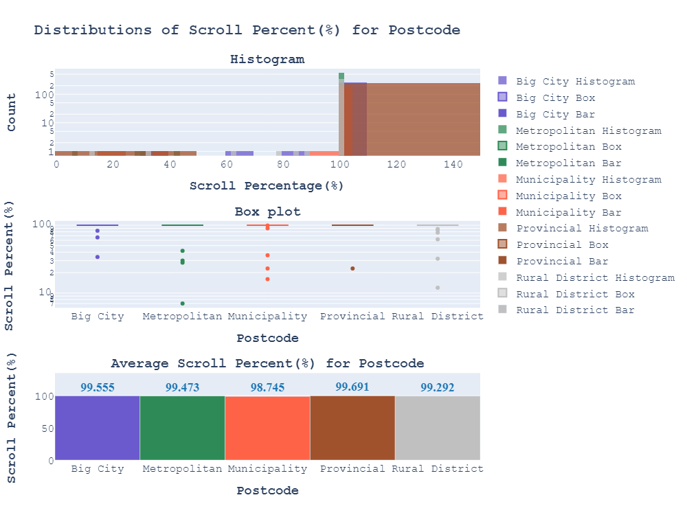

!!! question "What is the topic distribution for postcodes?"

!!! success "Solution"
    Five topics consistently appear across all postcodes, but their frequency varies within each postcode.
    ```python
    # Distribution of Topics across Postcodes
    ## Get all the unique topics
    topic_list = unique_subset_topics(df)
    unique_topics = sorted(topic_list)
    ## Plot
    topic_feature_bar_distribution(
        df_=df, feature_='postcode', yrange=[0, 2.5],
        topic_list_=unique_topics,
        subplot_titles_=[
            '<b>Big City<b>', '<b>Metropolitan<b>', '<b>Municiplaity<b>',
            '<b>Provincial<b>', '<b>Rural District<b>'
        ],
        xaxis_title='<b>Topics<b>', yaxis_title='<b>Count<b>',
        title_='<b>Topic Distribution per Postcodes<b>',
        height_=850, width_=1000
    )
    ```
    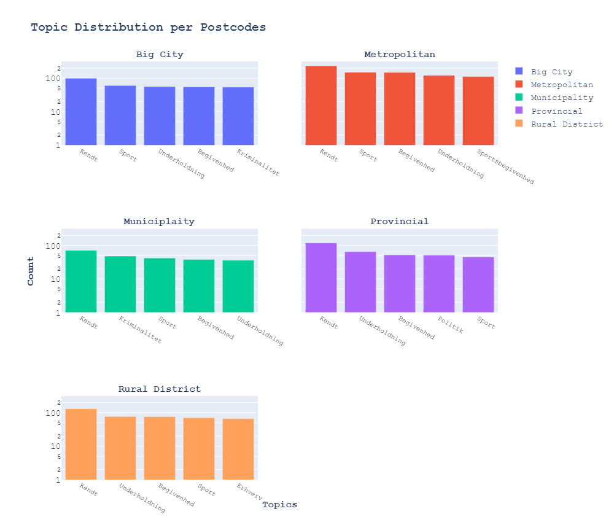


!!! question  "What is the daily and hourly activity for postcodes?"
!!! success "Solution"
    The daily and hourly activity trajectories are similar across each postcode.
    ```python
    # Daily Activity Users / Hourly Activity Users across Postcodes
    daily_hourly_activity_feature_bar_distribution(
        df_=df, feature_='postcode', yrange=[0, 4],
        subplot_titles_=['<b>Daily<b>', '<b>Monthly<b>'],
        title_='<b>Daily and Hourly Activity per Postcode<b>',
        height_=750, width_=1000
    )
    ```
    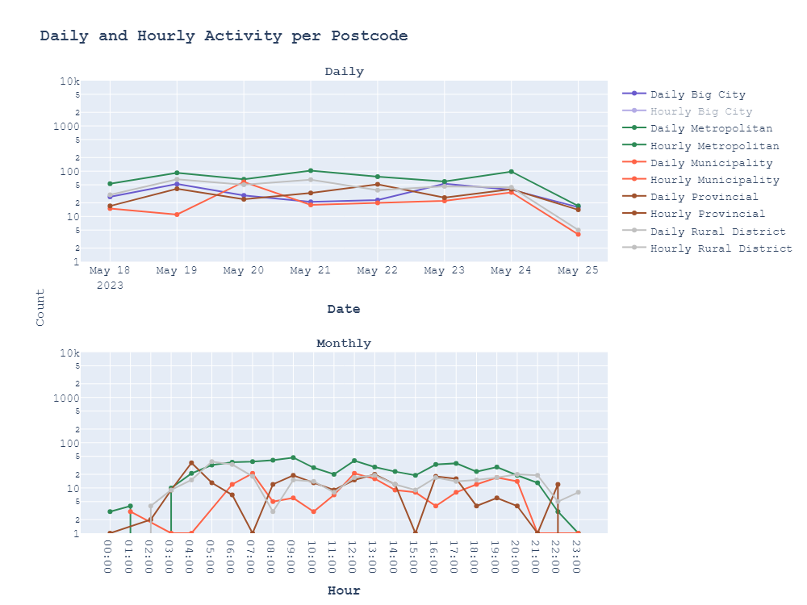

-----------------------------------------------------
For more analysis, check out my notebook containing the code!

Stay tuned for my next post which will go over the model selection for Recommendation Systems!


