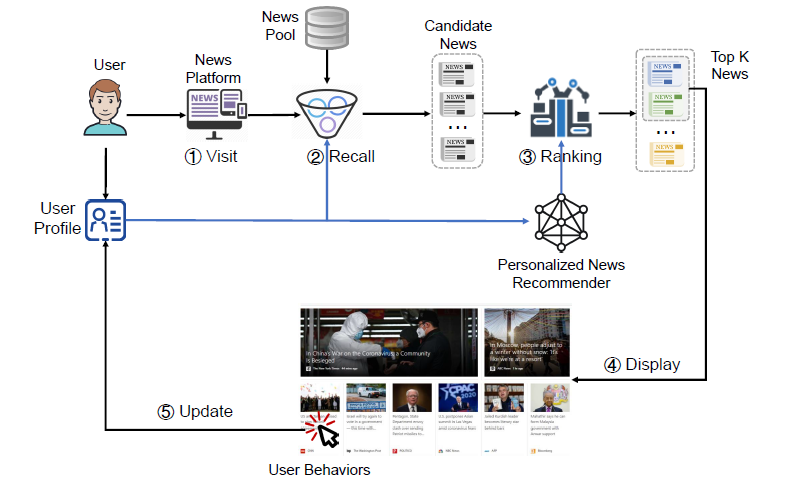
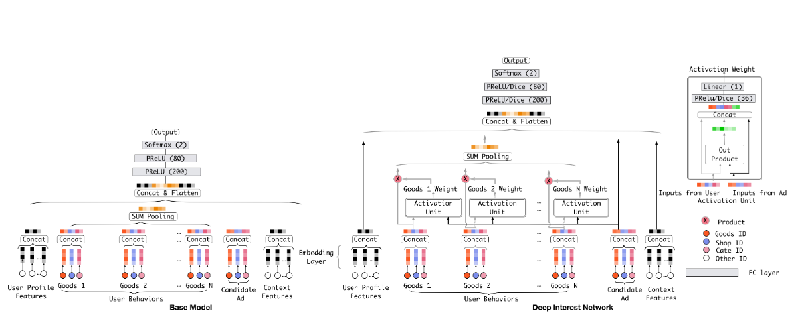
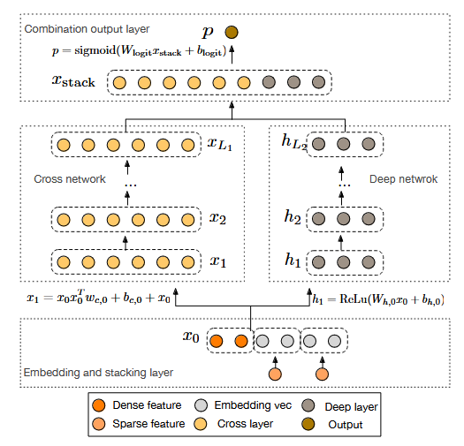

# RecSys Challenge 2024: Model Selection

## Introduction
!!! abstract "Purpose"
    This article will cover model selection in the RecSys Challenge 2024. The content will be structured into the following sections:

    - News RecSys
    - Model Selection

    
    For more in-depth analysis, please check out the [notebook](https://github.com/SulmanK/2024-Recsys-Challenge/blob/main/notebooks/2024_Recsys_Challenge_Model.ipynb)!

    <!-- more -->


!!! info "About"
    This year's challenge focuses on online news recommendation, addressing both the technical and normative challenges inherent in designing effective and responsible recommender systems for news publishing. The challenge will delve into the unique aspects of news recommendation, including modeling user preferences based on implicit behavior, accounting for the influence of the news agenda on user interests, and managing the rapid decay of news items. Furthermore, our challenge embraces the normative complexities, involving investigating the effects of recommender systems on the news flow and whether they resonate with editorial values. [[1]](https://recsys.eb.dk/)

!!! info "Challenge Task"
    The Ekstra Bladet RecSys Challenge aims to predict which article a user will click on from a list of articles that were seen during a specific impression. Utilizing the user's click history, session details (like time and device used), and personal metadata (including gender and age), along with a list of candidate news articles listed in an impression log, the challenge's objective is to rank the candidate articles based on the user's personal preferences. This involves developing models that encapsulate both the users and the articles through their content and the users' interests. The models are to estimate the likelihood of a user clicking on each article by evaluating the compatibility between the article's content and the user's preferences. The articles are ranked based on these likelihood scores, and the precision of these rankings is measured against the actual selections made by users. [[1]](https://recsys.eb.dk/)

!!! info note "Dataset Information"
    The Ekstra Bladet News Recommendation Dataset (EB-NeRD) was created to support advancements in news recommendation research. It was collected from user behavior logs at Ekstra Bladet. We collected behavior logs from active users during the 6 weeks from April 27 to June 8, 2023. This timeframe was selected to avoid major events, e.g., holidays or elections, that could trigger atypical behavior at Ekstra Bladet. The active users were defined as users who had at least 5 and at most 1,000 news click records in a three-week period from May 18 to June 8, 2023. To protect user privacy, every user was delinked from the production system when securely hashed into an anonymized ID using one-time salt mapping. Alongside, we provide Danish news articles published by Ekstra Bladet. Each article is enriched with textual context features such as title, abstract, body, categories, among others. Furthermore, we provide features that have been generated by proprietary models, including topics, named entity recognition (NER), and article embeddings. [[2]](https://recsys.eb.dk/dataset/)

    For more information on the [dataset](https://recsys.eb.dk/dataset/).

## News Recommendation

!!! question "Why do we care about news recommendations?" 

With the rise of online news services like Google News, millions now access news conveniently online. However, finding relevant articles can be challenging. Personalized news recommender systems (NRS) address this by tailoring recommendations to individual interests, enhancing user experience and saving time. These systems track recent user interactions and incorporate factors like publication date, recency, and popularity into their algorithms.

!!! question "What are important aspects of personalized news recommenders?"
Unlike recommendation methods based solely on non-personalized factors like news popularity and freshness, personalized news recommendation (PNR) deeply considers each user's interests. It matches news content, location, and category to user preferences, offering personalized services. Key characteristics of PNR include:

1) **Diversity**: High-quality recommendations require diverse results to enhance user experience and engagement. Most methods focus on accuracy, often neglecting diversity.

2) **Timeliness**: Delivering news quickly is crucial, as the value of news diminishes over time.

3) **Popularity**: Current methods predict click-through rates (CTR) using headlines, summaries, and entities, but few integrate news popularity and user attention to popular news in their predictions.


!!! question "How can we solve this problem?"

Understanding how predictions are made by standard news recommenders is often difficult due to unclear influencing factors. To address this, identifying the key factors that determine whether a user will click on an article is crucial. This approach offers several benefits:

1) It helps system designers understand user behavior and improve recommendations.

2) Transparent recommendations can increase user trust and acceptance.

3) An explainable system enhances user experience, building overall trust.

!!! question "What are area in which personalzied news recommendations fall under?"

### Time-Based News Recommendation
Time-based news recommendation involves timeliness and real-time updates, crucial features that distinguish news recommendations from others. News loses value over time, so systems must update recommendations based on current user behavior (e.g., pulling and sliding). This ensures quick adaptation to changing interests and enhances the user experience.

Liu et al. propose a dual-task deep neural network model that uses an extended time module to refine news embedding and predict user engagement time. This method improves the timeliness of recommendations and promotes the dissemination of the latest news. However, it can slightly diminish the focus on user interests, highlighting the need to balance timeliness and user preferences in news recommendation systems. [[1]](https://www.ijcai.org/Proceedings/2020/482) 

### Location-Based News Recommendation
Mobile users' locations vary, making it essential to consider their current location for more accurate news recommendations. Location-based news recommendations help users find local news and stay updated on nearby events. However, research often focuses on improving location matching accuracy, neglecting location-aware user preferences.

Yuan et al. address this by incorporating the location of news events into recommendation models. They propose an algorithm to extract news event locations and use a vector space model to represent news features. Separate user interest models are then constructed for news with and without geographical locations. [[2]](https://www.jsjkx.com/EN/Y2018/V45/I11A/462)

### Social Network-Based News Recommendation
Social networks, composed of nodes (individuals) and edges (relationships), enable users to make friends and share information, significantly impacting information dissemination. Social information, reflecting users' and their friends' activities, captures the dynamic and diverse nature of user interests. Experiments show that incorporating social factors dynamically captures changing user interests, improving news recommendation effectiveness. 

Saravanapriya et al. propose a multilabel convolutional neural network that mines social media to predict users' multilabel interests and recommend popular news articles based on user tags. [[3]](https://www.semanticscholar.org/paper/Multi-label-Convolution-Neural-Network-for-News-on-Saravanapriya-Senthilkumar/a6004a33699ced82c61ff2b492f225bdc44444d8)


### Sesssion-Based News recommendation
Session-based news recommendation models user preferences over short periods to provide personalized reading suggestions.

Moreira et al. propose Chameleon, a session-based deep learning meta-architecture using recurrent neural networks (RNN) to model users' sequential interests. [[4]](https://arxiv.org/pdf/1904.10367)

!!! question "How do traditional recommendaton system methods apply to news?"
Traditional news recommendation methods fall into three categories: collaborative filtering-based, content-based, and hybrid methods.

1) **Collaborative filtering**: Recommends news based on user similarities or news similarity. However, it often faces data sparsity and cold start issues due to insufficient user ratings, metadata, and textual content for new or less popular news.

2) **Content-based**: Recommends news with similar content to the clicked news, focusing on mining semantic features of news texts.

3) **Hybrid**: Combines collaborative filtering and content-based approaches to overcome limitations of individual methods.

!!! question "Personalized News Recommender Workflow"
In a personalized news recommender system, when a user visits the platform, a small set of candidate news is recalled from a large pool. The personalized recommender then ranks these based on inferred user interests from profiles. The top K news are displayed, and user behaviors on these are recorded to update user profiles for future recommendations. [[5]](https://arxiv.org/abs/2106.08934)



There are three key components in this architecture that are crucial in providing accurate recommendations:

1) News Modeling

News modeling, crucial for news recommendation, employs two main techniques: feature-based and deep learning-based methods.

**Feature-based**: Relies on handcrafted features to represent news articles. For example, in collaborative filtering (CF), news articles are often represented by their IDs. However, this approach suffers from severe cold-start problems and suboptimal performance.

**Deep learning-based**: Incorporates content features to represent news, often using features extracted from news texts. For instance, methods like SF-IDF use WordNet synonym sets to enhance TF-IDF. Additionally, factors like news popularity and recency are considered. However, manually designing features requires significant effort and domain knowledge, and may not fully capture semantic information encoded in news texts.

2) User Modeling

User modeling techniques in news recommendation fall into two main categories: feature-based and deep learning-based methods.

**Feature-based**: Often represent users with their IDs but suffer from data sparsity issues. To improve accuracy, other user information such as click behaviors on news is considered. For instance, Garcin et al. use Latent Dirichlet Allocation (LDA) to extract topics from news titles, summaries, and bodies, aggregating topic vectors of clicked news into a user vector.

**Deep learning-based**: Utilize deep learning techniques to model user interests more accurately. These methods can automatically learn complex patterns from user interactions with news articles, potentially alleviating the need for manual feature engineering.

3) Personalized Ranking

Once news and user interests are modeled, the next step is to rank candidate news in a personalized manner. Methods typically prioritize news based on their relevance to user interests. Accurately measuring this relevance is the core challenge in personalized news ranking.


!!! question "How do we evaluate these methods?"

Various metrics evaluate news recommender system performance, focusing on ranking relevance. The Area Under Curve (AUC) score is commonly used, especially in methods treating recommendation as a classification problem.

$$ AUC = \frac{|\left((i,j)|Rank(p_i) < Rank(n_j)\right)|}{N_pN_n}$$

$N_p$ and $N_n$ represent the numbers of positive and negative samples, respectively. $p_i$ is the predicted score of the $i$-th positive sample, and $n_j$ is the score of the $j$-th negative sample.

Due to the large volume of news, users typically focus more on news at the top of the recommendation list. Some methods adjust recommendation results based on the ranking list. Common ranking evaluation metrics include MRR (mean reciprocal rank) and NDCG (normalized discounted cumulative gain).

$$MRR = \frac{1}{|U|}\sum_{u \in U}\frac{1}{rank_a}$$

Here, $u \in U$ traverses all users, and $rank_u$ denotes the position of the first TP example in the user recommendation list.

$$ NDCG@K = \frac{\sum_{i = 1}^k (2^{r_i} - 1)/log_2(l+i)}{\sum_{u \in U} 1/log_2(l+i)}$$ 

where $r_i$ is the relevance score of the $i$-th news. If user clicks on the $i$-th news, the value of $r_i$ is 1.

## Model Selection
We will explore news recommendation systems, starting from first principles and progressing to state-of-the-art approaches. This will include exploring content-based approaches and hybrid-based approaches.


### Content Based
Our first approach will be utilizing TF-IDF vectorization because of its simplicity.

#### TF-IDF vectorization
It stands for **Term Frequency-Inverse Document Frequency** and aims to quantify the importance of each word in a document relative to a collection of documents (the corpus). Words that appear frequently in a document but rarely in the rest of the corpus get high scores, making them important features.
It has three major components:

(1) **Term Frequency (TF)**: Measures how frequently a term occurs in a document.

$$ TF(t, d) = \frac{\text{Number of times term } t \text{ appears in document } d}{\text{Total number of terms in document } d}$$

(2) **Inverse Document Frequency (IDF)**: Reduces the weight of terms that occur in many documents, as they are less informative.

$$ IDF(t) = \log\left(\frac{\text{Total number of documents}}{\text{Number of documents containing term } t}\right)$$

(3) **TF-IDF Score**: Combines TF and IDF to assign a score to each term in a document.

$$ \text{TF-IDF}(t, d) = TF(t, d) \times IDF(t)$$

Next, we need to use a similarity method to compare documents, such as cosine similarity or FAISS.


##### Cosine Similarity
Cosine similarity is a measure used to determine the similarity between two non-zero vectors in a multi-dimensional space. It calculates the cosine of the angle between the vectors, with values ranging from -1 to 1. In the context of NLP and recommender systems, it is commonly used to compare TF-IDF or word embeddings to evaluate the similarity between documents or items. Setting an appropriate threshold value is crucial for determining the significance of similarity. 

$$ \text{cosine_similarity}(\mathbf{A}, \mathbf{B}) = \frac{\mathbf{A} \cdot \mathbf{B}}{\|\mathbf{A}\| \|\mathbf{B}\|}$$

!!! success "Implmentation"
```python
# Packages
from sklearn.feature_extraction.text import TfidfVectorizer
from sklearn.metrics.pairwise import cosine_similarity
import numpy as np
import pandas as pd
import sklearn

# Load in training data
# Articles
df_art = pd.read_parquet("Data/Small/articles.parquet")

# Behaviors
df_bev = pd.read_parquet("Data/Small/train/behaviors.parquet")

# History
df_his = pd.read_parquet("Data/Small/train/history.parquet")

# Preprocess the data
# Convert datatype of column first
df_bev['article_id'] = df_bev['article_id'].apply(lambda x: x if isinstance(x, str) else int(x) if not np.isnan(x) else x)

# Join bevhaiors to article
df = df_bev.join(df_art.set_index("article_id"), on="article_id")

# Join bevhaiors to history
df = df.join(df_his.set_index("user_id"), on="user_id")

# Drop all other dataframes from me
df.dropna(subset=['article_id'], inplace=True)

# Change article IDs into int
df['article_id'] = df['article_id'].apply(lambda x: int(x))
df['article_id'] = df['article_id'].astype(np.int64)

# Change age from int to string
df['device_type'] = df['device_type'].apply(lambda x: device_(x))

# Change genders from float to string
df['gender'] = df['gender'].apply(lambda x: gender_(x))

# Change age to str it's a range
df['age'] = df['age'].astype('Int64')
df['age'] = df['age'].astype(str)
df['age'] = df['age'].apply(
    lambda x: x if x == '<NA>' else x + ' - ' + x[0] + '9')


# Change postcodes from int to str
df['postcode'] = df['postcode'].apply(lambda x: postcodes_(x))

# Modeling
# Rand Seed
np.random.seed(42)

# Merge fields into strings for processing
df_art['topics_str'] = df_art['topics'].apply(' '.join)
df_art['entity_groups_str'] = df_art['entity_groups'].apply(' '.join)
df_art['ner_clusters_str'] = df_art['ner_clusters'].apply(' '.join)

# Create a dictionary for quick lookups
article_content_dict = {
    row['article_id']: f"{row['title']} {row['body']} {row['category_str']} {row['article_type']} "
                       f"{row['ner_clusters_str']} {row['entity_groups_str']} {row['topics_str']}"
    for _, row in df_art.iterrows()
}

# Fit TF-IDF vectorizer
vectorizer = TfidfVectorizer(norm='l1')
tfidf_matrix_all = vectorizer.fit_transform(article_content_dict.values())
article_ids = list(article_content_dict.keys())

# Map article IDs to indices in the TF-IDF matrix
article_id_to_idx = {article_id: idx for idx, article_id in enumerate(article_ids)}

# Initialize predicted impressions list
predicted_impressions = []
# Store similarity scores for auc_score
similarity_scores = []

# Process each row of the user behavior data
for i in df_bev.index[0:1000]:  
    # Extract the articles viewed by the current user
    user_article_history = df_bev.loc[i, 'article_ids_inview']
    
    # Map article IDs to indices if they exist in the article ID-to-index dictionary
    indices = [article_id_to_idx[x] for x in user_article_history if x in article_id_to_idx]
    
    # If no valid indices are found, append None to predictions and skip further processing
    if not indices:
        predicted_impressions.append(None)
        continue
    
    # Compute the average TF-IDF vector for the user's article history
    user_profile_vector = tfidf_matrix_all[indices].mean(axis=0).A
    
    highest_similarity = 0
    best_imp = None

    # Evaluate each article in the user's history for similarity to the user's profile
    for imp in user_article_history:
        if imp in article_id_to_idx:
            # Retrieve the TF-IDF vector for the article
            imp_idx = article_id_to_idx[imp]
            imp_tfidf_vector = tfidf_matrix_all[imp_idx].A

            # Calculate the cosine similarity between the user's profile and the article
            similarity = cosine_similarity(user_profile_vector, imp_tfidf_vector.reshape(1, -1))[0, 0]
            
            # Update the best match if the current similarity is higher
            if similarity > highest_similarity:
                highest_similarity = similarity
                best_imp = imp

    # If similarity is low, pick a random article; otherwise, use the best match
    if highest_similarity <= 0.5:
        impression = np.random.choice(user_article_history)
        predicted_impressions.append(impression)
        # Assign low similarity value for random choice
        similarity_scores.append(0)  
        print(f"User {df_bev.loc[i, 'user_id']}: Low similarity, random impression chosen")
    else:
        predicted_impressions.append(best_imp)
        similarity_scores.append(highest_similarity)
        print(f"User {df_bev.loc[i, 'user_id']}: Best impression {best_imp} with similarity {highest_similarity}")

# Prepare binary labels for AUC
actual_impressions = [x[0] for x in df_bev['article_ids_clicked'].values][0:1000]
binary_labels = [1 if pred == actual else 0 for pred, actual in zip(predicted_impressions, actual_impressions)]
auc_score = sklearn.metrics.roc_auc_score(binary_labels, similarity_scores)

# Calculate accuracy
y_pred = predicted_impressions
y_true = actual_impressions
acc = sklearn.metrics.accuracy_score(y_true, y_pred)

print("-------------------------")
print("Accuracy:", acc)
print("AUC Score:", auc_score)

```
The model's accuracy is 0.12, lower than a random model's 1/6 (≈0.1667) chance. However, its ROC-AUC score is 0.59, indicating a decent starting point as it outperforms random guessing.

##### FAISS
FAISS (Facebook AI Similarity Search) is a library developed by Facebook AI that provides efficient tools for similarity search and clustering of dense vectors. The central task in FAISS is finding vectors in a database that are closest to a query vector, typically using a similarity measure like cosine similarity or Euclidean distance. Setting an appropriate threshold value is crucial for determining the significance of similarity. In some cases, a dimensional reduction techniques such as SVD must be employed to lower the number of memory required for computation.

!!! success "Implmentation"
```python
# Packages
from sklearn.decomposition import TruncatedSVD
from sklearn.feature_extraction.text import TfidfVectorizer
import numpy as np
import pandas as pd
import sklearn
import faiss  

# Load in training data
# Articles
df_art = pd.read_parquet("Data/Small/articles.parquet")

# Behaviors
df_bev = pd.read_parquet("Data/Small/train/behaviors.parquet")

# History
df_his = pd.read_parquet("Data/Small/train/history.parquet")

# Preprocess the data
# Convert datatype of column first
df_bev['article_id'] = df_bev['article_id'].apply(lambda x: x if isinstance(x, str) else int(x) if not np.isnan(x) else x)

# Join bevhaiors to article
df = df_bev.join(df_art.set_index("article_id"), on="article_id")

# Join bevhaiors to history
df = df.join(df_his.set_index("user_id"), on="user_id")

# Drop all other dataframes from me
df.dropna(subset=['article_id'], inplace=True)

# Change article IDs into int
df['article_id'] = df['article_id'].apply(lambda x: int(x))
df['article_id'] = df['article_id'].astype(np.int64)

# Change age from int to string
df['device_type'] = df['device_type'].apply(lambda x: device_(x))

# Change genders from float to string
df['gender'] = df['gender'].apply(lambda x: gender_(x))

# Change age to str it's a range
df['age'] = df['age'].astype('Int64')
df['age'] = df['age'].astype(str)
df['age'] = df['age'].apply(
    lambda x: x if x == '<NA>' else x + ' - ' + x[0] + '9')


# Change postcodes from int to str
df['postcode'] = df['postcode'].apply(lambda x: postcodes_(x))

# Modeling
# Rand Seed
np.random.seed(42)

# Merge fields into strings for processing
df_art['topics_str'] = df_art['topics'].apply(' '.join)
df_art['entity_groups_str'] = df_art['entity_groups'].apply(' '.join)
df_art['ner_clusters_str'] = df_art['ner_clusters'].apply(' '.join)

# Create a dictionary for quick lookups
article_content_dict = {
    row['article_id']: f"{row['title']} {row['body']} {row['category_str']} {row['article_type']} "
                       f"{row['ner_clusters_str']} {row['entity_groups_str']} {row['topics_str']}"
    for _, row in df_art.iterrows()
}

# Fit TF-IDF vectorizer
vectorizer = TfidfVectorizer(norm='l1')
tfidf_matrix_all = vectorizer.fit_transform(article_content_dict.values())
article_ids = list(article_content_dict.keys())

# Dimensionality reduction for the TF-IDF matrix
# Number of components to keep
n_components = 100  
svd = TruncatedSVD(n_components=n_components)
tfidf_matrix_reduced = svd.fit_transform(tfidf_matrix_all)

# Create a FAISS index for the reduced TF-IDF matrix
index = faiss.IndexFlatL2(tfidf_matrix_reduced.shape[1]) 
index.add(tfidf_matrix_reduced)  

# Map article IDs to indices in the TF-IDF matrix
article_id_to_idx = {article_id: idx for idx, article_id in enumerate(article_ids)}

# Initialize predicted impressions list
predicted_impressions = []
# Store similarity scores for auc_score
similarity_scores = []

# Process each user behavior
for i in df_bev.index[0:1000]:
    user_article_history = df_bev.loc[i, 'article_ids_inview']
    indices = [article_id_to_idx[x] for x in user_article_history if x in article_id_to_idx]

    if not indices:
        predicted_impressions.append(None)
        continue

    # Aggregate user history into a single vector
    user_profile_vector = tfidf_matrix_reduced[indices].mean(axis=0).reshape(1, -1).astype(np.float32)

    # Use FAISS to find nearest neighbors (articles) based on user profile vector
    # Search for top 10 nearest neighbors (articles)
    D, I = index.search(user_profile_vector, k=10)

    # Get the most similar article based on the nearest neighbor
    highest_similarity = D[0][0]
    best_imp_idx = I[0][0]

    # Handle low similarity by selecting a random article
    if highest_similarity < 0.00005:
        impression = np.random.choice(user_article_history)
        predicted_impressions.append(impression)
        similarity_scores.append(0)
        print(f"User {df_bev.loc[i, 'user_id']}: Low similarity, random impression chosen")
    else:
        # Retrieve the article ID of the best match
        best_imp = article_ids[best_imp_idx]
        predicted_impressions.append(best_imp)
        # Store the similarity score
        similarity_scores.append(highest_similarity)  
        print(f"User {df_bev.loc[i, 'user_id']}: Best impression {best_imp} with similarity {highest_similarity}")

# Prepare binary labels for AUC
actual_impressions = [x[0] for x in df_bev['article_ids_clicked'].values][0:1000]
binary_labels = [1 if pred == actual else 0 for pred, actual in zip(predicted_impressions, actual_impressions)]
auc_score = sklearn.metrics.roc_auc_score(binary_labels, similarity_scores)

# Calculate accuracy
y_pred = predicted_impressions
y_true = actual_impressions
acc = sklearn.metrics.accuracy_score(y_true, y_pred)

print("-------------------------")
print("Accuracy:", acc)
print("AUC Score:", auc_score)


```
The model's accuracy is 0.096, below a random model's 1/6 (≈0.1667) chance, and its ROC-AUC score of 0.3324 indicates it performs worse than random guessing.

### Hybrid-Approach
Content-based approaches performed poorly due to the use of TF-IDF vectorization, a bag-of-words model that fails to capture relationships between words. Now, we'll use more state-of-the-art models!

!!! question "What are some hybrid-based CTR approaches that can be applied to news recommendation?"


While researching novel recommender systems for CTR prediction, I discovered the BARS-CTR paper, which offers an open-source benchmark across diverse datasets and models. Its GitHub repository, [FuxiCTR](https://github.com/reczoo/FuxiCTR), was pivotal in understanding and applying hybrid approaches like Deep & Cross Network (DCN) and Deep Interest Network (DIN). [[6]](https://arxiv.org/pdf/2009.05794)


#### Deep Interest Network

The Deep Interest Network (DIN) enhances CTR prediction by adaptively capturing users' diverse interests. It uses a local activation unit to model user behaviors in relation to the specific ad, improving on traditional Embedding & MLP methods.



The local activation unit in DIN is a key component that allows the model to capture the diversity of user interests by dynamically generating a user representation vector based on the relevance of their past behaviors to the specific ad being shown. Instead of a fixed representation, this unit emphasizes behaviors related to the ad being considered. For example, if a user has browsed both clothes and electronics, the local activation unit will give more weight to clothes-related behaviors when predicting their likelihood to click on a T-shirt ad. This weighted sum pooling approach, similar to attention mechanisms but without normalizing the weights, retains information about the intensity of the user's interest, allowing DIN to distinguish between strong and weak interest levels. [[7]](https://arxiv.org/pdf/1706.06978)


##### Data Preparation
The data preparation script is displayed [here](https://github.com/SulmanK/2024-Recsys-Challenge/blob/main/fuxcitr_dir/data/prepare_data_v1.py).

The main goal is to preprocess news and user interaction data across the training, validation, and testing sets.

- Inputs: article, behavior, history .parquet files
- Output: training, validation, testing .csv files

**Function**

1. Loading in news articles from the parquet files.

2. Tokenize and map categorical features.

3. Process user interaction history.

4. Create feature mappings for categories, sentiments, and article types.

5. Generate CSV files with processed features.

##### Model training
Train a Deep Interest Network (DIN) model. The model configuration is [here](https://github.com/SulmanK/2024-Recsys-Challenge/blob/main/fuxcitr_dir/config/base_config/model_config.yaml). 

**Important parameters**

*Model Architecture*

- embedding_dim: Dimensionality of feature embeddings (default: 40)
- dnn_hidden_units: Neural network architecture (default: [500, 500, 500])
- dnn_activations: Activation function for dense layers (default: relu)

*Attention Mechanism*


- din_target_field: The target item being predicted
- din_sequence_field: User's historical interaction sequence
- attention_hidden_units: Structure of attention network
- attention_hidden_activations: Activation in attention layers (default: "Dice")
- din_use_softmax: Whether to use softmax in attention mechanism

*Training Dynamics*


- learning_rate: Controls model convergence (default: 1e-3)
- batch_size: Number of samples per training iteration
- epochs: Total training iterations
- optimizer: Optimization algorithm (default: adam)


Below is a code snippet of a DIN dataset config that performed the best.
```python
dataset_config:
    ebnerd_large_x2:
        data_root: ./data/
        data_format: csv
        train_data: ./data/Ebnerd_large_x2/train.csv
        valid_data: ./data/Ebnerd_large_x2/valid.csv
        test_data: ./data//Ebnerd_large_x2/test.csv
        min_categr_count: 10
        data_block_size: 100000
        streaming: True
        feature_cols:
            - {name: impression_id, active: True, dtype: int, type: meta, remap: False}
            - {name: read_time, active: True, dtype: float, type: numeric, fill_na: 0}
            - {name: user_id, active: True, dtype: str, type: categorical}
            - {name: article_id, active: True, dtype: str, type: categorical}
            - {name: trigger_id, active: True, dtype: str, type: categorical}
            - {name: device_type, active: True, dtype: str, type: categorical}
            - {name: is_sso_user, active: True, dtype: str, type: categorical}
            - {name: gender, active: True, dtype: str, type: categorical}
            - {name: postcode, active: True, dtype: str, type: categorical}
            - {name: age, active: True, dtype: str, type: categorical}
            - {name: is_subscriber, active: True, dtype: str, type: categorical}
            - {name: premium, active: True, dtype: str, type: categorical}
            - {name: article_type, active: True, dtype: str, type: categorical}
            - {name: ner_clusters, active: True, dtype: str, type: sequence, splitter: ^, max_len: 5, padding: pre}
            - {name: topics, active: True, dtype: str, type: sequence, splitter: ^, max_len: 5, padding: pre}
            - {name: category, active: True, dtype: str, type: categorical}
            - {name: subcategory, active: True, dtype: str, type: sequence, splitter: ^, max_len: 5, padding: pre}
            - {name: total_inviews, active: False, dtype: float, type: numeric, fill_na: 0}
            - {name: total_pageviews, active: False, dtype: float, type: numeric, fill_na: 0}
            - {name: total_read_time, active: False, dtype: float, type: numeric, fill_na: 0}
            - {name: sentiment_score, active: False, dtype: float, type: numeric, fill_na: 0}
            - {name: sentiment_label, active: True, dtype: str, type: categorical}
            - {name: subcat1, active: True, dtype: str, type: categorical}
            - {name: hist_id, active: True, dtype: str, type: sequence, splitter: ^, max_len: 50, padding: pre, share_embedding: article_id}
            - {name: hist_cat, active: True, dtype: str, type: sequence, splitter: ^, max_len: 50, padding: pre, share_embedding: category}
            - {name: hist_subcat1, active: True, dtype: str, type: sequence, splitter: ^, max_len: 50, padding: pre, share_embedding: subcat1}
            - {name: hist_sentiment, active: True, dtype: str, type: sequence, splitter: ^, max_len: 50, padding: pre, share_embedding: sentiment_label}
            - {name: hist_type, active: True, dtype: str, type: sequence, splitter: ^, max_len: 50, padding: pre, share_embedding: article_type}
            - {name: publish_days, active: True, dtype: str, type: categorical}
            - {name: publish_hours, active: True, dtype: str, type: categorical}
            - {name: impression_hour, active: True, dtype: str, type: categorical}
            - {name: impression_weekday, active: True, dtype: str, type: categorical}
            - {name: pulish_3day, active: True, dtype: str, type: categorical}
            - {name: pulish_7day, active: True, dtype: str, type: categorical}
            - {name: article_id_img, active: True, dtype: str, type: categorical, freeze_emb: True,
               preprocess: "copy_from(article_id)", pretrain_dim: 64, pretrained_emb: "./data/Ebnerd_large_x1/image_emb_dim64.npz", 
               pretrain_usage: "init", min_categr_count: 1}
            - {name: article_id_text, active: True, dtype: str, type: categorical, freeze_emb: True,
               preprocess: "copy_from(article_id)", pretrain_dim: 64, pretrained_emb: "./data/Ebnerd_large_x1/contrast_emb_dim64.npz", 
               pretrain_usage: "init", min_categr_count: 1}
            - {name: hist_id_img, active: True, dtype: str, type: sequence, splitter: ^, max_len: 50, padding: pre, freeze_emb: True,
               preprocess: "copy_from(hist_id)", pretrain_dim: 64, pretrained_emb: "./data/Ebnerd_large_x1/image_emb_dim64.npz", 
               pretrain_usage: "init", min_categr_count: 1, share_embedding: article_id_img}
            - {name: hist_id_text, active: True, dtype: str, type: sequence, splitter: ^, max_len: 50, padding: pre, freeze_emb: True,
               preprocess: "copy_from(hist_id)", pretrain_dim: 64, pretrained_emb: "./data/Ebnerd_large_x1/contrast_emb_dim64.npz", 
               pretrain_usage: "init", min_categr_count: 1, share_embedding: article_id_text}     
        label_col: {name: click, dtype: float}
```


Below is a code snippet of a DIN model config that performed the best.
```python
DIN_doubleq:
    attention_dropout: 0.2
    attention_hidden_activations: ReLU
    attention_hidden_units: [512, 256]
    attention_output_activation: null
    batch_norm: true
    batch_size: 7168
    dataset_id: TBD
    debug_mode: false
    din_sequence_field: click_history
    din_target_field: item_id
    din_use_softmax: false
    dnn_activations: ReLU
    dnn_hidden_units: [1024, 512, 256]
    early_stop_patience: 2
    embedding_dim: 64
    embedding_regularizer: 0.0001
    epochs: 10
    eval_steps: null
    feature_config: null
    feature_specs: null
    group_id: impression_id
    item_info_fields: 12
    learning_rate: 0.0005
    loss: binary_crossentropy
    metrics: [avgAUC, AUC, logloss]
    model: DIN
    model_root: ./checkpoints/
    monitor: avgAUC
    monitor_mode: max
    net_dropout: 0.1
    net_regularizer: 0
    num_workers: 3
    optimizer: adam
    pickle_feature_encoder: true
    save_best_only: true
    seed: 20242025
    shuffle: true
    task: binary_classification
    use_features: null
    verbose: 1
```
##### Prediction
The submission script is displayed [here](https://github.com/SulmanK/2024-Recsys-Challenge/blob/main/fuxcitr_dir/submit.py).

The main goal is to make predictions on the testing set.

**Function**

1. Create a data loader for test data
2. Load test data from CSV
3. Predicts scores for each sample
4. Ranks predictions for each impression 
5. Writes results to a predictions.txt file
6. Zip the predictions 

##### Procedure
1. Prepare the data by preprocessing news and user interaction data. (go to fuxcitr_dir/data directory)

    ``` python prepare_data_v2.py```

2. Run the following script in the fuxcitr_dir directory to train the model on train and validation sets.

    ```python run_param_tuner.py --config config/DIN_ebnerd_large_x2_tuner_config_doubleq_02.yaml --gpu 0```

3. Run the following script in the fuxcitr_dir directory to make predictions on the test set.

    ```python submit.py --config config/DIN_ebnerd_large_x2_tuner_config_doubleq_02 --expid DIN_ebnerd_large_x2_001_1860e41e --gpu 1```

##### Results
The results of our best-performing run, including detailed metrics, can be found [here](https://github.com/SulmanK/2024-Recsys-Challenge/blob/main/fuxcitr_dir/exp_results/DiN_ebnerd_large_x2_tuner_config_doubleq_02.csv). It outlines the specifications of our top DIN model, in which we achieved an ROC-AUC score of 0.676359.

```csv
 20241214-233112,[command] python run_expid.py --config config/DiN_ebnerd_large_x2_tuner_config_doubleq_02 --expid DIN_ebnerd_large_x2_001_3e89b3ec --gpu 0,[exp_id] DIN_ebnerd_large_x2_001_3e89b3ec,[dataset_id] ebnerd_large_x2_7ea969aa,[train] N.A.,[val] avgAUC: 0.676359 - MRR: 0.443784 - NDCG(k=5): 0.504221,[test] 
```

#### Deep Cross Network

The Deep Cross Network (DCN) combines a cross network and a deep neural network to capture feature interactions in high-dimensional sparse data. The cross network handles explicit feature crossing, while the deep network models implicit interactions. [[8]](https://arxiv.org/pdf/1708.05123)




Here's a simplified breakdown of its components:

1. **Embedding and Stacking Layer**
    - Converts categorical features (e.g., "country=USA") into numerical representations for the model to process.  
    - Combines these embeddings with other numerical features into a single input vector.  


2. **Cross Network**
    - The core of the DCN, designed to efficiently identify interactions between features.  
    - For example, it can uncover that users in the USA who like a specific brand are highly likely to click on a particular ad.  


3. **Deep Network**
    - A standard neural network component that captures complex, nonlinear patterns in the data.  

4. **Combination Layer**
    - Merges the outputs from the cross and deep networks.  
    - The combined features are used to predict the likelihood of a user clicking on an ad.  


##### Data Preparation
The data preparation script is displayed [here](https://github.com/SulmanK/2024-Recsys-Challenge/blob/main/fuxcitr_dir/data/prepare_data_v1.py).

The main goal is to preprocess news and user interaction data across the training, validation, and testing sets.

- Inputs: article, behavior, history .parquet files
- Output: training, validation, testing .csv files

**Function**

1. Loading in news articles from the parquet files.

2. Tokenize and map categorical features.

3. Process user interaction history.

4. Create feature mappings for categories, sentiments, and article types.

5. Generate CSV files with processed features.

##### Model training
Train a Deep Cross Network (DCN) model. The model configuration is [here](https://github.com/SulmanK/2024-Recsys-Challenge/blob/main/fuxcitr_dir/src/DCN.py). 

**Important Parameters**

*Model Architecture*

- embedding_dim: Dimensionality of feature embeddings (*default: 10*). This controls the size of the embedding vectors used to represent categorical features.

- dnn_hidden_units: Architecture of the fully connected neural network (*default: []*). This defines the number of layers and the units in each layer. Leave empty to use only the cross network.

- dnn_activations: Activation function for the dense layers (*default: "ReLU"*). Determines the non-linear transformation applied to the output of each dense layer.

- num_cross_layers: Number of cross layers in the CrossNet (*default: 3*). Controls the depth of the cross feature interactions.

- net_dropout: Dropout rate applied to the dense layers (*default: 0*). Helps to prevent overfitting.

- batch_norm: Whether to apply batch normalization to dense layers (*default: False*). Useful for stabilizing training.

*Regularization*

- embedding_regularizer: Regularization applied to the embedding layer. Helps to control overfitting in the embeddings.

- net_regularizer: Regularization applied to the network layers.

*Training Dynamics*

- learning_rate: Controls the step size for model optimization (*default: 1e-3*). Affects how quickly the model converges during training.
- optimizer: Optimization algorithm used for training (*default: as specified in the model initialization*).
- batch_size: Number of samples per training iteration. Determines the computational efficiency and convergence stability.
- epochs: Total number of training iterations. Defines how many times the model will see the full dataset.


Below is a code snippet of a DCN dataset config that performed the best.
```python
dataset_config:
    ebnerd_large_x2:
        data_root: ./data/
        data_format: csv
        train_data: ./data/Ebnerd_large_x2/train.csv
        valid_data: ./data/Ebnerd_large_x2/valid.csv
        test_data: ./data//Ebnerd_large_x2/test.csv
        min_categr_count: 10
        data_block_size: 100000
        streaming: True
        feature_cols:
            - {name: impression_id, active: True, dtype: int, type: meta, remap: False}
            - {name: read_time, active: True, dtype: float, type: numeric, fill_na: 0}
            - {name: user_id, active: True, dtype: str, type: categorical}
            - {name: article_id, active: True, dtype: str, type: categorical}
            - {name: trigger_id, active: True, dtype: str, type: categorical}
            - {name: device_type, active: True, dtype: str, type: categorical}
            - {name: is_sso_user, active: True, dtype: str, type: categorical}
            - {name: gender, active: True, dtype: str, type: categorical}
            - {name: postcode, active: True, dtype: str, type: categorical}
            - {name: age, active: True, dtype: str, type: categorical}
            - {name: is_subscriber, active: True, dtype: str, type: categorical}
            - {name: premium, active: True, dtype: str, type: categorical}
            - {name: article_type, active: True, dtype: str, type: categorical}
            - {name: ner_clusters, active: True, dtype: str, type: sequence, splitter: ^, max_len: 5, padding: pre}
            - {name: topics, active: True, dtype: str, type: sequence, splitter: ^, max_len: 5, padding: pre}
            - {name: category, active: True, dtype: str, type: categorical}
            - {name: subcategory, active: True, dtype: str, type: sequence, splitter: ^, max_len: 5, padding: pre}
            - {name: total_inviews, active: False, dtype: float, type: numeric, fill_na: 0}
            - {name: total_pageviews, active: False, dtype: float, type: numeric, fill_na: 0}
            - {name: total_read_time, active: False, dtype: float, type: numeric, fill_na: 0}
            - {name: sentiment_score, active: False, dtype: float, type: numeric, fill_na: 0}
            - {name: sentiment_label, active: True, dtype: str, type: categorical}
            - {name: subcat1, active: True, dtype: str, type: categorical}
            - {name: hist_id, active: True, dtype: str, type: sequence, splitter: ^, max_len: 50, padding: pre, share_embedding: article_id}
            - {name: hist_cat, active: True, dtype: str, type: sequence, splitter: ^, max_len: 50, padding: pre, share_embedding: category}
            - {name: hist_subcat1, active: True, dtype: str, type: sequence, splitter: ^, max_len: 50, padding: pre, share_embedding: subcat1}
            - {name: hist_sentiment, active: True, dtype: str, type: sequence, splitter: ^, max_len: 50, padding: pre, share_embedding: sentiment_label}
            - {name: hist_type, active: True, dtype: str, type: sequence, splitter: ^, max_len: 50, padding: pre, share_embedding: article_type}
            - {name: publish_days, active: True, dtype: str, type: categorical}
            - {name: publish_hours, active: True, dtype: str, type: categorical}
            - {name: impression_hour, active: True, dtype: str, type: categorical}
            - {name: impression_weekday, active: True, dtype: str, type: categorical}
            - {name: pulish_3day, active: True, dtype: str, type: categorical}
            - {name: pulish_7day, active: True, dtype: str, type: categorical}
            - {name: article_id_img, active: True, dtype: str, type: categorical, freeze_emb: True,
               preprocess: "copy_from(article_id)", pretrain_dim: 64, pretrained_emb: "./data/Ebnerd_large_x1/image_emb_dim64.npz", 
               pretrain_usage: "init", min_categr_count: 1}
            - {name: article_id_text, active: True, dtype: str, type: categorical, freeze_emb: True,
               preprocess: "copy_from(article_id)", pretrain_dim: 64, pretrained_emb: "./data/Ebnerd_large_x1/contrast_emb_dim64.npz", 
               pretrain_usage: "init", min_categr_count: 1}
            - {name: hist_id_img, active: True, dtype: str, type: sequence, splitter: ^, max_len: 50, padding: pre, freeze_emb: True,
               preprocess: "copy_from(hist_id)", pretrain_dim: 64, pretrained_emb: "./data/Ebnerd_large_x1/image_emb_dim64.npz", 
               pretrain_usage: "init", min_categr_count: 1, share_embedding: article_id_img}
            - {name: hist_id_text, active: True, dtype: str, type: sequence, splitter: ^, max_len: 50, padding: pre, freeze_emb: True,
               preprocess: "copy_from(hist_id)", pretrain_dim: 64, pretrained_emb: "./data/Ebnerd_large_x1/contrast_emb_dim64.npz", 
               pretrain_usage: "init", min_categr_count: 1, share_embedding: article_id_text}     
        label_col: {name: click, dtype: float}
```


Below is a code snippet of a DCN model config that performed the best.
```python
DCN_doubleq:
    batch_norm: true
    batch_size: 7168
    dataset_id: Ebnerd_large_data
    debug_mode: false
    dnn_activations: ReLU
    dnn_hidden_units: [1024, 512, 256]
    early_stop_patience: 2
    embedding_dim: 64
    embedding_regularizer: 1.0e-05
    epochs: 10
    eval_steps: null
    feature_config: null
    feature_specs: null
    group_id: impression_id
    item_info_fields: 12
    learning_rate: 0.0005
    loss: binary_crossentropy
    metrics: [avgAUC, AUC, logloss]
    model: DCN
    model_root: ./checkpoints/
    monitor: avgAUC
    monitor_mode: max
    net_dropout: 0.1
    net_regularizer: 0
    num_cross_layers: 3
    num_workers: 3
    optimizer: adam
    pickle_feature_encoder: true
    save_best_only: true
    seed: 20242025
    shuffle: true
    task: binary_classification
    use_features: null
    verbose: 1
```
##### Prediction
The submission script is displayed [here](https://github.com/SulmanK/2024-Recsys-Challenge/blob/main/fuxcitr_dir/submit.py).

The main goal is to make predictions on the testing set.

**Function**

1. Create a data loader for test data
2. Load test data from CSV
3. Predicts scores for each sample
4. Ranks predictions for each impression 
5. Writes results to a predictions.txt file
6. Zip the predictions 

##### Procedure
1. Prepare the data by preprocessing news and user interaction data. (go to fuxcitr_dir/data directory)

    ``` python prepare_data_v2.py```

2. Run the following script in the fuxcitr_dir directory to train the model on train and validation sets.

    ```python run_param_tuner.py --config config/DCN_ebnerd_large_x2_tuner_config_doubleq_02.yaml --gpu 0```

3. Run the following script in the fuxcitr_dir directory to make predictions on the test set.

    ```python submit.py --config config/DCN_ebnerd_large_x2_tuner_config_doubleq_01 --expid DCN_ebnerd_large_x2_001_1860e41e --gpu 1```

##### Results
The results of our best-performing run, including detailed metrics, can be found [here](https://github.com/SulmanK/2024-Recsys-Challenge/blob/main/fuxcitr_dir/exp_results/DCN_ebnerd_large_x2_tuner_config_doubleq_02.csv). It outlines the specifications of our best performing model, in which we achieved an ROC-AUC score of 0.6857.

```csv
20241214-205228	[command] python run_expid.py --config config/DCN_ebnerd_large_x2_tuner_config_doubleq_02 --expid DCN_ebnerd_large_x2_001_c76e9991 --gpu 0	[exp_id] DCN_ebnerd_large_x2_001_c76e9991	[dataset_id] ebnerd_large_x2_7ea969aa	[train] N.A.	[val] avgAUC: 0.685714 - MRR: 0.454175 - NDCG(k=5): 0.516215	[test] 
```


## References
1.  [Hypernews: simultaneous news recommendation and active-time prediction via a double-task deep neural network.](https://www.ijcai.org/Proceedings/2020/482)

2.  [Research on news recommendation methods considering geographical location of news](https://www.jsjkx.com/EN/Y2018/V45/I11A/462)

3.  [Saravanapriya M, Senthilkumar R, Saktheeswaran J (2022) Multi-label convolution neural network for personalized news recommendation based on social media mining.](https://www.semanticscholar.org/paper/Multi-label-Convolution-Neural-Network-for-News-on-Saravanapriya-Senthilkumar/a6004a33699ced82c61ff2b492f225bdc44444d8)

4.  [Contextual Hybrid Session-based News Recommendation with Recurrent Neural Networks](https://arxiv.org/pdf/1904.10367)

5. [Personalized News Recommendation: Methods and Challenges](https://arxiv.org/abs/2106.08934)

6. [BARS-CTR: Open Benchmarking for Click-Through Rate Prediction](https://arxiv.org/pdf/2009.05794)

7. [Deep Interest Network for Click-Through Rate Prediction](https://arxiv.org/pdf/1706.06978)

8. [Deep & Cross Network for Ad Click Predictions](https://arxiv.org/pdf/1708.05123)