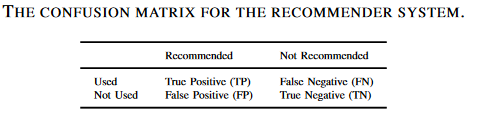
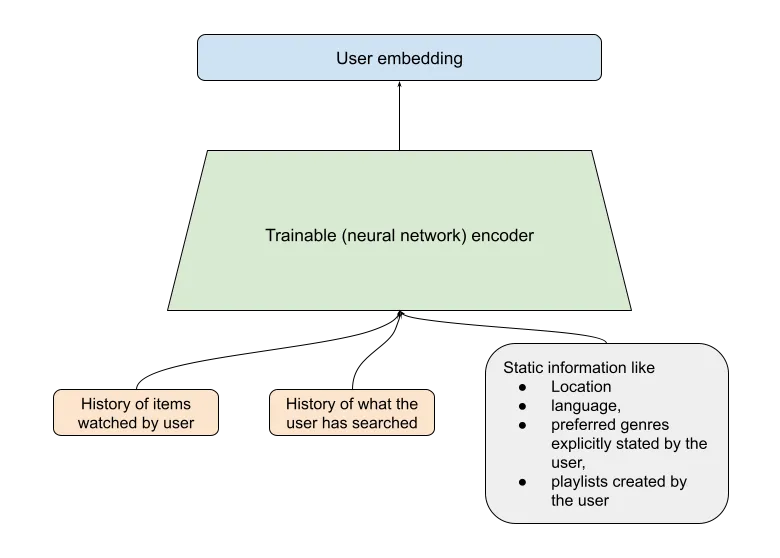
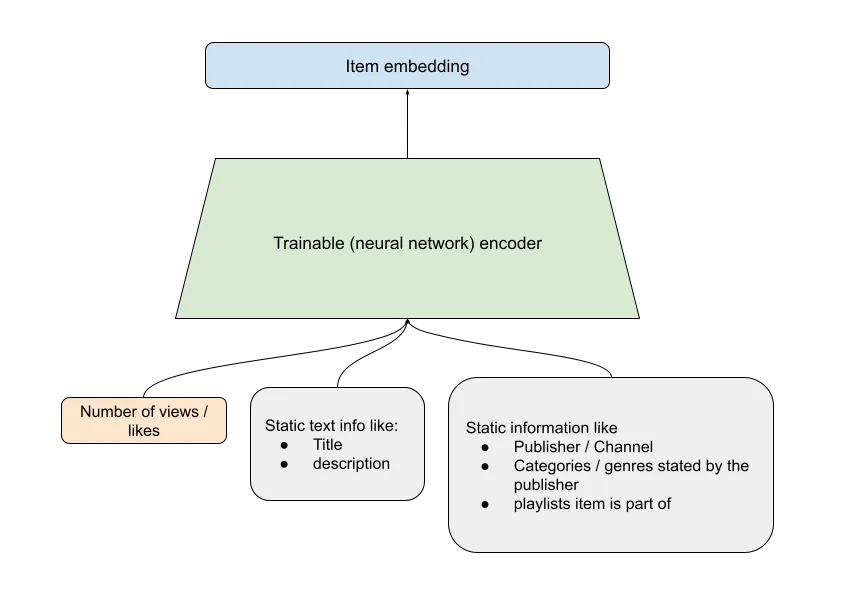

# Recommendation Systems: Overview

## Introduction

### What is RecSys?
Recommender systems suggest things you might like by analyzing your preferences, item details, and how you've interacted with them. 
Personalized recommender systems predict individual preferences based on past behavior, while group recommender systems consider collective preferences to resolve conflicts. Personalized systems focus on tailoring recommendations to individual interests and are the most studied type. [[1]](https://arxiv.org/abs/2306.12680)

### Why do we care about Recsys?
In industry, recommender systems are crucial for improving user experience and driving sales on online platforms. For instance, 80% of Netflix movie views and 60% of YouTube video clicks stem from recommendations. [[2]](https://dl.acm.org/doi/pdf/10.1145/2843948),[[3]](https://dl.acm.org/doi/10.1145/1864708.1864770). Recommender systems are vital for keeping users engaged by supplying relevant items.engaged on the platform. 

### Problems from RecSys
In commercial applications, a recommender system's robustness, data bias, and fairness are critical for its success. Robustness ensures accurate recommendations despite changing data. Data bias refers to systematic errors that can lead to unfair recommendations. Fairness means providing unbiased recommendations regardless of user characteristics. [[1]](https://arxiv.org/abs/2306.12680) 

#### Robustness

Adversarial attacks test recommender system robustness by altering image or text inputs. In natural language processing, attackers exploit embeddings, like user or item profiles, for attacks.

#### Data bias
Adversarial attacks test recommender system robustness by altering inputs like pixel values or text. In natural language processing, attackers exploit embeddings, such as user or item profiles, exposure bias, and position bias for attacks. Addressing biases is crucial for reliable recommendations.

##### Popularity deviation
Popularity deviation, akin to a long-tail problem, occurs when a small number of highly popular items dominate user interactions, while less popular items receive little attention. This skews model training towards popular items, resulting in unfair recommendations favoring popular items over others.

##### Selection bias
Selection bias arises when users tend to rate only products they strongly like or dislike, causing a Missing-Not-At-Random (MNAR) problem and skewing recommendations.

##### Exposure bias
Exposure bias occurs when users can only see and interact with a portion of items presented by the system due to time constraints. This leads to deviations because users may miss items they would like or dislike.

##### Positional deviation
Positional deviation refers to users' tendency to interact more with items placed prominently in recommendation lists, regardless of relevance to their needs. This concept impacts click-through rate prediction in recommender systems.

#### Fairness
Recommender system fairness includes user-based and item-based fairness. User-based fairness ensures no discrimination based on sensitive attributes, while item-based fairness ensures equal recommendation opportunities for all items. The cold-start and long-tail problems are examples of item-based fairness issues, with the latter also linked to exposure bias.

##### User-Based Fairness
Researchers are actively exploring methods like meta-learning, adversarial training, and differential privacy to improve user-based fairness in machine learning models. Approaches such as Cold-Transformer aim to enhance user preference accuracy by incorporating context-based embeddings. These efforts highlight the significance of addressing fairness and privacy concerns to better serve under-served users. [[4]](https://dl.acm.org/doi/proceedings/10.1145/3477495)

##### Item-Based Fairness
Various methods address item-based fairness in recommender systems:

- Causal inference frameworks reduce popularity bias and alleviate the long tail problem.  [[5]](https://dl.acm.org/doi/10.1145/3459637.3482071)
- Adversarial training  enhances model accuracy but may amplify popularity deviation in unbalanced data distributions. [[6]](https://dl.acm.org/doi/10.1145/3460231.3478858)
- The FairGAN model tackles fairness by mapping it to the negative preference problem and preserving user utility. [[7]](https://dl.acm.org/doi/10.1145/3485447.3511958)

### What are the evaluation metrics?
Evaluation metrics for recommender systems can be classified into Rating Based Indicators (RBI) and Item Based Indicators (IBI). RBI assesses recommendations using predicted rating scores, while IBI evaluates recommendations based on a list of predicted items. 

#### Rating-Based Indicator
Rating-based indicators assess the quality of predicted rating scores, often by calculating the gap between implicit or explicit labels. Common measurements include Root Mean Squared Error (RMSE), especially when the rating score is an explicit value. 

RMSE is calculated by

$$RMSE = \sqrt{\frac{1}{|U||I|}\sum_{u \in U, i \in I}(\hat{r}_{ui} - r_ui)^2}$$

Similarly, Mean Absolute Error (MAE) is another common measurement, given by:

$$MAE = \sqrt{\frac{1}{|U||I|}\sum_{u \in U, i \in I}|\hat{r}_{ui} - r_ui|}$$

In both equations, $U$ represents the set of users, $I$ represents the set of items, $\hat{r}$ denotes the predicted rating, and $r$ denotes the true rating.

RMSE and MAE are non-negative metrics, where lower values indicate better performance. However, they are sensitive to outliers because each squared difference $((\hat{r_{ui}} - r_{ui}))^2$ in RMSE, $|\hat{r_{ui}} - r_{ui}|^2$ in MAE)  contributes proportionally to the final error. [[1]](https://arxiv.org/abs/2306.12680)

#### Item-Based Indicator

When ranking information is absent in a recommender system, evaluation can utilize a confusion matrix like the Table above for assessment. In evaluation, TP represents the used items recommended by the system, while FP denotes unused items incorrectly recommended. FN indicates used items not recommended by the system. TN is the outcome of the not used items that are not recommended by the system. Commonly used metrics like Precision, Recall, and F-Measure are combinations from the previously mentioned metrics for a more holistic evaluation.

$$Precision = \frac{TP}{TP + FP}$$

$$Recall = \frac{TP}{TP + FN}$$

$$F-Measure = \frac{2*Precision*Recall}{Precision + Recall}$$

#### Ranking Indicator
Precision and Recall metrics are not inherently concerned with the order of recommendations. To address this, Precision@k and Recall@k focus on subsets of ordered lists, considering only the top k items for evaluation.

A more comprehensive evaluation metric is the mean average precision (MAP@k) and mean average recall (MAR@k), which average precision and recall across all users for the top k recommendations.

$$ MAP@K = \frac{\sum_{i=1}^k(Precision@i * rel(i))}{min(k,number\; of\; relevant\; items  )}$$

$$ MAR@K = \frac{\sum_{i=1}^k(Recall@i * rel(i))}{total\; number\; of\; relevant\; items  )}$$

MAP@k and MAR@k utilize the indicator function $rel(i)$, where 1 indicates relevance and 0 indicates irrelevance of the $i-th$ item to the target. While useful for evaluating overall system performance, these metrics are not suitable for fine-grained numerical ratings as they require a threshold for conversion to binary correlations, leading to bias and loss of detailed information.

### What are Recommendation System Methods?
Personalized recommender systems can be categorized into three main approaches:

  * Collaborative filtering

  * Content-based

  * Hybrid methods

#### Collaborative filtering
Collaborative filtering (CF) is a popular recommendation technique leveraging the collective knowledge of users to predict preferences. It assumes users with similar behaviors share similar opinions, utilizing user profiles created from historical interactions. CF encompasses memory-based CF and model-based CF approaches.

##### Memory-based CF
Memory-based collaborative filtering (CF) calculates similarity between users or items and generates recommendations based on sorted similarity values. It's efficient and popular, leveraging historical data to capture user behavior patterns and preferences for personalized recommendations.

###### Challenges
The sparsity of the interaction matrix, with limited non-zero values, makes recommendation predictions prone to errors. Additionally, as user and item spaces expand, similarity calculations become more complex and time-consuming, hindering scalability in large-scale applications.

###### How is similarity calculated?
Similarity calculation is essential in recommender systems, especially in collaborative filtering, where it's derived from co-rated items to predict preferences. Methods like Pearson Correlation Coefficient (PCC), Cosine similarity (COS), Mean Squared Difference (MSD), Proximity Impact Popularity (PIP), Jaccard Similarity, and Proximity Significance Singularity (PSS) are commonly used. Each method has distinct strengths and limitations, with selection dependent on system type and data characteristics.

##### Model-based CF
Model-based collaborative filtering (CF) is another popular recommendation approach. It predicts user preferences based on relationships between users and items.

The neural-based CF framework involves mapping user and item representations ($s_u$ and $s_i$) along with reviewing text data ($t_{ui}$) to a continuous vector space through a neural network ($NN$). The model parameters ($\theta$) are optimized to minimize prediction error. The output of the neural network ($\hat{r}$) represents the predicted rating, typically used in factorization-based methods for further refinement. 

The Factorization Machine (FM) is a tool in neural-based CF, adept at efficiently handling sparse data, a common challenge in user-item interaction data. This versatility extends to incorporating various features, both categorical and numerical, making it well-suited for real-world recommendation tasks. Its scalability in training procedures further solidifies its popularity for large-scale recommendation systems.

The factorization machine predicts the output $y \in R$, which considers the dot product between $\omega$ and $x$ as well as the dot product between the rows of $V$. The weight parameter $w \in R^d$ and the factorization matrix $V \in R^{dxk}$ are key components of the model, with $k$ being a rank hyperparameter that can be adjusted based on the data type.
 
$$y_{FM} := <w,x> + \sum_{i>j}<v_j,v_i>x_jx_i$$

#### Content-based
The content-based recommender system classifies items based on attribute information for personalized recommendations. Unlike collaborative filtering, it treats recommendations as a user-specific classification problem, learning a classifier from item features. It focuses on user preference models and interaction history. Item classification in content-based RS relies on item features obtained through item presentation algorithms. Side information can include metadata or user-generated content, typically item descriptions or full-text indexing. 

##### Similarity measures
Cosine Similarity: Measures the cosine of the angle between two vectors. It's widely used for text-based recommendations.

Euclidean Distance: Measures the straight-line distance between two vectors in a multidimensional space.

Pearson Correlation Coefficient: Measures the linear correlation between two variables. It's often used when dealing with numerical attributes.

Jaccard Similarity: Measures the similarity between two sets by comparing their intersection to their union. It's useful for categorical data or binary features

#### Hybrid 
Recommender systems have evolved to require integration of multiple data sources for real-time, accurate recommendations. Deep learning facilitates effective fusion of diverse information, like context and content, in hybrid recommender systems, combine user-item interactions and contextual features for recommendation. [[8]](https://dl.acm.org/doi/10.1145/3460231.3474272).

##### Why is a hybrid approach suitable?
The cold start problem in collaborative filtering occurs when new users have insufficient data for personalized recommendations. To address this, a hybrid approach can be adopted, starting with content-based recommendations until enough user data is collected. Once sufficient data is available, the system can transition to collaborative filtering for more accurate and personalized recommendations.

##### Two-Tower
The two tower model encompasses two main components:

* user embeddings
* item embeddings

###### User embeddings
User preference history, including liked items and timestamps, past searches, location, preferred languages, and relevant metadata are considered for recommendations. [[9]](https://recsysml.substack.com/p/two-tower-models-for-retrieval-of)

###### Item embeddings
Gathers information about recommendable items, including their title, description, metadata like language and publisher, and dynamic data such as views and likes over time.

These components are combined by computing their dot product. A high dot product value indicates a good match between the user and the item.

#### Deep Learning Techniques
In recent years, deep learning techniques have enabled advancements in recommendation systems, particularly with architectures like the dual encoder

## References
[1] [Recent Developments in Recommender Systems: A Survey](https://arxiv.org/abs/2306.12680)

[2] [The Netflix Recommender System: Algorithms, Business Value, and Innovation](https://dl.acm.org/doi/pdf/10.1145/2843948)

[3] [The Youtube Video Recommendation System. In Recsys](https://dl.acm.org/doi/10.1145/1864708.1864770)

[4] [Transform cold-start users into warm via fused behaviors in large-scale recommendation](https://dl.acm.org/doi/proceedings/10.1145/3477495)

[5] ["Causer: Causal session-based recommendations for handling popularity bias"](https://dl.acm.org/doi/10.1145/3459637.3482071)

[6] [The Idiosyncratic Effects of Adversarial Training on Bias in Personalized Recommendation Learning](https://dl.acm.org/doi/10.1145/3460231.3478858)

[7] [FairGAN: GANs-based Fairness-aware Learning for Recommendations with Implicit Feedback](https://dl.acm.org/doi/10.1145/3485447.3511958)

[8] [Together is better: Hybrid recommendations combining graph embeddings and contextualized word representation](https://dl.acm.org/doi/10.1145/3460231.3474272)

[9] [Two tower model for retrieval](https://recsysml.substack.com/p/two-tower-models-for-retrieval-of)

