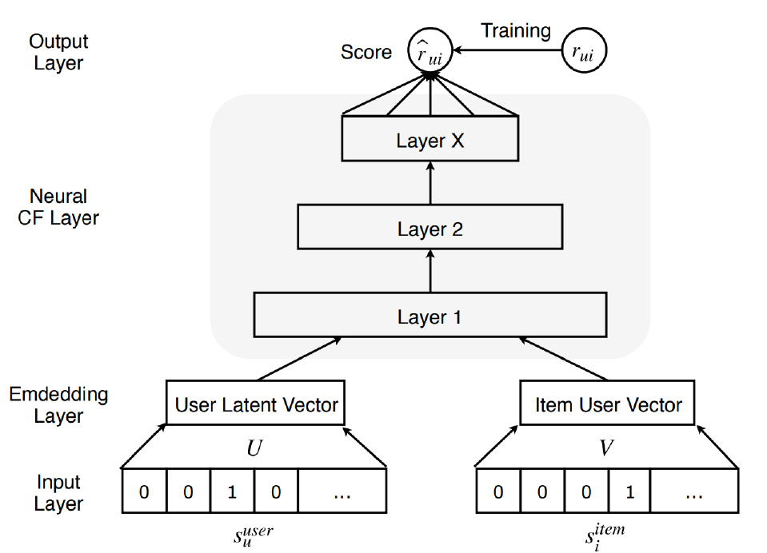
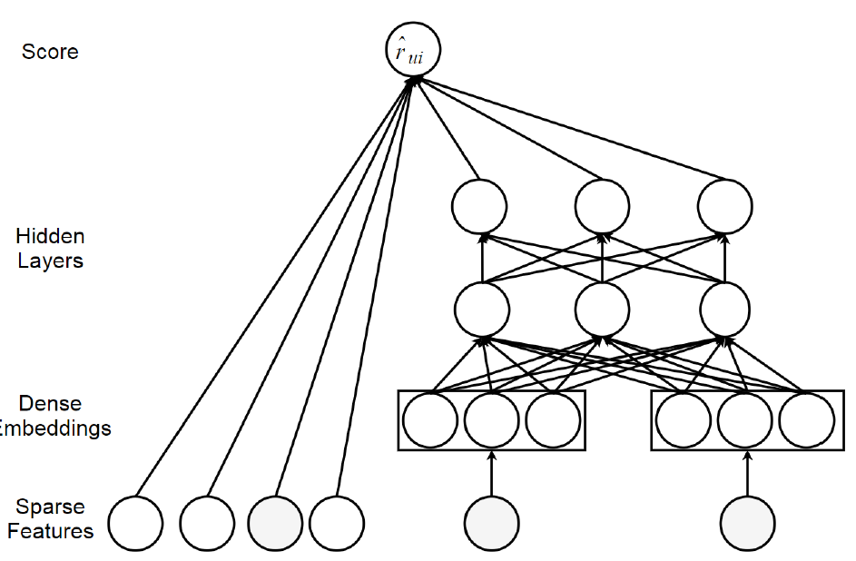
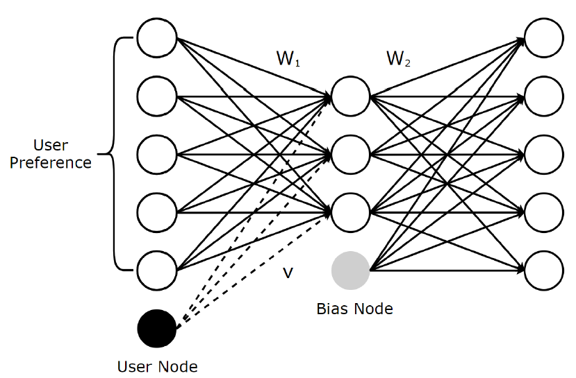
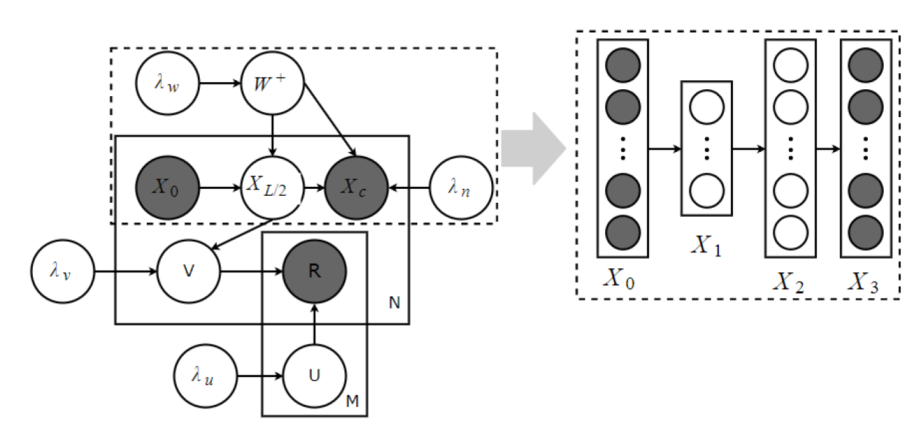
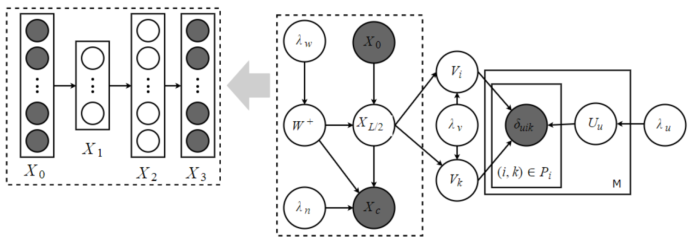
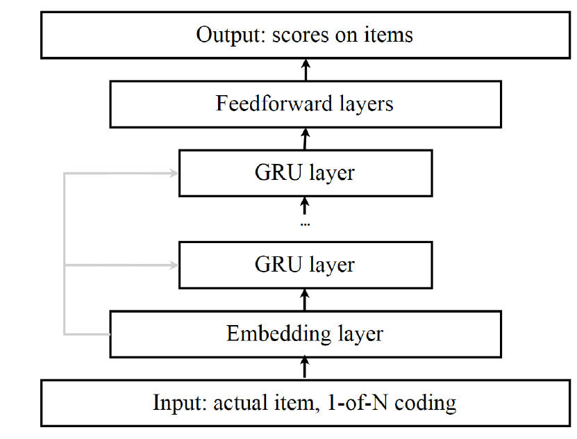

# Recommendation Systems: Overview

## Introduction
!!! abstract "Purpose"
    This article will cover an overview of recommendation systems. The content will be structured to answer the following questions:

    - What is RecSys?
    - What is the importance of Recommender Systems?
    - What are the main challenges faced in Recommender Systems?
    - What are the common evaluation metrics utilized in Recommender Systems?
    - What are the various methods employed in Recommendation Systems?
    - How has neural network architecture been utilized in Recommender Systems?
    
    <!-- more -->

### What is RecSys?
Recommender systems suggest things you might like by analyzing your preferences, item details, and how you've interacted with them. 
Personalized recommender systems predict individual preferences based on past behavior, while group recommender systems consider collective preferences to resolve conflicts. Personalized systems focus on tailoring recommendations to individual interests and are the most studied type. [[1]](https://arxiv.org/abs/2306.12680)

### What is the importance of Recommender Systems?
In industry, recommender systems are crucial for improving user experience and driving sales on online platforms. For instance, 80% of Netflix movie views and 60% of YouTube video clicks stem from recommendations. [[2]](https://dl.acm.org/doi/pdf/10.1145/2843948),[[3]](https://dl.acm.org/doi/10.1145/1864708.1864770). Recommender systems are vital for keeping users engaged by supplying relevant items.engaged on the platform. 

### What are the main challenges faced in Recommender Systems?
In commercial applications, a recommender system's robustness, data bias, and fairness are critical for its success. Robustness ensures accurate recommendations despite changing data. Data bias refers to systematic errors that can lead to unfair recommendations. Fairness means providing unbiased recommendations regardless of user characteristics. [[1]](https://arxiv.org/abs/2306.12680) 

#### Robustness

Adversarial attacks test recommender system robustness by altering image or text inputs. In natural language processing, attackers exploit embeddings, like user or item profiles, for attacks.

#### Data bias
Adversarial attacks test recommender system robustness by altering inputs like pixel values or text. In natural language processing, attackers exploit embeddings, such as user or item profiles, exposure bias, and position bias for attacks. Addressing biases is crucial for reliable recommendations.

##### Popularity deviation
Popularity deviation is a challenge similar to the long-tail problem. It occurs when a small number of highly popular items dominate user interactions, while less popular items receive little attention. This skews model training towards popular items, resulting in unfair recommendations favoring popular items over others.

##### Selection bias
Selection bias arises when users tend to rate only products they strongly like or dislike, causing a Missing-Not-At-Random (MNAR) problem and skewing recommendations.

##### Exposure bias
Exposure bias occurs when users can only see and interact with a portion of items presented by the system due to time constraints. This leads to deviations because users may miss items they would like or dislike.

##### Positional deviation
Positional deviation refers to users' tendency to interact more with items placed prominently in recommendation lists, regardless of relevance to their needs. This concept impacts click-through rate prediction in recommender systems.

#### Fairness
Recommender system fairness includes user-based and item-based fairness. User-based fairness ensures no discrimination based on sensitive attributes, while item-based fairness ensures equal recommendation opportunities for all items. The cold-start and long-tail problems are examples of item-based fairness issues, with the latter also linked to exposure bias.

##### User-Based Fairness
Researchers are actively exploring methods like meta-learning, adversarial training, and differential privacy to improve user-based fairness in machine learning models. Approaches such as cold-transformer aim to enhance user preference accuracy by incorporating context-based embeddings. These efforts highlight the significance of addressing fairness and privacy concerns to better serve under-served users. [[4]](https://dl.acm.org/doi/proceedings/10.1145/3477495)

##### Item-Based Fairness
Various methods address item-based fairness in recommender systems:

- Causal inference frameworks reduce popularity bias and alleviate the long tail problem.  [[5]](https://dl.acm.org/doi/10.1145/3459637.3482071)
- Adversarial training  enhances model accuracy but may amplify popularity deviation in unbalanced data distributions. [[6]](https://dl.acm.org/doi/10.1145/3460231.3478858)
- The FairGAN model tackles fairness by mapping it to the negative preference problem and preserving user utility. [[7]](https://dl.acm.org/doi/10.1145/3485447.3511958)

### What are the common evaluation metrics utilized in Recommender Systems?
Evaluation metrics for recommender systems can be classified into Rating Based Indicators (RBI) and Item Based Indicators (IBI). RBI assesses recommendations using predicted rating scores, while IBI evaluates recommendations based on a list of predicted items. 

#### Rating-Based Indicator
Rating-based indicators assess the quality of predicted rating scores, often by calculating the gap between implicit or explicit labels. Common measurements include Root Mean Squared Error (RMSE), especially when the rating score is an explicit value. 

RMSE is calculated by

$$RMSE = \sqrt{\frac{1}{|U||I|}\sum_{u \in U, i \in I}(\hat{r}_{ui} - r_ui)^2}$$

Similarly, Mean Absolute Error (MAE) is another common measurement, given by:

$$MAE = \sqrt{\frac{1}{|U||I|}\sum_{u \in U, i \in I}|\hat{r}_{ui} - r_ui|}$$

In both equations, $U$ represents the set of users, $I$ represents the set of items, $\hat{r}$ denotes the predicted rating, and $r$ denotes the true rating.

RMSE and MAE are non-negative metrics, where lower values indicate better performance. However, they are sensitive to outliers because each squared difference $((\hat{r_{ui}} - r_{ui}))^2$ in RMSE, $|\hat{r_{ui}} - r_{ui}|^2$ in MAE)  contributes proportionally to the final error. [[1]](https://arxiv.org/abs/2306.12680)

#### Item-Based Indicator

When ranking information is absent in a recommender system, evaluation can utilize a confusion matrix. Here, TP (True Positives) represents used items recommended by the system, FP (False Positives) denotes unused items incorrectly recommended, FN (False Negatives) indicates used items not recommended, and TN (True Negatives) is the count of unused items not recommended. Common metrics such as Precision, Recall, and F-Measure are derived from these values for a comprehensive evaluation.

$$Precision = \frac{TP}{TP + FP}$$

$$Recall = \frac{TP}{TP + FN}$$

$$F-Measure = \frac{2*Precision*Recall}{Precision + Recall}$$

#### Ranking Indicator
Precision and Recall metrics are not inherently concerned with the order of recommendations. To address this, Precision@k and Recall@k focus on subsets of ordered lists, considering only the top k items for evaluation.

A more comprehensive evaluation metric is the mean average precision (MAP@k) and mean average recall (MAR@k), which average precision and recall across all users for the top k recommendations.

$$ MAP@K = \frac{\sum_{i=1}^k(Precision@i * rel(i))}{min(k,number\; of\; relevant\; items  )}$$

$$ MAR@K = \frac{\sum_{i=1}^k(Recall@i * rel(i))}{total\; number\; of\; relevant\; items  )}$$

MAP@k and MAR@k utilize the indicator function $rel(i)$, where 1 indicates relevance and 0 indicates irrelevance of the $i-th$ item to the target. While useful for evaluating overall system performance, these metrics are not suitable for fine-grained numerical ratings as they require a threshold for conversion to binary correlations, leading to bias and loss of detailed information.

### What are the various methods employed in Recommendation Systems?
Personalized recommender systems can be categorized into three main approaches:

  * Collaborative filtering

  * Content-based

  * Hybrid methods

#### Collaborative filtering
Collaborative filtering (CF) is a popular recommendation technique leveraging the collective knowledge of users to predict preferences. It assumes users with similar behaviors share similar opinions, utilizing user profiles created from historical interactions. CF encompasses memory-based CF and model-based CF approaches.

##### Memory-based CF
Memory-based collaborative filtering (CF) calculates similarity between users or items and generates recommendations based on sorted similarity values. It's efficient and popular, leveraging historical data to capture user behavior patterns and preferences for personalized recommendations.

###### Challenges
The sparsity of the interaction matrix, with limited non-zero values, makes recommendation predictions prone to errors. Additionally, as user and item spaces expand, similarity calculations become more complex and time-consuming, hindering scalability in large-scale applications.

###### How is similarity calculated?
Similarity calculation is essential in recommender systems, especially in collaborative filtering, where it's derived from co-rated items to predict preferences. Methods like Pearson Correlation Coefficient (PCC), Cosine similarity (COS), Mean Squared Difference (MSD), Proximity Impact Popularity (PIP), Jaccard Similarity, and Proximity Significance Singularity (PSS) are commonly used. Each method has distinct strengths and limitations, with selection dependent on system type and data characteristics.

##### Model-based CF
Model-based collaborative filtering (CF) is another popular recommendation approach. It predicts user preferences based on relationships between users and items. This is commonly known as the Two-Tower paradigm.

The two tower model encompasses two main components:

* user embeddings
* item embeddings

User preference history, including liked items and timestamps, past searches, location, preferred languages, and relevant metadata are considered for recommendations. [[9]](https://recsysml.substack.com/p/two-tower-models-for-retrieval-of)

Gathers information about recommendable items, including their title, description, metadata like language and publisher, and dynamic data such as views and likes over time.

These components are combined by computing their dot product. A high dot product value indicates a good match between the user and the item.

#### Content-based
The content-based recommender system classifies items based on attribute information for personalized recommendations. Unlike collaborative filtering, it treats recommendations as a user-specific classification problem, learning a classifier from item features. It focuses on user preference models and interaction history. Item classification in content-based RS relies on item features obtained through item presentation algorithms. Side information can include metadata or user-generated content, typically item descriptions or full-text indexing. 

##### Similarity measures
Cosine Similarity: Measures the cosine of the angle between two vectors. It's widely used for text-based recommendations.

Euclidean Distance: Measures the straight-line distance between two vectors in a multidimensional space.

Pearson Correlation Coefficient: Measures the linear correlation between two variables. It's often used when dealing with numerical attributes.

Jaccard Similarity: Measures the similarity between two sets by comparing their intersection to their union. It's useful for categorical data or binary features

#### Hybrid 
Recommender systems have evolved to require integration of multiple data sources for real-time, accurate recommendations. Deep learning facilitates effective fusion of diverse information, like context and content, in hybrid recommender systems, combine user-item interactions and contextual features for recommendation. [[8]](https://dl.acm.org/doi/10.1145/3460231.3474272).

##### Why is a hybrid approach suitable?
The cold start problem in collaborative filtering occurs when new users have insufficient data for personalized recommendations. To address this, a hybrid approach can be adopted, starting with content-based recommendations until enough user data is collected. Once sufficient data is available, the system can transition to collaborative filtering for more accurate and personalized recommendations.

#### ow has neural network architecture been utilized in Recommender Systems?
In recent years, deep learning has significantly advanced recommendation systems, especially with architectures like the dual encoder. Deep neural networks are beneficial as they integrate multiple neural building blocks into a single, trainable function. This is particularly useful for content-based recommendations involving multi-modal data, such as text (reviews, tweets) and images (social posts, product images). CNNs and RNNs enable joint end-to-end representation learning, outperforming traditional methods that require designing modality-specific features.

##### Strengths
###### Nonlinear Transformations
Unlike linear models, deep neural networks can model non-linearity in data using nonlinear activations like ReLU, sigmoid, and tanh. This capability allows them to capture complex and intricate user-item interaction patterns

###### Representation Learning
Deep neural networks effectively learn underlying factors and useful representations from input data. They leverage extensive descriptive information about items and users, enhancing our understanding and improving recommendation accuracy.

###### Sequence Modelling
Deep neural networks excel in sequential modeling tasks like machine translation, natural language understanding, and speech recognition. They are well-suited for capturing the temporal dynamics of user behavior and item evolution, making them ideal for applications like next-item prediction and session-based recommendations.

###### Flexbility
Deep learning techniques are highly flexible, allowing easy combination of neural structures to create hybrid models or replace modules. This enables the development of powerful composite recommendation models that capture various characteristics and factors.

##### Limitations
###### Interpretability
Despite their success, deep learning models are often criticized for being black boxes, with non-interpretable hidden weights and activations. This limits explainability. However, neural attention models have alleviated this concern by improving the interpretability of deep neural models. [[10]](https://dl.acm.org/doi/10.1145/3109859.3109890)

###### Data 
Another limitation of deep learning is its need for large amounts of data to support its rich parameterization. However, unlike domains such as language or vision where labeled data is scarce, recommender systems can easily gather substantial data. Million/billion scale datasets are common in both industry and academia.

###### Hyperparamter Tuning
The need for extensive hyperparameter tuning is not unique to deep learning but applies to machine learning in general. Traditional models like matrix factorization also require tuning of parameters such as regularization factors and learning rates. While deep learning may introduce additional hyperparameters, this challenge is not exclusive to it.

#### Models
Recommendation models leveraging neural building blocks are categorized into eight subcategories aligned with deep learning models: MLP, AE, CNNs, RNNs, RBM, NADE, AM, AN, and DRL-based recommender systems. We will describe MLP, AE, CNNs, and RNNs. 

Deep learning-based recommendation models often integrate multiple deep learning techniques. The flexibility of deep neural networks allows for the combination of several neural building blocks to complement each other, resulting in a more powerful hybrid model.

##### Multilayer Perceptron based Recommendations
The Multilayer Perceptron (MLP) is renowned for its ability to accurately approximate any measurable function, making it a powerful and versatile network. Serving as the cornerstone for many advanced techniques, MLP is extensively utilized across diverse domains.
[[11]](https://ojs.aaai.org/index.php/AAAI/article/view/4457)

###### Neural Collaborative Filtering
Recommendation often involves a two-way interaction between user preferences and item features. For instance, matrix factorization decomposes the rating matrix into low-dimensional user and item latent factors. Constructing a dual neural network allows for modeling this interaction between users and items.

The scoring function is defined as:

$$\hat{r}_{ui} = f(U^T * s_{u}^{user}, V^T * s_i^{item} | U,V, \theta) $$

where function $f(.)$ represents the multilayer perceptron, and $θ$ is the parameters of this network. Traditional MF can be viewed as a special case of NCF. Therefore, it is convenient to fuse the neural interpretation of matrix factorization with MLP to formulate a more general model which makes use of both linearity of MF and non-linearity of MLP to enhance recommendation quality.

The entire network can be trained with weighted square loss for explicit feedback or binary cross-entropy loss for implicit feedback, defined as:

$$L = - \sum_{(u,i) \in OUO}r_{ui}log\hat{r_ui}+(1-r_{ui}log(1-\hat{r_{ui}})) $$

###### Deep Factorization Machine
DeepFM is an end-to-end model combining factorization machines (FM) and multilayer perceptrons (MLP). It captures low-order feature interactions through FM and high-order interactions via MLP's deep structure. Inspired by the wide & deep network, DeepFM replaces the wide component with a neural FM, reducing the need for extensive feature engineering. The input includes user-item pairs and their features.

The prediction score is computed by combining the outputs of FM and MLP, represented as $y_{FM}$ and $y_{MLP}$, respectively. [[12]](https://dl.acm.org/doi/10.1145/3511808.3557240)

$$\hat{r}_{ui} = \sigma(y_{FM}(x) + y_{MLP}(x))$$

###### Feature Representation with MLP

Originally designed for Google Play app recommendations, the model comprises two main components: a wide learning unit and a deep learning unit. The wide unit memorizes direct features from past data, while the deep unit generates abstract representations for generalization. This combination enhances the model's accuracy and diversity in recommendations.[[13]](https://dl.acm.org/doi/10.1145/3018661.3018665)

Formally, the learning process is represented by the equation $y = W_{wide}^T{x, \phi(X)} + b$, where $W_{wide}^T$ and $b$ denote the model parameters.

The input ${x, \phi(x)}$ represents the concatenated feature set, comprising the raw input feature $x$ and the transformed feature $\phi(x)$. Each layer of the deep neural component follows the formula $a^{(l+1)}= f(W_{deep}^{(l)}+b^{(l)})$, where $l$ denotes the layer index, $f(.)$ represents the activation function, and $W_{deep}^{(i)}$ and $b^{(l)}$ are the weight and bias terms, respectively. The wide and deep learning model is achieved by combining these two models.

$$P(\hat{r}_{ui} = 1|x = \sigma(W_{wide}^T,{x, \phi(x) + W_{deep}^Ta^{(l_f)} + bias} )) $$

In this equation, $\sigma(.)$ represents the sigmoid function, $\hat{r}_{ui}$ denotes the binary rating label, and $a^{(l_f)}$ signifies the final activation. The joint model is optimized using stochastic back-propagation, following the regularized leader algorithm. Finally, the recommendation list is generated based on the predicted scores.

###### Recommendation with Deep Structured Semantic Model
The Deep Structured Semantic Model (DSSM) is a deep neural network designed to learn semantic representations of entities and measure their semantic similarities. It's commonly applied in information retrieval and particularly well-suited for top-n recommendation tasks. DSSM maps entities into a shared low-dimensional space and computes their similarities using the cosine function. [[14]](https://dl.acm.org/doi/10.1145/3485447.3512065)

Deep Semantic Similarity based Personalized Recommendation (DSPR) is a personalized recommender system that utilizes tag annotations to represent users and items. Both users and items are mapped into a common tag space, and cosine similarity is used to measure the relevance between users and items. The loss function of DSPR is defined as:

$$ L = - \sum_{u, i}[log(e^{sim(u,i*)} -  log \sum_{u,i} e^{sim(u,i)})] $$

Negative samples $(u, i)$ are randomly chosen pairs of users and items that are not positively associated, serving as contrastive examples in training.

MV-DNN is tailored for cross-domain recommendation, where users are considered as the central view and each domain (assuming there are Z domains) as auxiliary views. Each user-domain pair has a corresponding similarity score. The loss function of MV-DNN is then defined based on these similarity scores.

$$ L = argmin_\theta \sum_{j=1} \frac{exp(\gamma * cosine(Y_u, Y_{u,j}))}{\sum{exp(\gamma*cosine(Y_u, f_a(X')))}{}}$$

In this equation, $\theta$ represents the model parameters, $y$ is the smoothing factor, $Y_u$ denotes the output of the user view, and $a$ is the index of the active view. $R^{da}$ represents the input domain of view $a$. MV-DNN is able to handle multiple domains effectively.

##### Autoencoder based Recommendation
Autoencoders can enhance recommender systems in two primary ways:

1) Feature Learning: Autoencoders can be used to learn lower-dimensional representations of user-item interactions at the bottleneck layer, effectively compressing the data into a more manageable form.

2) Matrix Completion: Autoencoders can directly fill in the missing entries of the interaction matrix in the reconstruction layer, predicting user preferences for unseen items.

Various types of autoencoders, including denoising, variational, contractive, and marginalized autoencoders, can be adapted for these recommendation tasks.

###### Autoencoder based Collaborative Filtering
AutoRec uses either user partial vectors r(u)r(u) or item partial vectors r(i)r(i) as inputs to reconstruct them in the output layer. There are two versions of AutoRec:

- Item-based AutoRec
- User-based AutoRec

The objective function for item-based AutoRec (I-AutoRec) is designed to minimize the reconstruction error between the original and predicted item vectors.

$$ argmin_\theta \sum_{i = 1}^N || r^{(i)} - h(r^{(i)} ; \theta) ||^2 + \lambda * reg $$

Before deploying AutoRec, consider these key points:

- **Performance**: I-AutoRec generally outperforms U-AutoRec, likely due to higher variance in user vectors.
- **Activation Functions**: The choice of activation functions $f(.)$ and $g(.)$ significantly impacts performance.
- **Hidden Units**: Moderately increasing the number of hidden units can improve results by enhancing the model's capacity.
- **Depth**: Adding more layers to create a deep network can lead to slight performance improvements.

Collaborative Denoising Autoencoder (CDAE) is used for ranking prediction based on user implicit feedback $r^{(u)}_{pref}$​, where entries are 1 if the user likes an item and 0 otherwise. The input is corrupted by Gaussian noise, resulting in a corrupted version $p(\hat{r}^{(u)}_{pref}| r^{(u)}_{pref})$​ drawn from a conditional Gaussian distribution. The reconstruction is represented as:

$$ h(\hat{r}^{(u)}_{pref}) = f(W_2 * g(W_1 * \hat{r}^{(u)}_{pref} + V_u + b_1) + b_2)$$

CDAE parameters are optimized by minimizing the reconstruction error between the original and reconstructed inputs.

$$argmin_{W_1, W_2, V, b_1, b_2} \frac{1}{M} \sum_{u = 1}^M E_{p(\hat{r}^{(u)}_{pref}|r^{(u)}_{pref})}[l(\hat{r}^{(u)}_{pref}, h(\hat{r}^{(u)}_{pref})] + \lambda * reg$$

CDAE initially updates its parameters using SGD over all feedback. However, considering all ratings is impractical in real-world applications. To address this, the authors proposed a negative sampling technique, which selects a small subset from the negative set (items the user hasn't interacted with). This approach significantly reduces time complexity without compromising ranking quality.

###### Feature Representation Learning with Autoencoder
Autoencoders are powerful for learning feature representations and can be used in recommender systems to extract features from user or item content.

Collaborative Deep Learning (CDL) is a hierarchical Bayesian model that combines stacked denoising autoencoders (SDAE) with probabilistic matrix factorization (PMF). The authors introduced a general Bayesian deep learning framework with two interconnected components:

- Perception Component: Provides a probabilistic interpretation of ordinal SDAE.
- Task Component: Utilizes PMF for recommendation.

This combination in CDL allows balancing side information and interaction history. The generative process of CDL is:

1) For each layer $l$ of the SDAE

  - For each column $n$ of weight matrix $W_l$ draw $W_{l,*n} ~ N(0, \lambda_w^{-1}I_{D1})$ 
  - Draw the bias vector $b_1 ~ N(0, \lambda_W^{-1}I_D)$ 
  - For each row $i$ of $X_i$, draw $X_{i,i*} ~ N(\sigma(X_{l-1, *}W_l + b_l), \lambda_x^{-1}I_{D_l})$ 

2) For each item $i$ 

  - Draw a clean input $X_{c,i*} ~ N(X_L,i* \lambda_n^{-1}I_{l_1})$ 
  - Draw a latent offset vector $\epsilon_1 ~ N(0, \lambda_v^{-1}I_D)$ and set the latent item vector: $V_i = \epsilon_i + X_{L}^T$ 
  - Draw a latent user vector for each user $u$, $U_u ~ N(0, \lambda_u^{-1}I_D)$ 
  - Draw a rating $r_{ut}$ for each user-item pair $(u,i), r_{ui} ~ N(U^T_uV_i, C^{-1}_{ui})$ 

Here, $W_l$​ and $b_l$​ are the weight matrix and bias vector for layer $l$, $X_l$​ represents layer $l$, and $\lambda_w$​, $\lambda_x$​, $\lambda_n$​, $\lambda_v$​, $\lambda_u$​ are hyperparameters. $C_{ui}$​ is a confidence parameter for the observations.

In Collaborative Deep Ranking (CDR), tailored for pairwise top-n recommendation, the generative process is as follows:

1) For each layer $l$ of the SDAE:

  - (Same as CDL)

2) For each item $i$:
  
  - (Same as CDL)

3) For each user $u$:
  
  - Draw a latent user vector for $u, U_u ~N(0, \lambda_u^{-1}I_D)$ 
  - For each pair-wise preference $(i,j) \in P_i$ where $P_i = {(i,j):r_{ui} - r_{uj} > 0}$ , draw the estimator, $\delta_{uij} ~ N(U^T_uV_i - U^T_uV_j, C^{-1}_{uij})$ 

 $\delta_{uij} = r_{ui} - r_{uj}$ represents the pairwise relationship of a user's preference between item $i$ and item $j$, where $r_{ui}$​ and $r_{uj}$​ are the ratings of items $i$ and $j$ by user $u$, respectively. $C_{uij}^{−1}$​ is a confidence value indicating how much user $u$ prefers item $i$ over item $j$.

##### Convolutional Neural Networks based Recommendation
Convolutional Neural Networks (CNNs) excel at processing unstructured multimedia data by leveraging convolution and pooling operations. Many recommendation models based on CNNs utilize these capabilities for feature extraction from multimedia inputs.

###### Feature Representation Learning with CNNs
Convolutional Neural Networks (CNNs) excel at feature representation learning from images, text, audio, and video. In Point-of-Interest (POI) recommendation, CNNs are particularly effective for image feature extraction. For example, Visual POI (VPOI) uses CNNs to extract features from images. This data is then integrated into a recommendation model based on Probabilistic Matrix Factorization (PMF), which examines the interactions between visual content and both latent user factors and latent location factors.

In CNNs used for recommendation systems, convolutional and max-pooling layers extract visual features from image patches. These features, along with user information, contribute to personalized recommendations. The network typically comprises two CNNs for image representation learning and a Multilayer Perceptron (MLP) for modeling user preferences.

During training, the network compares pairs of images: one positive image (liked by the user) and one negative image (disliked by the user) against the user's preferences. Training data consists of triplets $t$ where the positive image $I_t^+$​ should be closer to the user UtUt​ than the negative image $I_t^−$​ according to a distance metric $D(π(U_t),ϕ(I_t^−))D(π(U_t​)$, where $D(.)$ represents the distance metric, such as Euclidean distance.

###### Graph CNNs for Recommendation

Graph Convolutional Networks (GCNs) excel at handling non-Euclidean data like social networks and knowledge graphs. In recommendations, GCNs can model interactions as bipartite graphs, integrating user and item information, such as social networks and item relationships, into the recommendation process.

Their model generates item embeddings from both graph structure and item feature information using random walk and GCNs. This approach is well-suited for large-scale web recommender systems. The proposed model has been successfully deployed in Pinterest to address various real-world recommendation tasks.

##### Recurrent Neural Networks based Recommendations
RNNs are perfect for processing sequential data, making them ideal for capturing the temporal dynamics of user interactions and behaviors, as well as handling sequential signals like text and audio.

###### Session-based Recommendation without User Identifier
In various real-world applications or websites, users may not always log in, depriving the system of access to their identifiers and long-term consumption habits or interests. However, mechanisms like sessions or cookies enable these systems to capture users' short-term preferences.

GRU4Rec is a session-based recommendation model using 1-of-N encoding to represent active session items. It predicts the likelihood of the next item in the session. Efficient training is achieved with a session-parallel mini-batches algorithm and an output sampling method. The model employs a ranking loss called Top!, which focuses on the relative ranking of items.

$$ L_s = \frac{1}{S} \sum_{j=1}^S \sigma(\hat{r_{si}} - \hat{r_si}) + \sigma(\hat{r}^2_{sj})$$

S is the sample size, $\hat{r}_{sj}$ and $\hat{r}_{sj}$ are the scores on negative item $i$ and positive item $j$ at session $s$, $\sigma$ is the logistic sigmoid function. The last term is used as a regularization.

###### Sequential Recommendation with User Identifier
In contrast to session-based recommenders, which typically lack user identifiers, the following studies focus on sequential recommendation tasks where user identifications are known.

Recurrent Recommender Network (RRN) is a non-parametric recommendation model built on RNNs. It models seasonal item evolution and user preference changes over time. It employs two LSTM networks to capture dynamic user $(u_{ut})$ and item $(v_{it})$ states. Alongside, it incorporates fixed properties like user long-term interests and item static features, integrating stationary latent attributes for users $​(u_u)$ and items $(v_i)$. The predicted rating of item $j$ by user $i$ at time $t$ is defined as:

$$ r_{ui|t} = f(u_{ut}, v_{it}, u_u, v_i)$$

In this model, $u_{ut}$​ and $v_{it}$​ are learned through LSTM, while $u_u$​ and $v_i$​ are learned via standard matrix factorization. The optimization objective is to minimize the squared error between predicted and actual ratings.

##### Feature Representation Learning with RNNs
For side information with sequential patterns, RNNs are ideal for representation learning. User-item interactions impact changes in preferences and item status. RNNs can model these historical interactions, learning representations of influences like drift, evolution, and co-evolution of user and item features.

Bansal et al. proposed a hybrid model employing GRUs to encode text sequences, addressing both warm-start and cold-start challenges in recommendation systems. They introduced a multi-task regularizer to counter overfitting and alleviate data sparsity. The primary task focuses on rating prediction, while an auxiliary task predicts item metadata such as tags and genres.[[16]](https://arxiv.org/pdf/1609.02116)

## References
[1] [Recent Developments in Recommender Systems: A Survey](https://arxiv.org/abs/2306.12680)

[2] [The Netflix Recommender System: Algorithms, Business Value, and Innovation](https://dl.acm.org/doi/pdf/10.1145/2843948)

[3] [The Youtube Video Recommendation System. In Recsys](https://dl.acm.org/doi/10.1145/1864708.1864770)

[4] [Transform cold-start users into warm via fused behaviors in large-scale recommendation](https://dl.acm.org/doi/proceedings/10.1145/3477495)

[5] ["Causer: Causal session-based recommendations for handling popularity bias"](https://dl.acm.org/doi/10.1145/3459637.3482071)

[6] [The Idiosyncratic Effects of Adversarial Training on Bias in Personalized Recommendation Learning](https://dl.acm.org/doi/10.1145/3460231.3478858)

[7] [FairGAN: GANs-based Fairness-aware Learning for Recommendations with Implicit Feedback](https://dl.acm.org/doi/10.1145/3485447.3511958)

[8] [Together is better: Hybrid recommendations combining graph embeddings and contextualized word representation](https://dl.acm.org/doi/10.1145/3460231.3474272)

[9] [Two tower model for retrieval](https://recsysml.substack.com/p/two-tower-models-for-retrieval-of)

[10] [Interpretable convolutional neural networks with dual local and global attention for review rating prediction](https://dl.acm.org/doi/10.1145/3109859.3109890)

[11] [Camo: A collaborative ranking method for content based recommendation](https://ojs.aaai.org/index.php/AAAI/article/view/4457)

[12] [Asymmetrical Context-aware Modulation for Collaborative Filtering Recommendation](https://dl.acm.org/doi/10.1145/3511808.3557240)

[13] [Joint Deep Modeling of Users and Items Using Reviews for Recommendation](https://dl.acm.org/doi/10.1145/3018661.3018665)

[14] [Hypercomplex Graph Collaborative Filtering](https://dl.acm.org/doi/10.1145/3485447.3512065)

[15] [Recurrent Recommender Networks](https://dl.acm.org/doi/10.1145/3018661.3018689)

[16] [Ask the gru: Multi-task learning for deep text recommendations](https://arxiv.org/pdf/1609.02116)