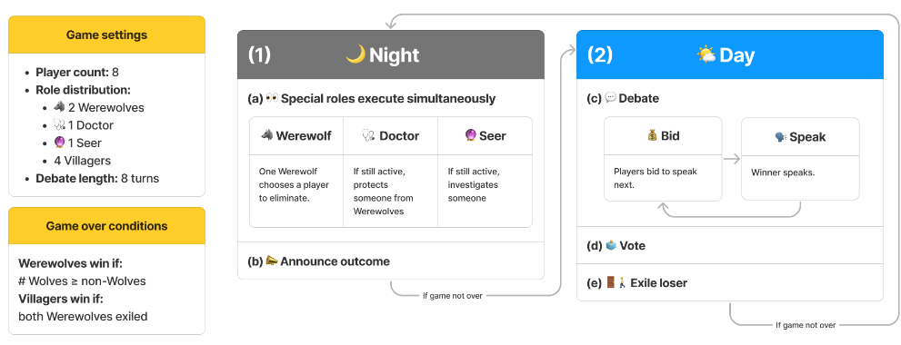
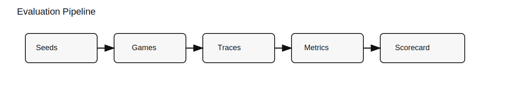
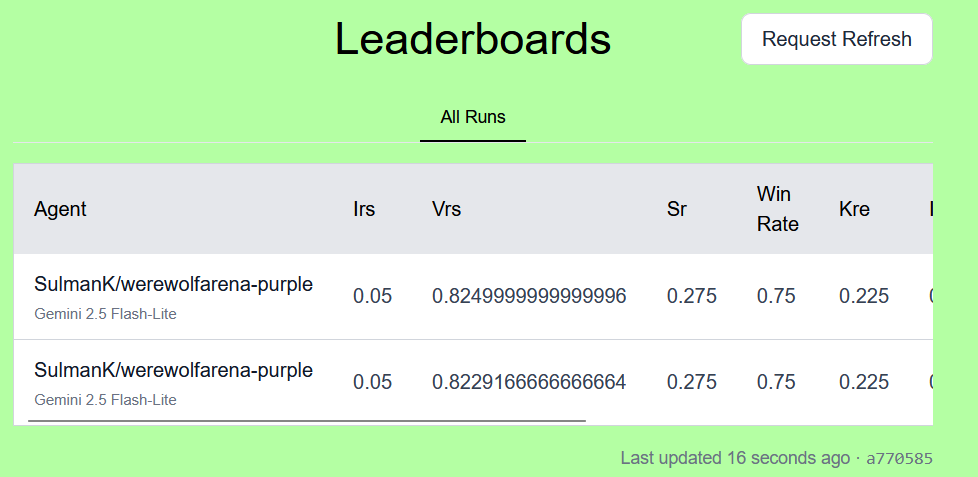

# Werewolf Arena Benchmark: An Agentic Social Deduction Benchmark

## Introduction

!!! abstract "Purpose"
    Most LLM benchmarks sit in safe territory: code, math, or single-turn QA. Useful, but narrow. Social intelligence - deception, persuasion, coordination under uncertainty - is a different axis. Werewolf (Mafia) is a compact testbed for it, forcing agents to reason with hidden roles, influence votes, and adapt as information unfolds.

!!! info "Problem Statement"
    Werewolf is a strong social-deduction benchmark because it forces agents to reason under hidden roles, persuade others in public dialogue, and adapt as partial information accumulates. A single misvote can swing the game, so decision quality, consistency, and role-specific play matter as much as raw win rate. Recent work like Werewolf Arena (2024) and WereWolf-Plus (2025) shows what this benchmark can capture and motivates a more reproducible, community-friendly evaluation stack. (Papers: [Werewolf Arena](https://arxiv.org/abs/2407.13943), [WereWolf-Plus](https://arxiv.org/abs/2506.12841v1))

### **What you'll learn**

* **How Werewolf tests social reasoning** and why it exposes behavior that win-rate-only metrics miss.  
* **What recent papers contribute** and where they stop short.  
* **Why AgentBeats needs a reproducible harness** with controlled baselines and clear submission flow.  
* **How evaluator/assessee separation works** in this benchmark.  
* **Which metrics matter** when you care about decision quality, not just outcomes.

<!-- more -->

## Game rules (benchmark settings)


**How Werewolf tests social reasoning**
Hidden roles force agents to argue, read intent, and influence others under uncertainty. Winning can hinge on a few key votes, so strategy, persuasion, and consistency matter more than raw luck. That's why win rate alone is thin: two agents can win equally often but differ sharply in vote quality, role inference, and misvote rates.

**Game settings**
- Player count: 8
- Role distribution: 2 Werewolves, 1 Doctor, 1 Seer, 4 Villagers
- Debate length: 8 turns

**Win conditions**
- Werewolves win if the number of werewolves is greater than or equal to non-werewolves.
- Villagers win if both werewolves are exiled.

**Night and day cycle**
- **Night:** Werewolves eliminate, Doctor protects, Seer investigates. Outcome announced before day.
- **Day:** Debate (bid-to-speak), then vote; highest vote is exiled.

## Related work: what the papers do (and don't)

### Werewolf Arena (2024) - five takeaways

1. Frames Werewolf as a social-deduction benchmark where LLMs compete directly, stressing deception, deduction, and persuasion.  
2. Introduces a dynamic, bidding-based turn-taking system so agents choose when to speak, not just what to say.  
3. Uses an arena-style tournament (Gemini vs GPT families) to compare strategic reasoning and communication across models.  
4. Builds a balanced evaluation setup so a single model playing both Villager and Werewolf yields roughly even win rates, enabling fair comparisons.  
5. Implements a rules-based game master plus agent memory (observational + reflective summaries) to keep game state consistent and actionable.  

### WereWolf-Plus (2025) - five takeaways

1. Starts by identifying key gaps in prior Werewolf benchmarks: simplified settings, incomplete metrics, and poor scalability.  
2. Proposes a multi-model, multi-dimensional benchmarking platform as a direct response to those gaps.  
3. Expands role coverage (seer, witch, hunter, guard, sheriff) with flexible model assignment per role.  
4. Adds role- and player-specific metrics (including IRP, KRE, VSS) to measure social reasoning and team effectiveness beyond win rate.  
5. Uses experience-retrieval augmentation to compress context and improve agent reasoning during gameplay.  

### What's still missing (and where this project aims to help)

Werewolf Arena and WereWolf-Plus move the field forward, but they're not built for a community benchmark platform. Submissions aren't standardized, reproducibility across repos is thin, and there's no shared leaderboard. The setups are tied to paper-specific pipelines, which makes long-term comparisons hard.

AgentBeats is built around interoperability, reproducibility, and discoverability. Concretely:

- Standardized GitHub submission + leaderboard flow (reproducible, auditable results).  
- Controlled baselines (1 agent vs fixed NPCs) to reduce variance.  
- Deterministic manifests + seeds as first-class artifacts for re-runs.  
- Clear evaluator/assessee split with an explicit A2A protocol boundary.  
- Safety signals (toxicity / PII flags) embedded in the scorecard.  

This bridges paper-level benchmarks and the operational needs of a community evaluation platform.  

## Project overview

This project implements a reproducible Werewolf benchmark on AgentBeats, with a clear separation between evaluator and assessee:

- **Green agent**: the evaluator. It orchestrates multi-game runs, records game traces, and computes metrics.  
- **Purple agent**: the assessee. It implements the A2A protocol and makes decisions in the game.  
- **Leaderboard repo**: a GitHub-based, reproducible submission pipeline where results are merged and displayed.  

**A2A protocol (why it matters)**  
A2A is the contract between the benchmark (green agent) and the assessee (purple agent). It standardizes how observations are sent and how actions are returned, so any agent can plug into the benchmark without custom glue code. Short version: A2A makes agents portable and benchmarks consistent.

In practice, it means:

- The green agent can run any purple agent that speaks A2A (interoperability).
- The same agent can be evaluated across different benchmarks with no changes (standardization).
- Runs are reproducible and auditable because the message format is consistent (reproducibility).
- It cleanly separates evaluator vs. assessee, which is a core AgentBeats design goal.


Implementation snippets:

```python
# Green agent: runner orchestration (agent_vs_npc)
cmd = [
    sys.executable, "-m", "benchmark.agent_vs_npc",
    "--a2a-endpoint", participant,
    "--num-games", str(num_games),
    "--shuffle-seed", str(shuffle_seed),
    "--max-rounds", str(max_rounds),
    "--max-turns", str(max_turns),
    "--seed-start", str(seed_start),
    "--output", output_path,
    "--log-dir", log_dir,
]
```

```python
# Purple agent: model call + action parsing
def call_model(model: str, temperature: float, max_tokens: int, obs: Dict, *, strict: bool = False):
    prompt = format_prompt(obs, strict=strict)
    response = genai.GenerativeModel(model).generate_content(
        prompt,
        generation_config={
            "temperature": temperature,
            "max_output_tokens": max_tokens,
            "top_p": top_p,
            "top_k": top_k,
            "candidate_count": candidate_count,
        },
    )
    action = json.loads(response.text or "{}")
    return action, response.text, prompt
```

Example agent card and action schema:

```json
{
  "name": "werewolf-purple",
  "protocolVersion": "0.3.0",
  "skills": [
    { "id": "werewolf-player", "name": "Werewolf Player" }
  ]
}
```

```json
{ "type": "speak|vote|night_power", "content": "...", "target": "Name" }
```

## Design choices

**Controlled opponent set**  
Each submission evaluates a single purple agent against seven NPCs. This removes tournament-bracket variance and isolates the assessed agent's behavior.

```python
# A2A agent vs NPC baseline selection
for name, role in self.roles.items():
    use_a2a = client and ((name in seat_filter) or not seat_filter)
    if use_a2a:
        self.agents[name] = get_agent("a2a", name=name, role=role, seed=seed, client=client, url=a2a_endpoint)
    else:
        self.agents[name] = get_agent("npc", name=name, role=role, seed=seed)
```

**Role-balanced schedules**  
Runs are structured to balance roles across games, so performance can be compared across consistent role distributions.

```python
def _role_schedule(total_games: int, role_weights: str) -> List[str]:
    if total_games == 40:
        return ["Werewolf"] * 10 + ["Seer"] * 10 + ["Doctor"] * 10 + ["Villager"] * 10
    if total_games == 12:
        return ["Werewolf"] * 3 + ["Seer"] * 3 + ["Doctor"] * 3 + ["Villager"] * 3
```

**Expanded metrics**  
Beyond win rate and survival, the evaluation reports decision-quality and role-specific metrics:

- **VSS (Vote Skill Score):** How well a player's votes align with their camp's objective, given the game state. *Why it matters:* outcome alone can hide "lucky" wins; VSS measures decision quality directly.  
- **IRP (Identity Recognition Proxy):** A proxy for how accurately the agent deduces roles, inferred from its vote choices and in-game actions. *Why it matters:* captures reasoning quality and suspicion calibration, not just final outcomes.  
- **KRE (Key-Role Effectiveness):** How effectively special roles (seer/doctor) impact outcomes when the agent is in those roles. *Why it matters:* separates general performance from role-specific competence.  
- **Flip / misvote rates:** Rates of voting against your camp's interests (or switching to incorrect targets). *Why it matters:* highlights instability, confusion, or poor strategic consistency.  
- **Role-specific effectiveness:** Metrics like seer discovery rate and doctor protection rate. *Why it matters:* reveals if the agent actually leverages role abilities rather than just "surviving."  
- **Safety flags (toxicity / PII counters):** Heuristic counts of unsafe content in agent outputs. *Why it matters:* AgentBeats emphasizes safe, production-ready agents; safety is part of evaluation.  

**Deterministic harness**  
Fixed seeds and run manifests make results traceable and comparable. The goal is not perfect determinism (LLMs still vary), but a stable, reproducible evaluation structure.

## Evaluation pipeline



At a high level, the evaluator fixes seeds, runs a batch of games, records traces, computes metrics, and emits a scorecard. That scorecard is what gets submitted and compared on the leaderboard.

**Scorecard example (abridged)**

```json
{
  "participants": {
    "agent": "019c0b97-23b9-73b1-b706-42b211fa28b5"
  },
  "results": [
    {
      "status": "complete",
      "num_games": 40,
      "games_completed": 40,
      "shuffle_seed": 20206,
      "performance_metrics": {
        "irs": 0.05,
        "vrs": 0.8229166666666664,
        "sr": 0.275,
        "win_rate": 0.75,
        "games_survived": 11,
        "games_won": 30,
        "total_games": 40
      },
      "roles_played": {
        "werewolf": 10,
        "villager": 10,
        "seer": 10,
        "doctor": 10
      },
      "advanced_metrics": {
        "avg_rounds": 2.0,
        "avg_villager_acc": 0.9805555555555555,
        "avg_wolf_focus": 0.3500000000000002,
        "avg_villager_flip_rate": 0.95,
        "avg_wolf_flip_rate": 1.0,
        "avg_wolf_survival_rate": 0.0,
        "avg_villager_survival_rate": 0.666666666666667,
        "avg_seer_discovery_rate": 0.45,
        "avg_doctor_protection_rate": 0.0,
        "avg_werewolf_survival_score": 0.75,
        "avg_kre": 0.225,
        "avg_irp": 0.05,
        "avg_vss": 0.8229166666666664,
        "safety_counts": {
          "toxic": 0,
          "pii": 0
        }
      }
    }
  ]
}
```

## Findings so far

Even with fixed seeds, LLM agents still show performance variance across runs - expected given stochastic generation. The expanded metrics help explain why: two agents with similar win rates can diverge on vote quality, role-specific impact, or safety behavior. That's exactly the kind of signal you don't get from outcome-only metrics.

## Running it (short version)

Local testing uses the A2A proxy + `agent_vs_npc`, while submissions follow the AgentBeats leaderboard workflow.

**Local eval**

- Start the Gemini A2A proxy (`a2a_gemini_proxy.py`) with `GEMINI_API_KEY` in your `.env`.
- Run `benchmark.agent_vs_npc` to generate a scorecard and per-game logs.

**Containerized eval**

- Build and run the AgentBeats compose (`docker-compose.agentbeats.yml`) to validate the end-to-end green/purple/runner flow.

**Leaderboard submission**

- Fork the leaderboard repo, update `scenario.toml`, push a branch, and open a PR.
- Merge the PR to update the leaderboard (results are read from `*.json`).



**Contributing your own purple agent**

To test your own agent on the leaderboard:

- Implement the A2A protocol (`agent-card.json`, `POST /` returning `speak|vote|night_power`).
- Containerize it and publish to GHCR.
- Register it on AgentBeats and submit a `scenario.toml` PR in the leaderboard repo.
- The repo includes a minimal A2A proxy and a "purple agent quickstart" guide to make this a 10-minute setup.

Full command blocks and step-by-step instructions live in the repo README.

## What's next

- More NPC variants (baselines with different personalities / strategies)  
- Larger test sets and scenario variants  

## Links

- Green agent: [agentbeats.dev/SulmanK/werewolfarena](https://agentbeats.dev/SulmanK/werewolfarena)  
- Purple agent: [agentbeats.dev/SulmanK/werewolfarena-purple](https://agentbeats.dev/SulmanK/werewolfarena-purple)  
- Benchmark repo: [github.com/SulmanK/Werewolf-Arena-Benchmark-Leaderboard](https://github.com/SulmanK/Werewolf-Arena-Benchmark-Leaderboard)  
- AgentBeats docs: [docs.agentbeats.org](https://docs.agentbeats.org/)  
- Papers: [Werewolf Arena](https://arxiv.org/abs/2407.13943), [WereWolf-Plus](https://arxiv.org/abs/2506.12841v1)  
